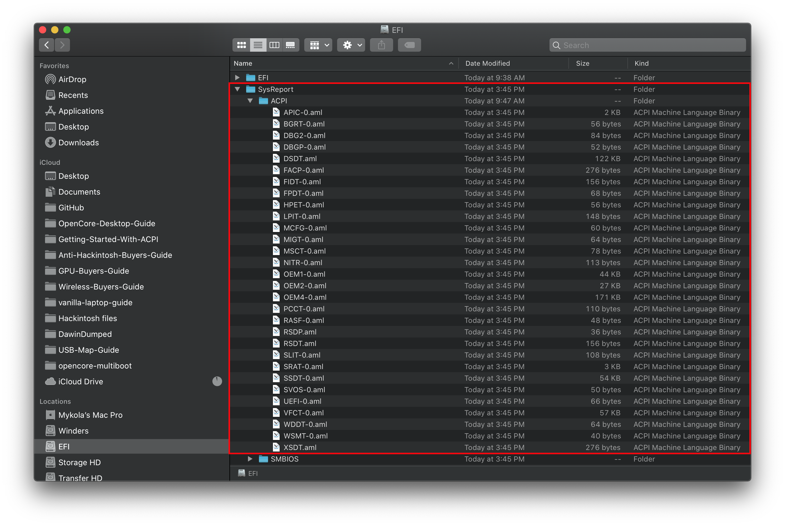
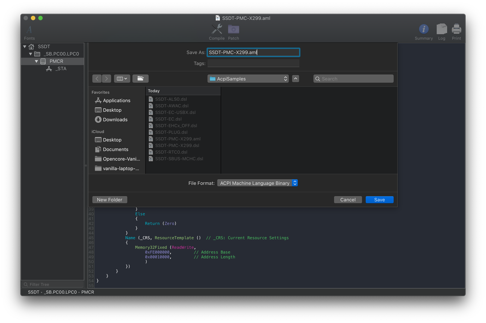
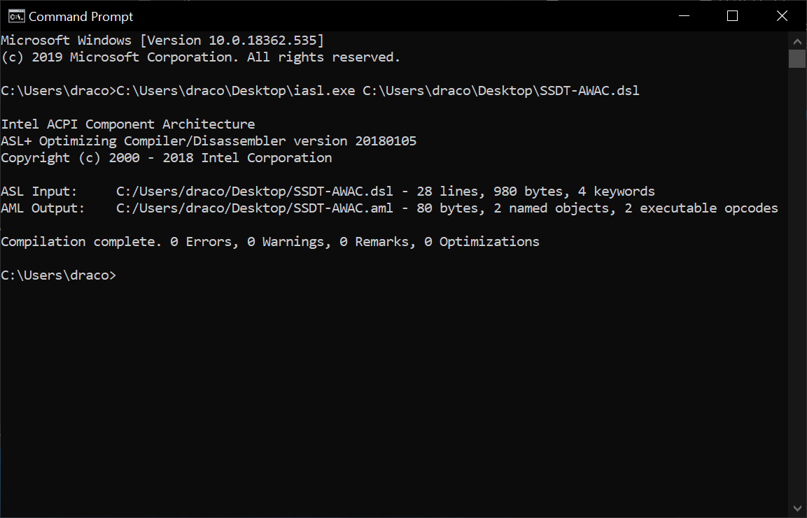

# Compilazione manuale

Questa guida spiega come ottenere manualmente gli SSDT

## Ottenere una copia del tuo DSDT

Per iniziare, otterremo una copia degli DSDT dal firmware. La via più veloce è quella di generare il file DSDT da SSDTTime, ma ecco altre opzioni:

### Da Windows

* [SSDTTime](https://github.com/corpnewt/SSDTTime/archive/refs/heads/master.zip)
  * Supporto di Windows e Linux per effettuare il dump del DSDT
  * `N. Dump DSDT - Automatically dump the system DSDT`
* [acpidump.exe](https://acpica.org/downloads/binary-tools)
  * Nel prompt dei comandi usare `path/to/acpidump.exe -b -n DSDT -z`, questo creerà il tuo DSDT con estensione .dat. Rinominalo come DSDT.aml
  
* Prendi nota che tutte le patch ACPI da Clover/OpenCore saranno applicate con questi 2 metodi
  
### Da Linux

* [SSDTTime](https://github.com/corpnewt/SSDTTime/archive/refs/heads/master.zip)
  * Supporto di Windows e Linux per effettuare il dump del DSDT
  * `N. Dump DSDT - Automatically dump the system DSDT`
* Prendi nota che tutte le patch ACPI da Clover/OpenCore saranno applicate con questi 2 metodi

### Da Clover

Per chi ha Clover precedentemente installato, questo è un metodo semplice per ottenere le tue tabelle ACPI:

* F4 nel menù di avvio Clover
  * Lo DSDT sarà creato in `EFI/CLOVER/ACPI/origin`, la cartella **deve** esistere prima di creare il DSDT

### Da OpenCore

Da OpenCore, abbiamo due opzioni:

* [Quirk del SysReport](#quirk-del-sysreport)
* [UEFI Shell](#uefi-shell)

#### Quirk del SysReport

Da OpenCore 0.5.9, abbiamo aggiunto un nuovo quirk chiamato SysReport che creerà tutte le tabelle DSDT automaticamente quando avvia. I principali problemi sono:

* Devi avere già una USB avviabile con OpenCore per usare questo metodo ([qui](https://github.com/utopia-team/opencore-debug/releases/latest) ne puoi trovare una già pronta!)
* Richiede oltretutto una versione di DEBUG di 0.5.9+

Devi solo rimpiazzare i seguenti file con quelli della [versione di DEBUG](https://github.com/acidanthera/OpenCorePkg/releases/latest):

* EFI/BOOT/
  * `BOOTx64.efi`
* EFI/OC/Bootstrap/
  * `Bootstrap.efi`
* EFI/OC/Drivers/
  * `OpenRuntime.efi`
* EFI/OC/
  * `OpenCore.efi`

Per avviare, salta la sezione ACPI, ritorna alla [homepage](..) e fai un config.plist valido per avviare la USB. Una volta avviata la USB, spegni il PC e controlla la USB:



E voilà! Hai un DSDT! Ora puoi continuare facendo gli SSDT

#### UEFI Shell

Per questo, dobbiamo prendere [`acpidump.efi`](https://github.com/macos86/macos86.github.io/raw/main/extra-files/acpidump.efi) e metterlo nei `EFI/OC/Tools` e nel config.plist nella sezione `Misc -> Tools` con gli argomenti: `-b -n DSDT -z` e seleziona quella opzione nel config di OpenCore.

Se OpenCore non riesce ad avviare acpidump.efi dal picker, puoi provare con la [OpenShell (inclusa con OpenCore)](https://github.com/acidanthera/OpenCorePkg/releases/latest) (ricorda di aggiungerlo sia in `EFI/OC/Tools` che nel config.plist in `Misc -> Tools` ):

```
shell> fs0: // rimpiazza con il corretto disco
fs0:\> dir  // verifica che sia la corretta cartella
   Directory of fs0:\
   01/01/01 3:30p EFI
fs0:\> cd EFI\OC\Tools
fs0:\EFI\OC\Tools> acpidump.efi -b -n DSDT -z  
```

Una volta fatto, dovresti trovare i tuoi DSDT nella cartella EFI/OC/Tools con estensione `.dat`. Rinomina questo `DSDT.dat` come `DSDT.aml` per maggiore chiarezza.

## Compiling and decompiling ACPI Tables

See [Troubleshooting](/troubleshooting.md) if you have dumping/compiling errors

* [macOS Compiling and Decompiling](/compile.md#macos)
* [Windows Compiling and Decompiling](/compile.md#windows)
* [Linux Compiling and Decompiling](/compile.md#linux)

### macOS

So compiling DSDTs and SSDTs are quite easy with macOS, all you need is [MaciASL](https://github.com/acidanthera/MaciASL/releases). To compile, just `File -> SaveAs -> ACPI Machine Language Binary(.AML)`, decompiling is just opening the file in MaciASL.

For those who prefer the command line, grab [iasl-stable](https://github.com/acidanthera/MaciASL/blob/master/Dist/iasl-stable) and run the following:

```
path/to/iasl path/to/DSDT.aml
```

* If compiled .aml file is provided, a decompiled .dsl file will be given and vice versa.



### Windows

Compiling and decompiling on windows is fairly simple though, you will need [iasl.exe](https://acpica.org/downloads/binary-tools) and Command Prompt:

```
path/to/iasl.exe path/to/DSDT.aml
```



* If compiled .aml file is provided, a decompiled .dsl file will be given and vice versa.

### Linux

Compiling and decompiling with Linux is just as simple, you will need a copy of iasl. You can get it here ([iasl](https://web.archive.org/web/20200508194642/http://amdosx.kellynet.nl/iasl.zip)) or through the `iasl` package in your package manager. iasl can be used as such:

```
path/to/iasl path/to/DSDT.aml
```

* If compiled .aml file is provided, a decompiled .dsl file will be given and vice versa.
