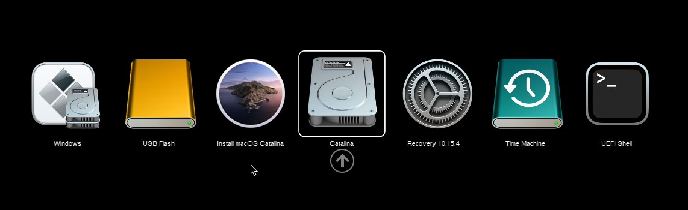
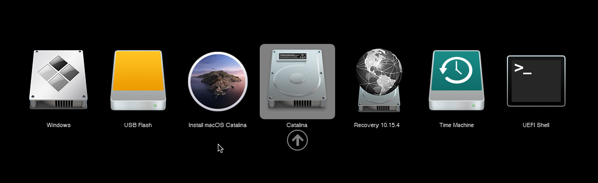

# Galleria Acidanthera

* [Repository di Acidanthera (OcBinaryData)](https://github.com/acidanthera/OcBinaryData)

Il set grafico di Acidanthera provvede un semplice design e si pone come esempio nella creazione dei set grafici per OpenCanopy. Correntemente, ci sono tre differenti set grafici, ispirati dall'originale UI del Boot Picker Apple nelle tre generazioni di macOS:

* Chardonnay (10.9 e meno recenti)
* Syrah (da 10.10 a 10.15)
* GoldenGate (11 e più recenti)

Questi set grafici sono ufficiali per OpenCanopy e sono sempre aggiornati. Attualmente le risorse sono mantenute da [@Andrey1970](https://github.com/Andrey1970AppleLife).

[[toc]]

## Set 1: GoldenGate

## Set 2: Syrah

## Set 3: Chardonnay

