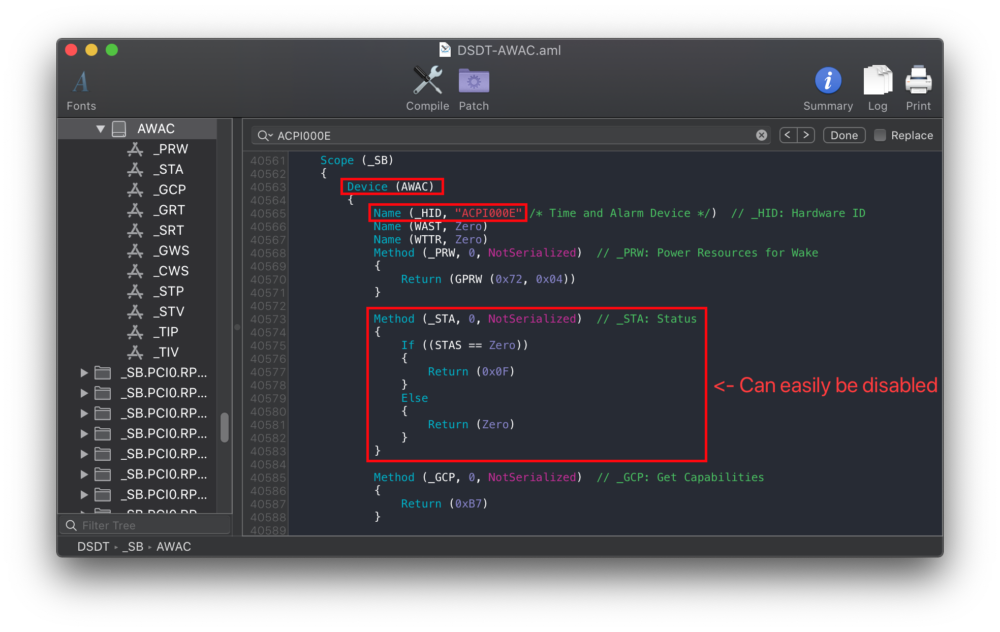
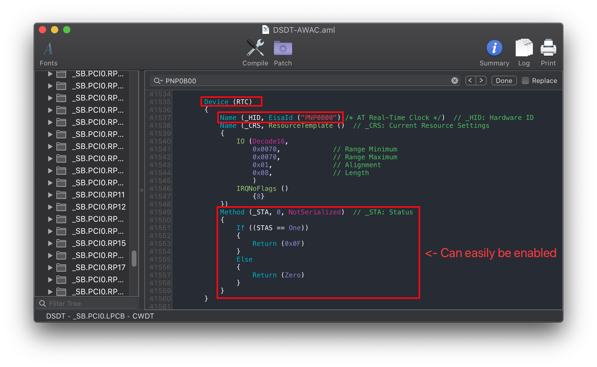
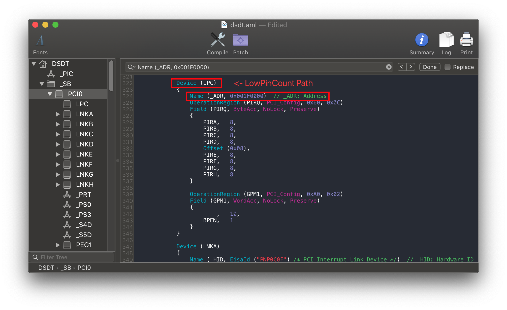
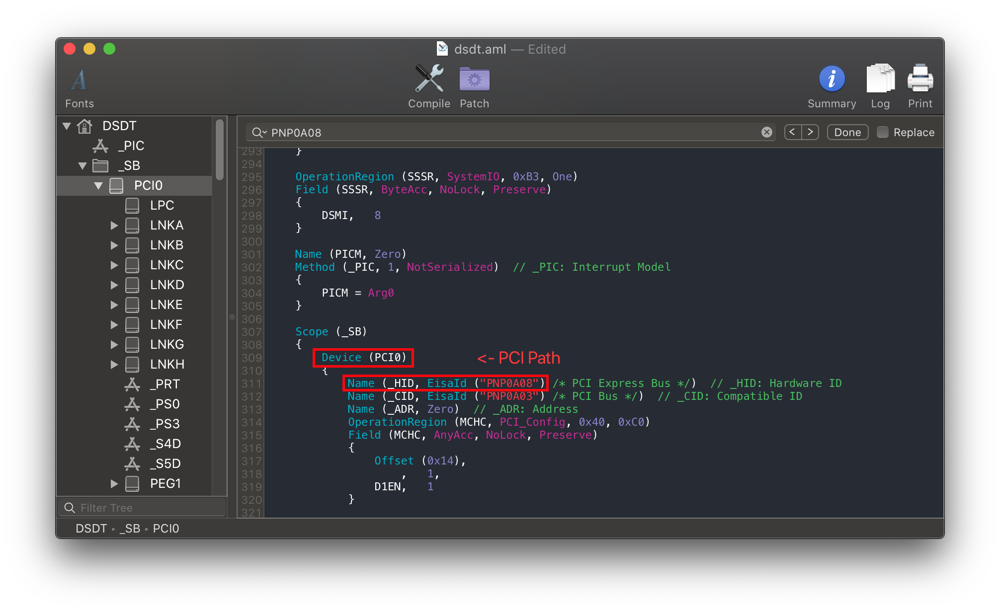
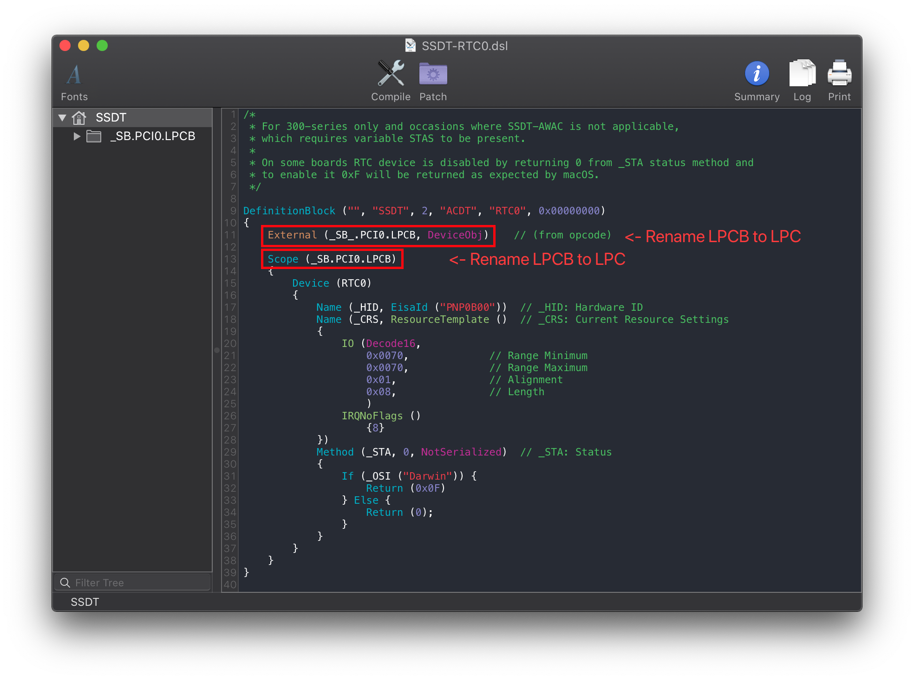
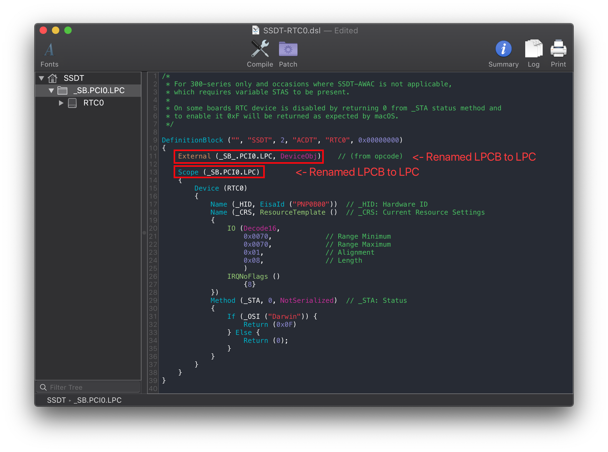
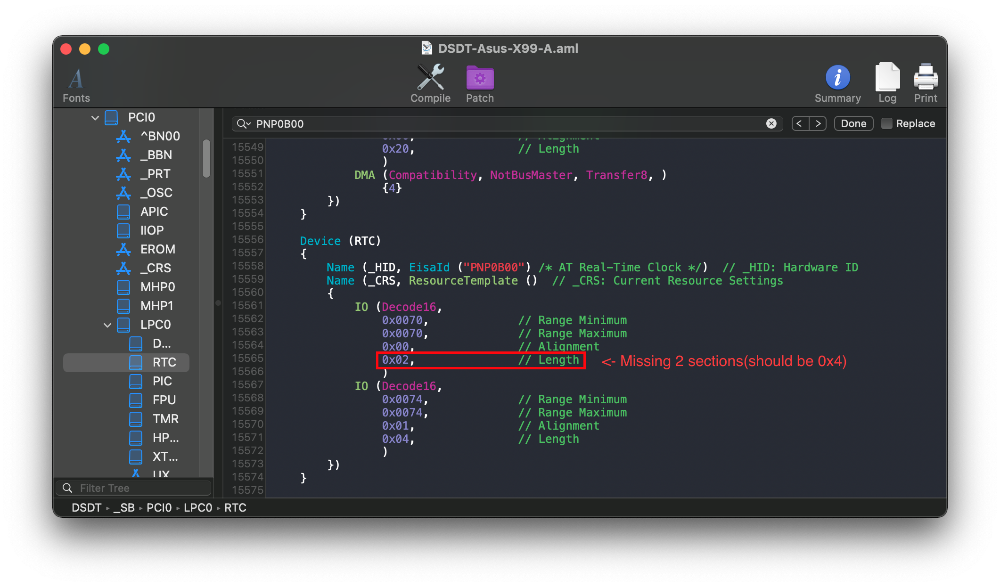
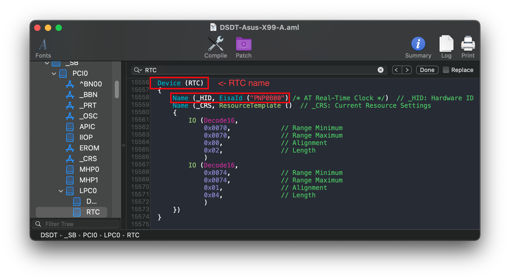
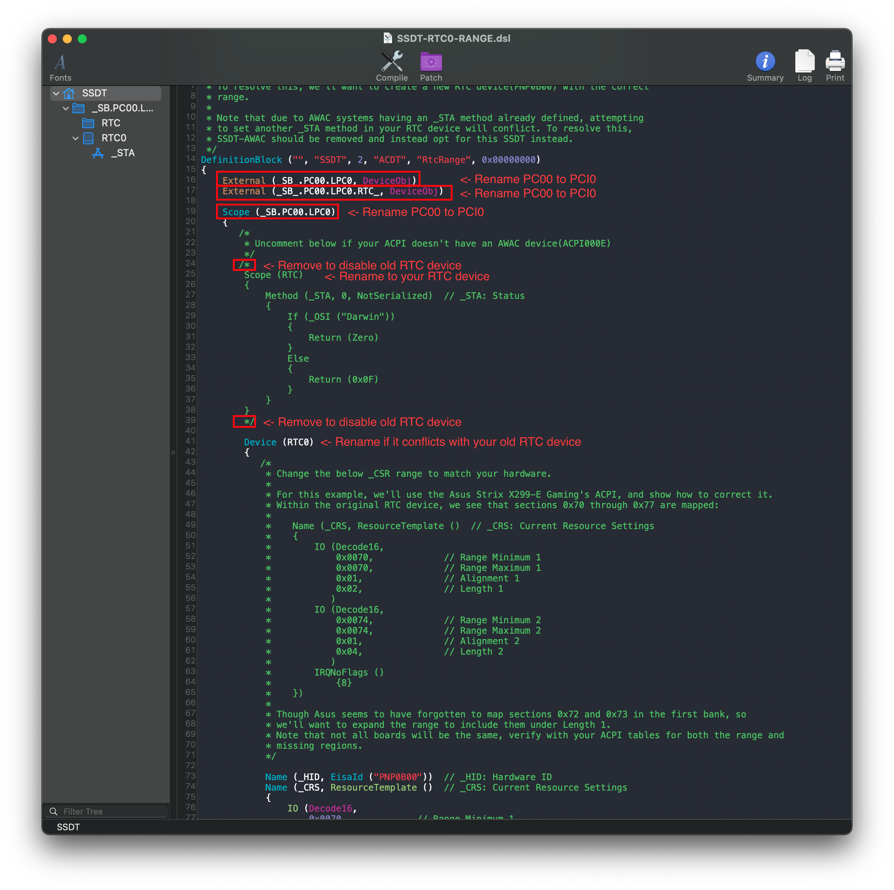
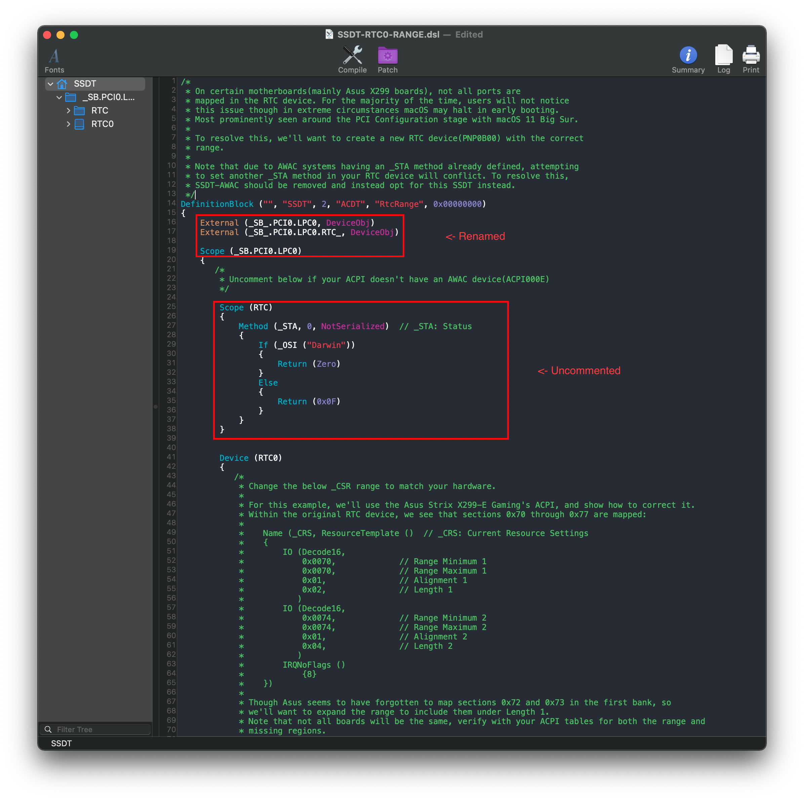

# Fixing System Clocks (SSDT-AWAC/RTC0)

[[toc]]

## What this SSDT does

The purpose of SSDT-AWAC/RTC0 is to fix the system clocks found on newer hardware, mainly found in the following:

* B360
* B365
* H310
* H370
* Z370 (Gigabyte and AsRock boards with newer BIOS versions)
* Z390
* B460
* Z490
* 400 series (Comet Lake, including Z490)
* 495 series (Icelake)
* X99
* X299

SSDT-AWAC tries to re-enable the old RTC clock that is compatible with macOS, while SSDT-RTC0 will instead create a "fake" RTC clock if there is no legacy one to enable.

## Methods to make this SSDT

For the RTC fix, there are 3 methods you can choose from:

* [Prebuilt](#prebuilt)
* [SSDTTime](#ssdttime)
  * **Does not support HEDT**
* [Manual](#manual)
  * For most users
* [Manual HEDT](#manual-hedt)
  * For X99 and X299 users

### Prebuilt

By far the easiest method, all you need to do is download the following file:

* [SSDT-AWAC.aml](https://github.com/macos86/Getting-Started-With-ACPI/blob/master/extra-files/compiled/SSDT-AWAC.aml)
  * For most users
* [SSDT-RTC0-RANGE-HEDT](https://github.com/macos86/Getting-Started-With-ACPI/blob/master/extra-files/compiled/SSDT-RTC0-RANGE-HEDT.aml)
  * For Intel's X99 and X299 platforms

Main things to note with this method:

* Assumes you both have an AWAC clock and it can be easily turned off with the RTC replacing it, **this may not always work**
  * This only applies to SSDT-AWAC
  * SSDT-RTC0-RANGE instead relies on known RTC names, and can only handle so many edge cases
* Doesn't really teach you anything
  * For most, this doesn't matter. But to some knowing what makes your hackintosh tick is part of the journey

### SSDTTime

::: warning Nota
Non supporta HEDT (X99 e X299)
:::

The second involves using SSDTTime which automates most of the process. See here on how to use it: [SSDTs: Easy Way](/ssdt-methods/ssdt-easy.md)

To get the SSDT-PMC, run the following:

* `7. Dump DSDT` then run `6. AWAC`

This will provide you with some files, the main one you care about is SSDT-AWAC.**aml**. or SSDT-RTC0.**aml**. The DSDT and .dsl are only left for referencing or verification.

The main things to note with this method:

* Doesn't really teach you anything
  * For most, this doesn't matter. But to some knowing what makes your hackintosh tick is part of the journey

### Manual

#### Determining which SSDT you need

::: warning Nota
X99 e X299 vedere [qui](#manual-hedt)
:::

Finding which SSDT you need is quite easy actually, first open your decompiled DSDT you got from [Dumping the DSDT](/dump.md) and [Decompiling and Compiling](/compile.md) with either MaciASL(if in macOS) or any other text editor if in Windows or Linux(VSCode has an [ACPI extension](https://marketplace.visualstudio.com/items?itemName=Thog.vscode-asl) that can also help).

Next search for `ACPI000E`. You should get something similar:



The above tells us a few things:

* We in fact do have an AWAC clock
  * If nothing shows up, you don't need to do anything for AWAC or RTC
* It can be easily disabled with STAS(if not, you can skip to here: [RTC0 Method](#rtc0-method))
  * `_STA` is the device status, with `Zero` meaning it won't show up
  
But to double check, next search for `PNP0B00`:



And looks at that, we can in fact disable our AWAC and enable the RTC! If not skip to here: [RTC0 Method](#rtc0-method)

Now it's as simple as grabbing [SSDT-AWAC.dsl](https://github.com/acidanthera/OpenCorePkg/tree/master/Docs/AcpiSamples/Source/SSDT-AWAC-DISABLE.dsl) and [compile](#compiling-the-ssdt), no changes needed You can also use the below SSDT to the same effect:

* [SSDT-AWAC.aml](https://github.com/macos86/Getting-Started-With-ACPI/blob/master/extra-files/compiled/SSDT-AWAC.aml)

#### RTC0 Method

This method is for those who either don't have a `PNP0B00` device to re-enable or have no easy way(via STAS variable).

##### Finding the ACPI path

Assuming you've gotten your DSDT already opened from earlier, search for the following:

* Finding the LowPinCount path:
  * Search `Name (_ADR, 0x001F0000)`
* Finding the PCI path:
  * Search `PNP0A08` (If multiple show up, use the first one)

You should get something like the following show up:

LPC Pathing          |  PCI Pathing
:-------------------------:|:-------------------------:
  |  

From the above, we can see we have both `PCI0` and `LPC`. Now we can head to the next stage

##### Edits to the sample SSDT

Now that we have our ACPI path, lets grab our SSDT and get to work:

* [SSDT-RTC0.dsl](https://github.com/acidanthera/OpenCorePkg/tree/master/Docs/AcpiSamples/Source/SSDT-RTC0.dsl)

By default, this uses `PCI0.LPCB` for the pathing. you'll want to rename accordingly.

Following the example from above, we'll be renaming it to `PCI0.LPC`:

```c
External (_SB_.PCI0.LPCB, DeviceObj) <- Rename this

Scope (_SB.PCI0.LPCB) <- Rename this
```



Following the example pathing we found, the SSDT should look something like this:

```c
External (_SB_.PCI0.LPC, DeviceObj) <- Renamed

Scope (_SB.PCI0.LPC) <- Renamed
```



##### Compiling the SSDT

With the SSDT done, you're now [ready to compile the SSDT!](/compile.md)

### Manual HEDT

#### Seeing if you need SSDT-RTC0-RANGE

To start, first open your decompiled DSDT you got from [Dumping the DSDT](/dump.md) and [Decompiling and Compiling](/compile.md) with either MaciASL(if in macOS) or any other text editor if in Windows or Linux(VSCode has an [ACPI extension](https://marketplace.visualstudio.com/items?itemName=Thog.vscode-asl) that can also help).

Now search for `PNP0B00` and look at the `_CRS` entry within it:



And from the above example, we see we have 2 banks of RTC memory:

* Bank 1: starts at 0x70 and is length 0x2
* Bank 2: starts at 0x74 and is length 0x4

Now the problem is that the OEM forgot to mat sections 0x72 and 0x73. Because of this, macOS may halt while booting(prominently in Big Sur)

And finally, verify if it has an _STA method as well. This will be used shortly

#### Finding the ACPI path

Finding the ACPI pathing is quite easy actually, first open your decompiled DSDT you got from [Dumping the DSDT](/dump.md) and [Decompiling and Compiling](/compile.md) with either MaciASL(if in macOS) or any other text editor if in Windows or Linux(VSCode has an [ACPI extension](https://marketplace.visualstudio.com/items?itemName=Thog.vscode-asl) that can also help).

To start, search for the following:

* Finding the RTC name:
  * Search `PNP0B00`
* Finding the LowPinCount path:
  * Search `Name (_ADR, 0x001F0000)`
* Finding the PCI path:
  * Search `PNP0A08` (If multiple show up, use the first one)

You should get something like the following show up:

RTC Pathing | LPC Pathing          |  PCI Pathing
:----------:|:-------------------------:|:-------------------------:
 |   |  

From the above, we can see we have `RTC`, `LPC0` and `PCI0`. Now we can head to the next stage

#### Edits to the sample SSDT

Now that we have our ACPI path, lets grab our SSDT and get to work:

* [SSDT-RTC0-RANGE.dsl](https://github.com/acidanthera/OpenCorePkg/tree/master/Docs/AcpiSamples/Source/SSDT-RTC0-RANGE.dsl)

By default, this uses `PC00.LPC0.RTC` for the pathing. you'll want to rename accordingly.

Following the example from above, we'll be renaming it to `PCI0.LPC0.RTC`:

```c
External (_SB_.PC00.LPC0, DeviceObj) <- Rename this

External (_SB_.PC00.LPC0.RTC_, DeviceObj) <- Rename this

Scope (_SB.PC00.LPC0) <- Rename this
```



Following the example pathing we found, the SSDT should look something like this:

```c
External (_SB_.PCI0.LPC0, DeviceObj) <- Renamed

Scope (_SB.PCI0.LPC0.RTC) <- Renamed

Scope (_SB.PCI0.LPC0) <- Renamed


  /* <- Remove if your RTC device didn't have an _STA
  Scope (RTC)
        {
            Method (_STA, 0, NotSerialized)  // _STA: Status
            {
                If (_OSI ("Darwin"))
                {
                    Return (Zero)
                }
                Else
                {
                    Return (0x0F)
                }
            }
        }
  */ <- Remove if your RTC device didn't have an _STA
```



##### Compiling the SSDT

With the SSDT done, you're now [ready to compile the SSDT!](/compile.md)

## Wrapping up

Once you're done making your SSDT, either head to the next page to finish the rest of the SSDTs or head here if you're ready to wrap up:

* [**Cleanup**](/cleanup.md)
