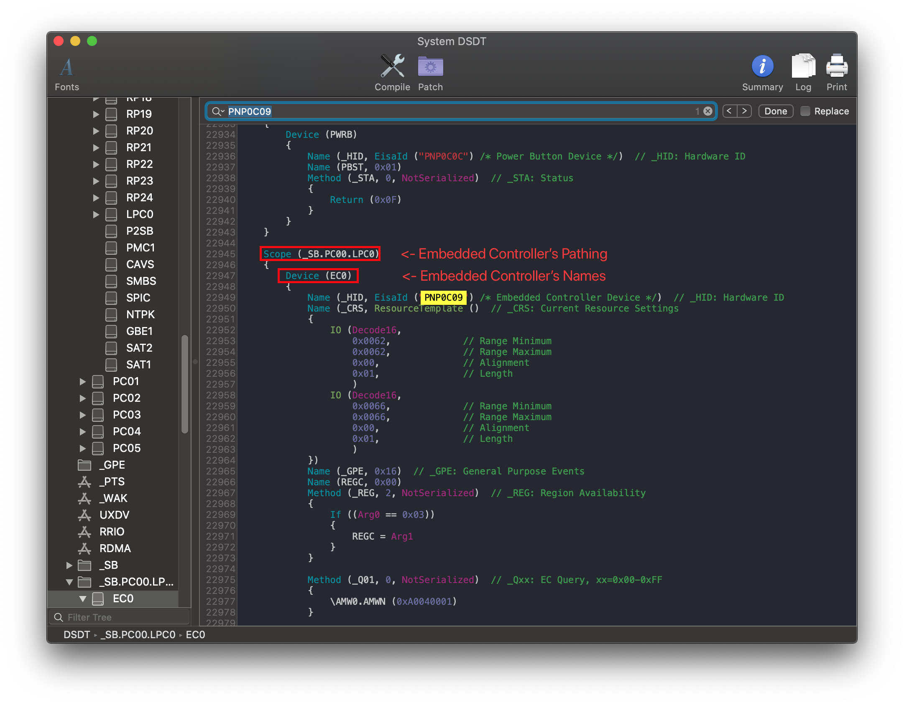
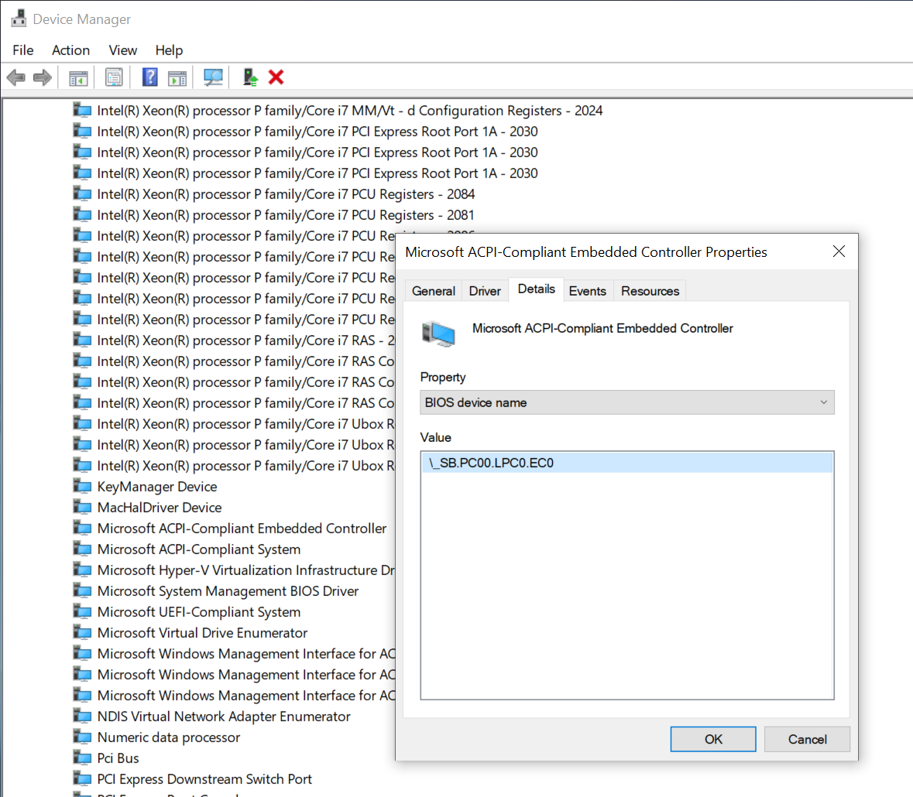
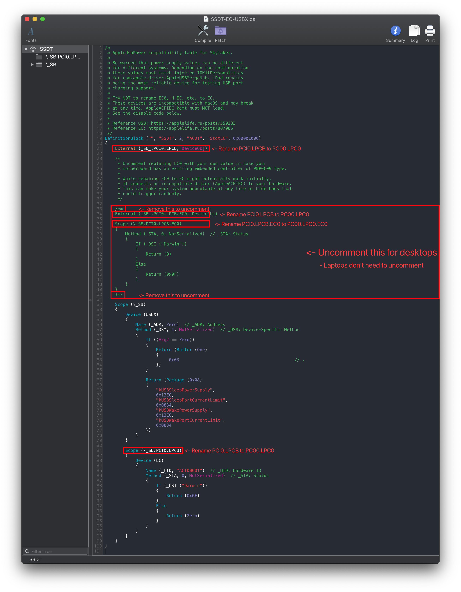
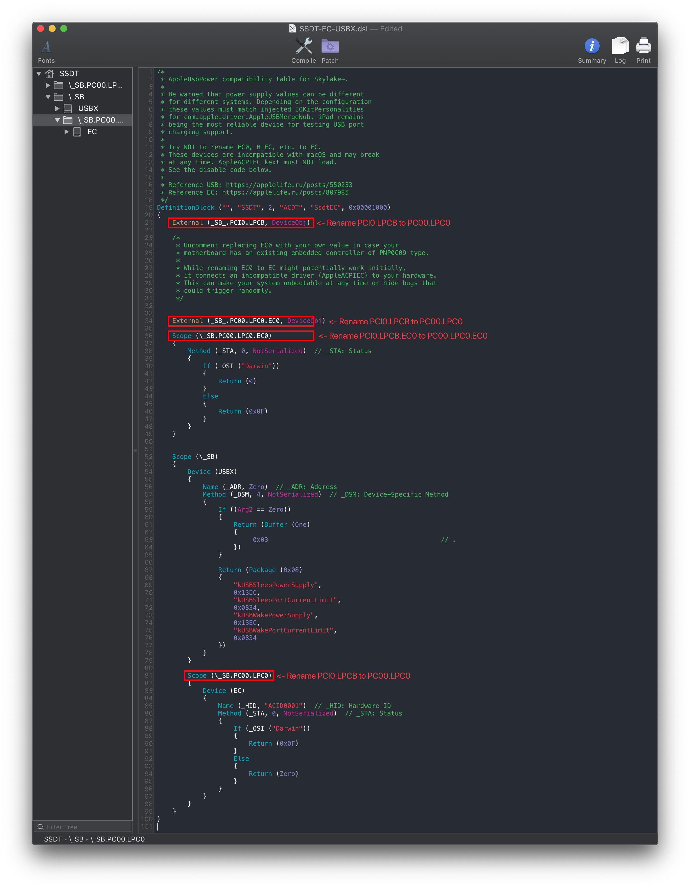
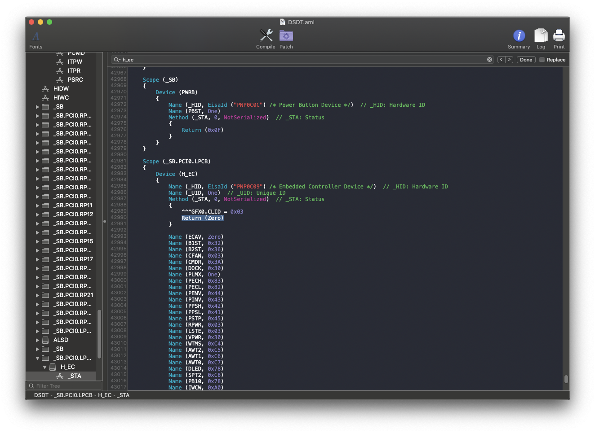

# Fixing Embedded Controller (SSDT-EC/USBX)

[[toc]]

## What this SSDT does

The purpose of SSDT-EC/USBX is a couple things:

* On desktops, the EC(or better known as the embedded controller) isn't compatible with AppleACPIEC driver, to get around this we disable this device when running macOS
* AppleBusPowerController will look for a device named `EC`, so we will want to create a fake device for this kext to load onto
  * AppleBusPowerController also requires a USBX device to supply USB power properties for Skylake and newer, so we will bundle this device in with the EC fix
* On laptops, the EC is used for hotkeys and battery so disabling this isn't all too ideal. Problem is our EC's name isn't compatible, so we will create a simple "fake" EC device that will satisfy Apple

So TL;DR:

* EC is embedded controller
* Desktops will want real EC off, and a fake EC created
* Laptops will just want an additional fake EC present
* Skylake and newer devices will want USBX as well

## Methods to make this SSDT

For the EC fix, there are 3 methods you can choose from:

* [Prebuilt](#prebuilt)
* [SSDTTime](#ssdttime)
* [Manual](#manual)

### Prebuilt

The main things to note with this method:

* Quite Bloated
  * There's ACPI naming for every type, this means there's added delays in boot times
* Doesn't really teach you anything
  * For most, this doesn't matter. But to some knowing what makes your hackintosh tick is part of the journey

By far the easiest way to fix your Embedded Controller is just downloading one of the files below:

#### Desktop

* [SSDT-EC-USBX-DESKTOP](https://github.com/macos86/Getting-Started-With-ACPI/blob/master/extra-files/compiled/SSDT-EC-USBX-DESKTOP.aml)
  * For Skylake desktops and newer and AMD CPU based systems
* [SSDT-EC-DESKTOP](https://github.com/macos86/Getting-Started-With-ACPI/blob/master/extra-files/compiled/SSDT-EC-DESKTOP.aml)
  * For Broadwell desktops and older

#### Laptops

* [SSDT-EC-USBX-LAPTOP.aml](https://github.com/macos86/Getting-Started-With-ACPI/blob/master/extra-files/compiled/SSDT-EC-USBX-LAPTOP.aml)
  * For Skylake laptops and newer
* [SSDT-EC-LAPTOP.aml](https://github.com/macos86/Getting-Started-With-ACPI/blob/master/extra-files/compiled/SSDT-EC-LAPTOP.aml)
  * For Broadwell laptops and older

### SSDTTime

The second involves using SSDTTime which automates most of the process. See here on how to use it: [SSDTs: Easy Way](/ssdt-methods/ssdt-easy.md)

To get the SSDT-EC on desktops, run the following:

* `7. Dump DSDT` then run `2. FakeEC`

To get the SSDT-EC on laptops, run the following:

* `7. Dump DSDT` then run `3.  FakeEC Laptop`

This will provide you with some files, the main one you care about is SSDT-EC.**aml**. The DSDT and .dsl are only left for referencing or verification.

The main things to note with this method:

* Doesn't provide you the USBX property to fix power
  * This can easily be fixed by using this prebuilt file in addition to SSDT-EC: [SSDT-USBX.aml](https://github.com/macos86/OpenCore-Post-Install/blob/master/extra-files/SSDT-USBX.aml)
  * Note USBX is only needed for Skylake and newer
* Doesn't really teach you anything
  * For most, this doesn't matter. But to some knowing what makes your hackintosh tick is part of the journey

### Manual

::: warning TO-DO

* Finish Edge cases and sample SSDT edits
:::

#### Finding the ACPI path

To find the ACPI pathing, you have 2 methods:

* [DSDT](#dsdt)
* [DeviceManager](#devicemanager)

##### DSDT

Finding the ACPI pathing is quite easy actually, first open your decompiled DSDT you got from [Dumping the DSDT](/dump.md) and [Decompiling and Compiling](/compile.md) with either MaciASL(if in macOS) or any other text editor if in Windows or Linux(VSCode has an [ACPI extension](https://marketplace.visualstudio.com/items?itemName=Thog.vscode-asl) that can also help).

Next, search for `PNP0C09`. You should get something similar:



From the above example we see 2 main things:

* Name of our embedded controller
  * In this case being `EC0`
* Pathing of our embedded controller
  * `PC00.LPC0`

But now we get into edge case territory, what fun!

If none of the above apply to you, you're ready for the next section:

##### DeviceManager

If you already have Windows installed on this machine, finding the EC pathing is fairly easy.

Start by opening up Device Manager in Windows and looking for a device named `Embedded Controller`. Once found, click on it and select the `BIOS device Name` entry. You should get something like this:



From the above, we can see that our pathing is `SB.PC00.LPC0.EC0`

Now with the pathing, you can head here: [Edits to the sample SSDT](#edits-to-the-sample-ssdt)

#### Edits to the sample SSDT

Now that we have our ACPI path, lets grab our SSDT and get to work:

* [SSDT-EC-USBX](https://github.com/acidanthera/OpenCorePkg/tree/master/Docs/AcpiSamples/Source/SSDT-EC-USBX.dsl)
  * For Skylake and newer and all AMD systems
* [SSDT-EC](https://github.com/acidanthera/OpenCorePkg/tree/master/Docs/AcpiSamples/Source/SSDT-EC.dsl)
  * For Broadwell and older
  
Now when opening this SSDT, you'll notice a few things. Mainly:

* Some code is commented out
  * This is code for disabling our EC
  * Laptops users **SHOULD NOT** uncomment this
* There's a new EC called `Device (EC)`
  * **DO NOT RENAME THIS**, this will be the EC we give to macOS

```
External (_SB_.PCI0.LPCB, DeviceObj) <- Rename this

Scope (_SB.PCI0.LPCB) <- Rename this
```



Following the example pathing we found, the SSDT should look something like this:

```
External (_SB_.PC00.LPC0, DeviceObj) <- Renamed

Scope (_SB.PC00.LPC0) <- Renamed
```



#### Edge Cases

##### Multiple PNP0C09's show up

When multiple PNP0C09 show up, we need to next check for the following properties:

* `_HID` (Hardware ID)
* `_CRS` (Current Resource Settings)
* `_GPE` (General Purpose Events)

What these signify is whether this PNP0C09 device is real or not, as per the [ACPI spec](https://uefi.org/sites/default/files/resources/ACPI_6_3_final_Jan30.pdf). So one's matching the above criteria are the one's we want to disable.

* Note: If _STA shows up as well, you'll need to go here: [PNP0C09 already has an `_STA` method](#no-pnp0c09-show-up)

##### No PNP0C09 show up

When this happens, you'll only need to create a "dummy" EC for macOS.

Try searching for any devices named: "LPCB", "LPC0", "LPC", "SBRG", "PX40". If you have any of these, try using the LPC pathing of each of those device in place of the Embedded Controller's pathing.

Note that **DO NOT** uncomment the EC disabling code as there are no devices that are considered "EC" in your machine.

##### PNP0C09 already named `EC`

Congrats! No need to create an SSDT-EC! However you will still want USBX if you're Skylake or newer.

Prebuilt can be grabbed here: [SSDT-USBX.aml](https://github.com/macos86/OpenCore-Post-Install/blob/master/extra-files/SSDT-USBX.aml)

##### PNP0C09 already has an `_STA` method

This is the equivalent of not having an EC as we can't control it with our SSDT-EC, instead we'll need to create a "dummy" EC for macOS. You'll still want to find the PCI and LPC pathing for this device. So follow the guide as if you were creating a laptop SSDT-EC/USBX.

Example of an EC with STA already:



#### Compiling the SSDT

With the SSDT done, you're now [ready to compile the SSDT!](/compile.md)

## Wrapping up

Once you're done making your SSDT, either head to the next page to finish the rest of the SSDTs or head here if you're ready to wrap up:

* [**Cleanup**](/cleanup.md)
