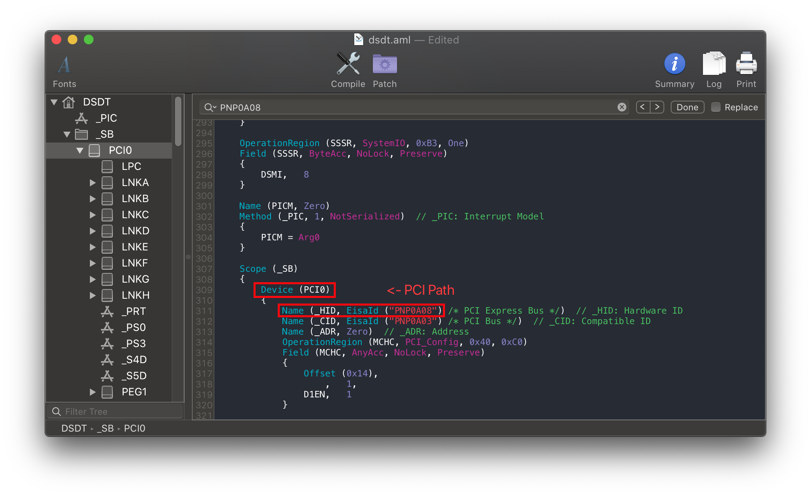

# Fixing NVRAM (SSDT-PMC)

[[toc]]

## What this SSDT does

This SSDT is required for all "true" 300 series motherboards(Z370 is excluded), it specifically brings back NVRAM support and requires very little configuration for the end user.

* B360
* B365
* H310
* H370 (HM370 shouldn't require this)
* Z390

10th gen motherboards **do not** need this SSDT, NVRAM's native on these platforms.

## Methods to make this SSDT

The main ways to make this SSDT:

* [Prebuilt](#prebuilt)
* [SSDTTime](#ssdttime)
* [Manual](#manual)

### Prebuilt

By far the easiest method, all you need to do is download the following file:

* [SSDT-PMC.aml](https://github.com/macos86/Getting-Started-With-ACPI/blob/master/extra-files/compiled/SSDT-PMC.aml)

Main things to note with this method:

* Bit Bloated
  * There's ACPI naming for most common paths, this means there's added delays in boot times(though unnoticeable to most as it's generally less than 0.5 seconds longer)
* Doesn't really teach you anything
  * For most, this doesn't matter. But to some knowing what makes your hackintosh tick is part of the journey

### SSDTTime

The second involves using SSDTTime which automates most of the process. See here on how to use it: [SSDTs: Easy Way](/ssdt-methods/ssdt-easy.md)

To get the SSDT-PMC, run the following:

* `7. Dump DSDT` then run `5. PMC`

This will provide you with some files, the main one you care about is SSDT-PMC.**aml**. The DSDT and .dsl are only left for referencing or verification.

The main things to note with this method:

* Doesn't really teach you anything
  * For most, this doesn't matter. But to some knowing what makes your hackintosh tick is part of the journey

### Manual

#### Finding the ACPI path

Finding the ACPI pathing is quite easy actually, first open your decompiled DSDT you got from [Dumping the DSDT](/dump.md) and [Decompiling and Compiling](/compile.md) with either MaciASL(if in macOS) or any other text editor if in Windows or Linux(VSCode has an [ACPI extension](https://marketplace.visualstudio.com/items?itemName=Thog.vscode-asl) that can also help).

Next, search for the following:

* Finding the LowPinCount path:
  * Search `Name (_ADR, 0x001F0000)`
* Finding the PCI path:
  * Search `PNP0A08` (If multiple show up, use the first one)

You should get something like the following show up:

LPC Pathing          |  PCI Pathing
:-------------------------:|:-------------------------:
  |  

Now with the pathing, you can head here: [Edits to the sample SSDT](#edits-to-the-sample-ssdt)

#### Edits to the sample SSDT

Now that we have our ACPI path, lets grab our SSDT and get to work:

* [SSDT-PMC.dsl](https://github.com/acidanthera/OpenCorePkg/tree/master/Docs/AcpiSamples/Source/SSDT-PMC.dsl)

By default, this uses `PCI0.LPCB` for the pathing. you'll want to rename accordingly.

Following the example from above, we'll be renaming it to `PCI0.LPC`:

```
External (_SB_.PCI0.LPCB, DeviceObj) <- Rename this

Scope (_SB.PCI0.LPCB) <- Rename this
```


Following the example pathing we found, the SSDT should look something like this:

```
External (_SB_.PCI0.LPC, DeviceObj) <- Renamed

Scope (_SB.PCI0.LPC) <- Renamed
```


#### Compiling the SSDT

With the SSDT done, you're now [ready to compile the SSDT!](/compile.md)

## Wrapping up

Once you're done making your SSDT, either head to the next page to finish the rest of the SSDTs or head here if you're ready to wrap up:

* [**Cleanup**](/cleanup.md)
