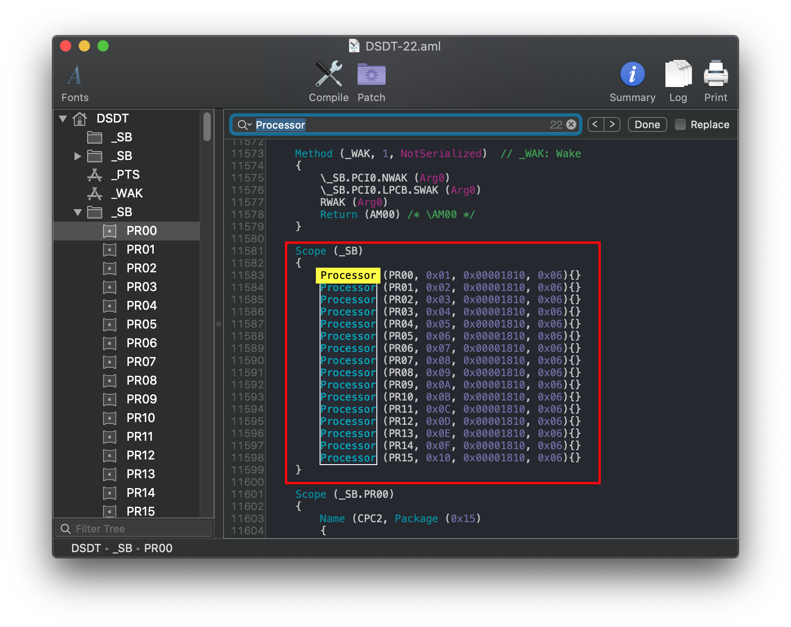
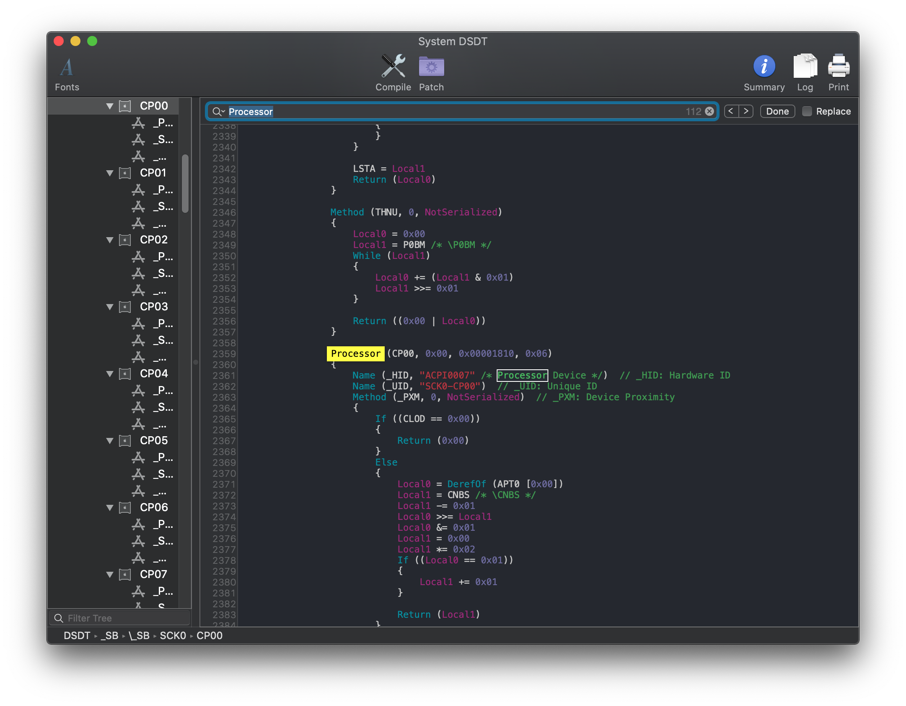
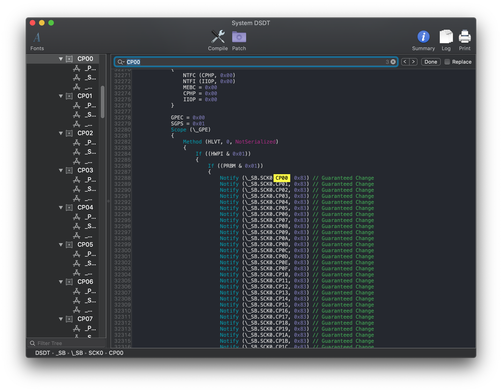
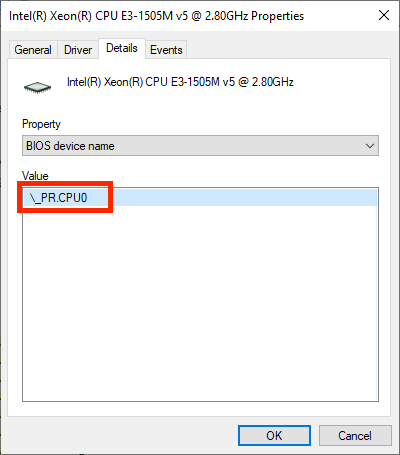
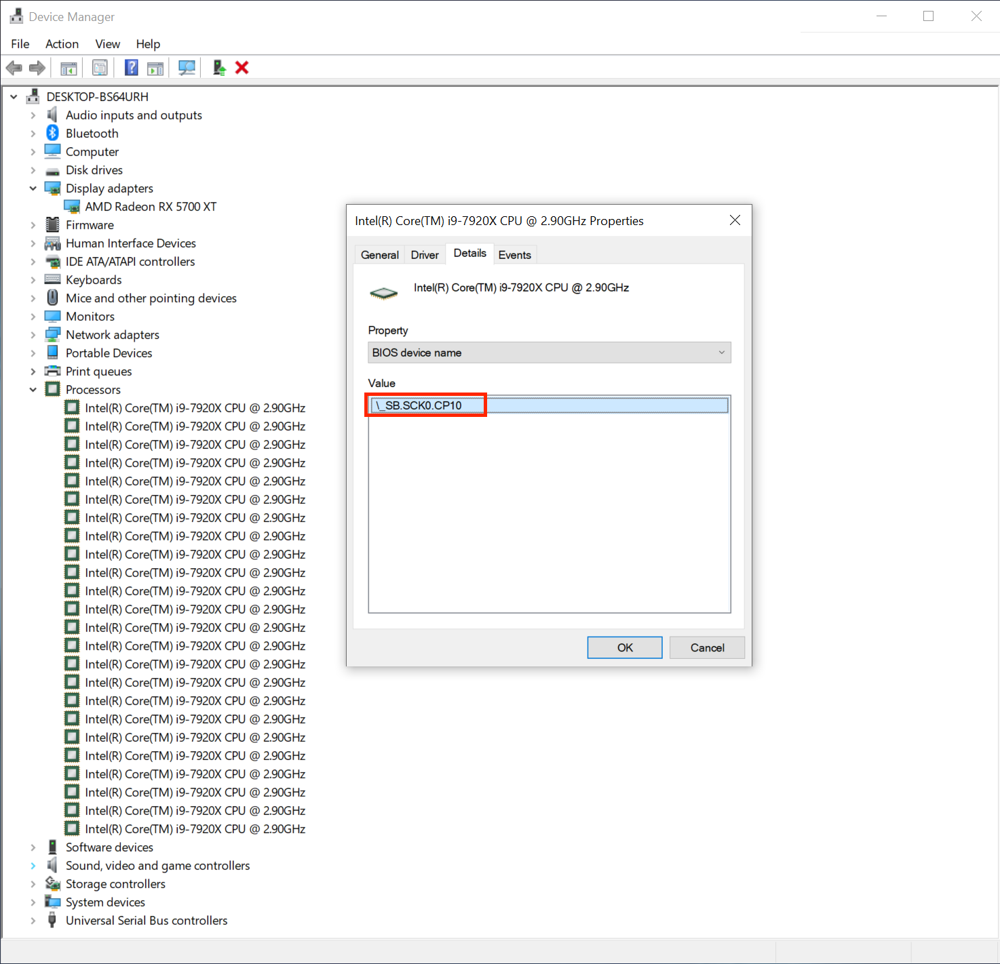
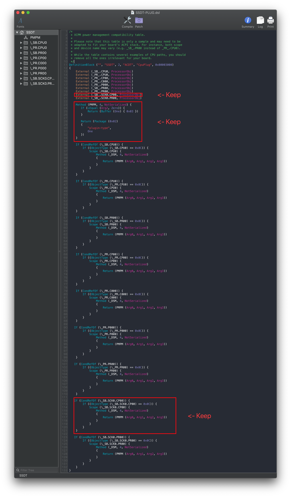
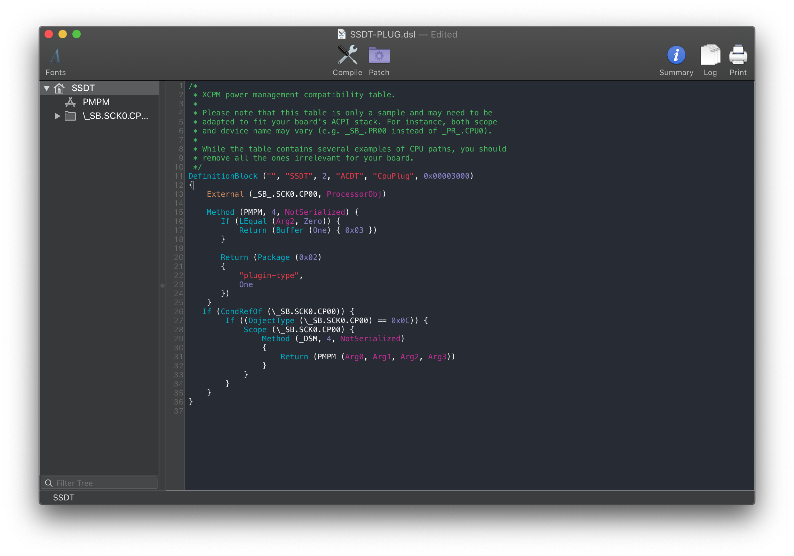

# Fixing Power Management (SSDT-PLUG)

[[toc]]

## What this SSDT does

The purpose of SSDT-PLUG is to allow the kernel's XCPM(XNU's CPU Power Management) to manage our CPU's power management. It's pretty self explanatory why you'd want this.

**Note**: SSDT-PLUG is only compatible with Intel's Haswell and newer CPUs, Sandy Bridge and Ivy Bridge will need to follow the [ssdtPRgen method](/OpenCore-Post-Install/universal/pm.md#sandy-and-ivy-bridge-power-management)(in post-install) while AMD users should not use this(unless attempting to attach AGPM which is outside the scope of Dortania's guides)

## Methods to make this SSDT

For SSDT-PLUG, there are 3 methods you can choose from:

* [Prebuilt](prebuilt.md)
* [SSDTTime](ssdttime.md)
* [Manual](manual.md)

### Prebuilt

By far the easiest way to get SSDT-PLUG is just downloading the below file:

* [SSDT-PLUG-DRTNIA.aml](https://github.com/macos86/Getting-Started-With-ACPI/blob/master/extra-files/compiled/SSDT-PLUG-DRTNIA.aml)

This prebuilt file is just a precompiled version of [SSDT-PLUG](https://github.com/acidanthera/OpenCorePkg/tree/master/Docs/AcpiSamples/Source/SSDT-PLUG.dsl) provided by Acidanthera.

The main things to note with this method:

* Quite Bloated
  * There's ACPI naming for every type, this means there's added delays in boot times(though unnoticeable to most as it's generally 0.5 seconds longer)
* Doesn't really teach you anything
  * For most, this doesn't matter. But to some knowing what makes your hackintosh tick is part of the journey

### SSDTTime

The second involves using SSDTTime which automates most of the process. See here on how to use it: [SSDTs: Easy Way](/ssdt-methods/ssdt-easy.md)

To get the SSDT-PLUG, run the following:

* `7. Dump DSDT` then run `3. PluginType`

This will provide you with some files, the main one you care about is SSDT-PLUG.**aml**. The DSDT and .dsl are only left for referencing or verification.

The main things to note with this method:

* Doesn't really teach you anything
  * For most, this doesn't matter. But to some knowing what makes your hackintosh tick is part of the journey

### Manual

#### Finding the ACPI path

To find the ACPI pathing, you have 2 methods:

* [DSDT](#dsdt)
* [DeviceManager](#devicemanager)

##### DSDT

CPU naming is fairly easy to figure out, first open your decompiled DSDT you got from [Dumping the DSDT](/dump.md) and [Decompiling and Compiling](/compile.md) with either MaciASL(if in macOS) or any other text editor if in Windows or Linux(VSCode has an [ACPI extension](https://marketplace.visualstudio.com/items?itemName=Thog.vscode-asl) that can also help).

Next search for `Processor`. This should give you a result like this:

As we can see, the first processor in our list is `SB.PR00`. This is what we'll be applying the `plugin-type=1` property too.

**X99 and X299 note**:

Due to the different DSDT structure of these systems, you'll need to actually check in multiple places as the pathing isn't as obvious:

If we then search for instances of `CP00` we find that its full ACPI pathing is `SB.SCK0.CP00`:

Now with the pathing, you can head here: [Edits to the sample SSDT](#edits-to-the-sample-ssdt)

###### DeviceManager

If you already have Windows installed on this machine, finding the CPU pathing is fairly easy.

Start by opening up Device Manager in Windows and looking for a device named `Processor`. Once found, click on it and select the `BIOS device Name` entry. You should get something like this:

From the above, we can see that our pathing is `PR.CPU0`. Pay close attention to the start as `PR` is important for creating the SSDT

**X99 and X299 note**:

Odd quirk of DeviceManager in Windows is that the Processor's order does not actually match the ACPI path, instead giving something like `SB.SCK0.CP10`:

When this happens, you can either:

* Look through and find the lowest value
* Assume the lowest(commonly being `PR00` or `CP00`)

So with the above X299 example, our CPU pathing would be `SB.SCK0.CP00`

Now with the pathing, you can head here: [Edits to the sample SSDT](#edits-to-the-sample-ssdt)

#### Edits to the sample SSDT

Now that we have our ACPI path, lets grab our SSDT and get to work:

* [SSDT-PLUG.dsl](https://github.com/acidanthera/OpenCorePkg/tree/master/Docs/AcpiSamples/Source/SSDT-PLUG.dsl)

From the above SSDT, it's very likely your processor is already there. If so, you can delete all the other entries other than yours and the `Method PMPM` as this is what injects the `plugin-type=1` property into our system.

* **Reminder**: We only need to apply `plugin-type=1` to the first thread

For the below example, we'll be using the X299 example(`SB.SCK0.CP00`)

Original          |  Cleaned Up
:-------------------------:|:-------------------------:
  |  

#### Compiling the SSDT

 With the SSDT done, you're now [ready to compile the SSDT!](/compile.md)

## Wrapping up

Once you're done making your SSDT, either head to the next page to finish the rest of the SSDTs or head here if you're ready to wrap up:

* [**Cleanup**](/cleanup.md)
