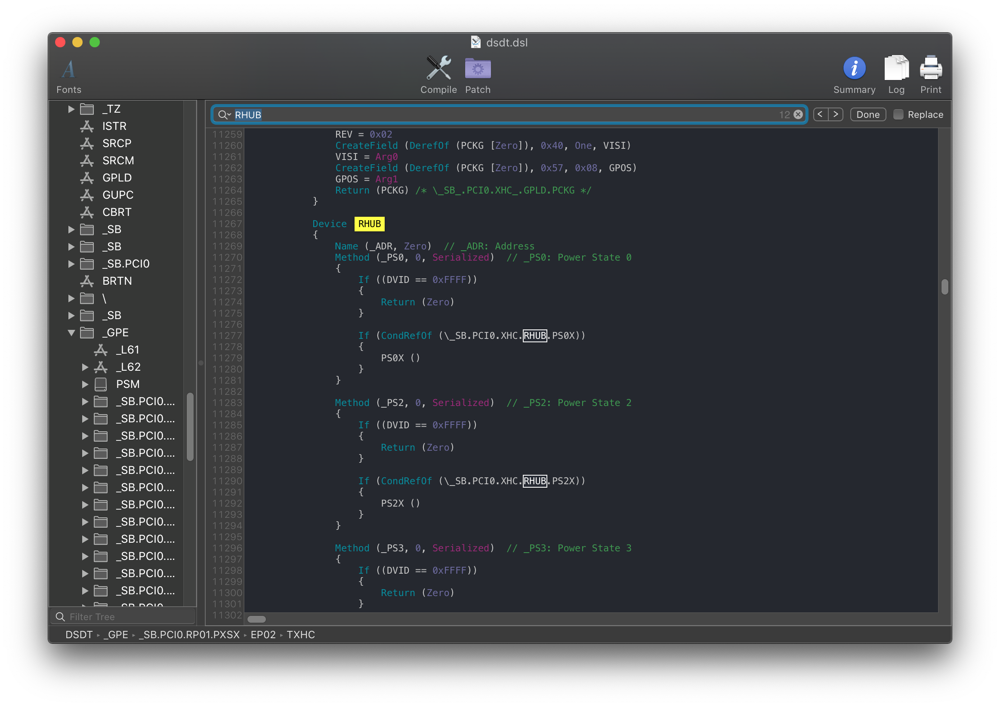
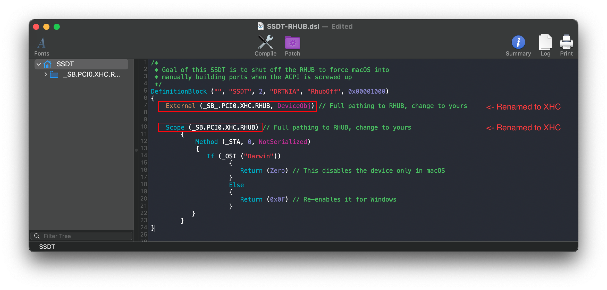

# Fixing USB

[[toc]]

## What this SSDT does

So on 400 series motherboards, certain OEMs have broken the ACPI spec and this results in issues when booting into macOS. To fix this, we'll want to turn off the RHUB device and force macOS to manually rebuild the ports.

The following platforms will require fixing:

* Mobile Icelake(currently Dell and Lenovo are the 2 known with this issue)
* Asus Z490 (Gigabyte and AsRock users are fine, whether MSI currently this is unknown)

## Methods to make this SSDT

For the RHUB fix, there are 3 methods you can choose from:

* [Prebuilt](#prebuilt)
* [SSDTTime](#ssdttime)
* [Manual](./manual.md)

### Prebuilt

By far the easiest method, all you need to do is download the following file:

* [SSDT-RHUB.aml](https://github.com/macos86/Getting-Started-With-ACPI/blob/master/extra-files/compiled/SSDT-RHUB.aml)

### SSDTTime

The second involves using SSDTTime which automates most of the process. See here on how to use it: [SSDTs: Easy Way](/ssdt-methods/ssdt-easy.md)

To get the SSDT-RHUB, run the following:

* `8. Dump DSDT` then run `7. USB Reset`

This will provide you with some files, the main one you care about is SSDT-USB-Reset.**aml**(Same file as SSDT-RHUB). The DSDT and .dsl are only left for referencing or verification.

The main things to note with this method:

* Doesn't really teach you anything
  * For most, this doesn't matter. But to some knowing what makes your hackintosh tick is part of the journey

### Manual

#### Finding the ACPI path

Finding the ACPI pathing is quite easy actually, first open your decompiled DSDT you got from [Dumping the DSDT](/dump.md) and [Decompiling and Compiling](/compile.md) with either MaciASL(if in macOS) or any other text editor if in Windows or Linux(VSCode has an [ACPI extension](https://marketplace.visualstudio.com/items?itemName=Thog.vscode-asl) that can also help).

Next, search for the `Device (RHUB)`

You should get something like the following show up:



From the above, we can see that the full ACPI pathing for RHUB is `PCI0.XHC.RHUB`. If it's not as clear you can search for what those device paths are for your system:

* Finding the PCI path:
  * Search `PNP0A08` (If multiple show up, use the first one)
* Finding XHCI path
  * Search for `XHC`, `XHCI` and `XHC1`, and yours is whichever shows up.

Now with the pathing, you can head here: [Edits to the sample SSDT](#edits-to-the-sample-ssdt)

#### Edits to the sample SSDT

Now that we have our ACPI path, lets grab our SSDT and get to work:

* [SSDT-RHUB.dsl](https://github.com/macos86/Getting-Started-With-ACPI/blob/master/extra-files/decompiled/SSDT-RHUB.dsl)

By default, this uses `PCI0.XHC1.RHUB` for the pathing. you'll want to rename accordingly.

Following the example from above, we'll be renaming it to `PCI0.XHC.RHUB`:

```
External (_SB_.PCI0.XHC1.RHUB, DeviceObj) <- Rename this

Scope (_SB.PCI0.XHC1.RHUB) <- Rename this
```


Following the example pathing we found, the SSDT should look something like this:

```
External (_SB.PCI0.XHC.RHUB, DeviceObj) <- Renamed

Scope (_SB.PCI0.XHC.RHUB) <- Renamed
```



#### Compiling the SSDT

 With the SSDT done, you're now [ready to compile the SSDT!](/compile.md)

## Wrapping up

Once you're done making your SSDT, either head to the next page to finish the rest of the SSDTs or head here if you're ready to wrap up:

* [**Cleanup**](/cleanup.md)
