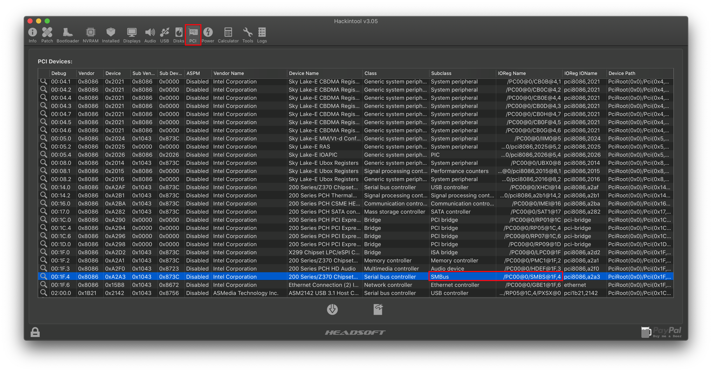
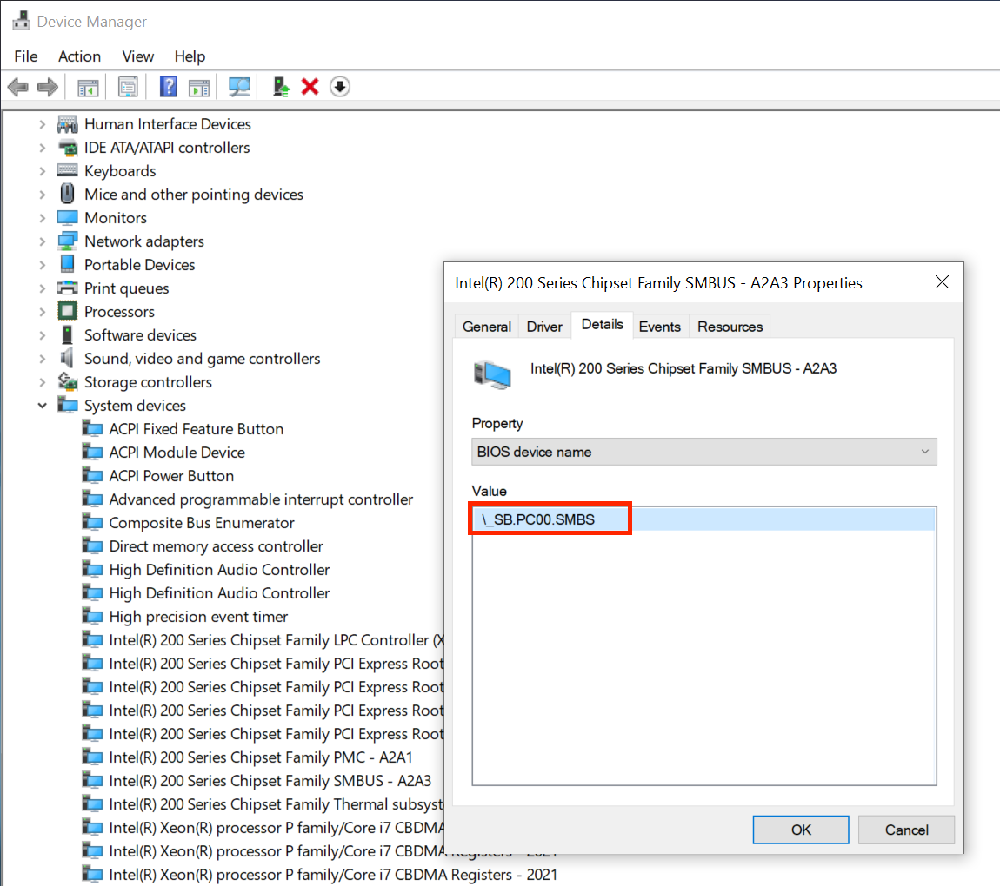
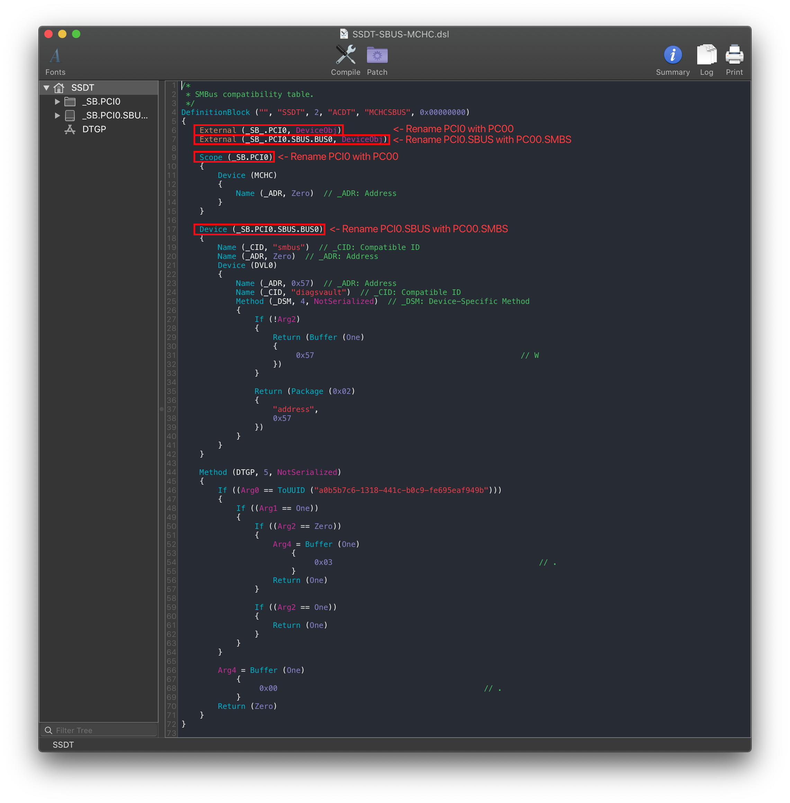
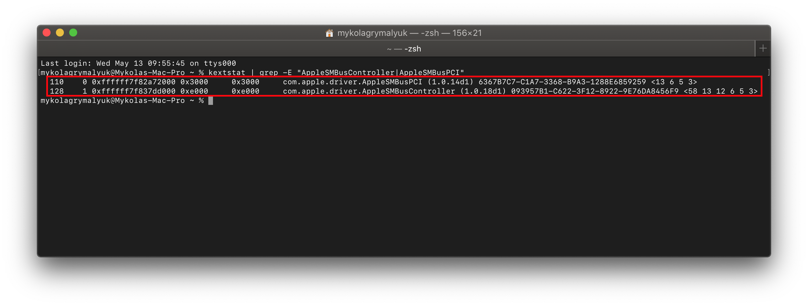

# Fixing SMBus support (SSDT-SBUS-MCHC)

[[toc]]

## What this SSDT does

This section of the guide refers to fixing AppleSMBus support in macOS, what is AppleSMBus? Well this mainly handles the System Management Bus, which has many functions like:

* AppleSMBusController
  * Aids with correct temperature, fan, voltage, ICH, etc readings
* AppleSMBusPCI
  * Same idea as AppleSMBusController except for low bandwidth PCI devices
* Memory Reporting
  * Aids in proper memory reporting and can aid in getting better kernel panic details if memory related
* Other things SMBus does: [SMBus wiki](https://en.wikipedia.org/wiki/System_Management_Bus)

For install purposes, this SSDT isn't needed but for post-install it's recommended to put the final touches on your hack.

## Methods to make this SSDT

To make this SSDT, you only got 1 method: Doing it manually.

### Fixing SMBus support: Manual

#### Finding the ACPI path

So to find the ACPI pathing of our SMBus, we've got 2 methods:

* [Hackintool](#hackintool)
* [DeviceManager](#devicemanager)

##### Hackintool

To find the correct pathing for your devices, grab [Hackintool](https://www.tonymacx86.com/threads/release-hackintool-v3-x-x.254559/) ([Github link](https://github.com/headkaze/Hackintool)) and head to the PCI tab:



Look for the SMBus device under Subclass, then look beside and you'll see the ACPI path(under IOReg Name). To convert , omit `@...`

* `/PC00@0/SMBS@1F,4` -> `PC00.SMBS`

With the ACPI pathing, you can now head here: [Edits to the sample SSDT](#edits-to-the-sample-ssdt)

##### DeviceManager

If you already have Windows installed on this machine, finding the SMBus pathing is fairly easy.

Start by opening up Device Manager in Windows and looking for a device named `SMBUS`. Once found, click on it and select the `BIOS device Name` entry. You should get something like this:



From the above example, we can see the SMBus is located at:

```
PC00.SMBS
```

With the ACPI pathing, you can now head here: [Edits to the sample SSDT](#edits-to-the-sample-ssdt)

#### Edits to the sample SSDT

Now that we know the ACPI pathing of the SMBus, we can finally start editing the our SSDT.

* [SSDT-SBUS-MCHC.dsl](https://github.com/acidanthera/OpenCorePkg/tree/master/Docs/AcpiSamples/Source/SSDT-SBUS-MCHC.dsl)

So the important parts we care about are:

```
External (_SB_.PCI0, DeviceObj) <- Rename this
External (_SB_.PCI0.SBUS.BUS0, DeviceObj) <- Rename this

Scope (_SB.PCI0) <- Rename this
{
    Device (MCHC)
    {
        Name (_ADR, Zero)  // _ADR: Address
    }
}

Device (_SB.PCI0.SBUS.BUS0) <- Rename this
```



Following the example SMBus pathing we found, the SSDT should look something like this:

```
External (_SB_.PC00, DeviceObj) <- Renamed
External (_SB_.PC00.SMBS.BUS0, DeviceObj) <- Renamed

Scope (_SB.PC00) <- Renamed
{
    Device (MCHC)
    {
        Name (_ADR, Zero)  // _ADR: Address
    }
}

Device (_SB.PC00.SMBS.BUS0) <- Renamed
```


#### Compiling the SSDT

 With the SSDT done, you're now [ready to compile the SSDT!](/compile.md)

#### Wrapping up

Once you're done making your SSDT, either head to the next page to finish the rest of the SSDTs or head here if you're ready to wrap up:

* [**Cleanup**](/cleanup.md)

#### Verify it's working

Once you've installed macOS, you can actually check whether your SSDT-SBUS-MCHC is working or not in terminal:

```
kextstat | grep -E "AppleSMBusController|AppleSMBusPCI"
```


