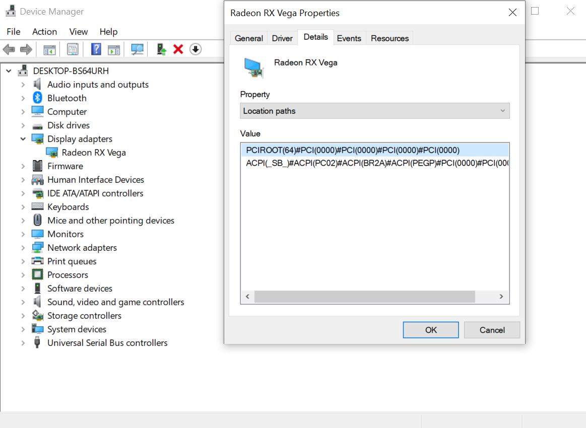
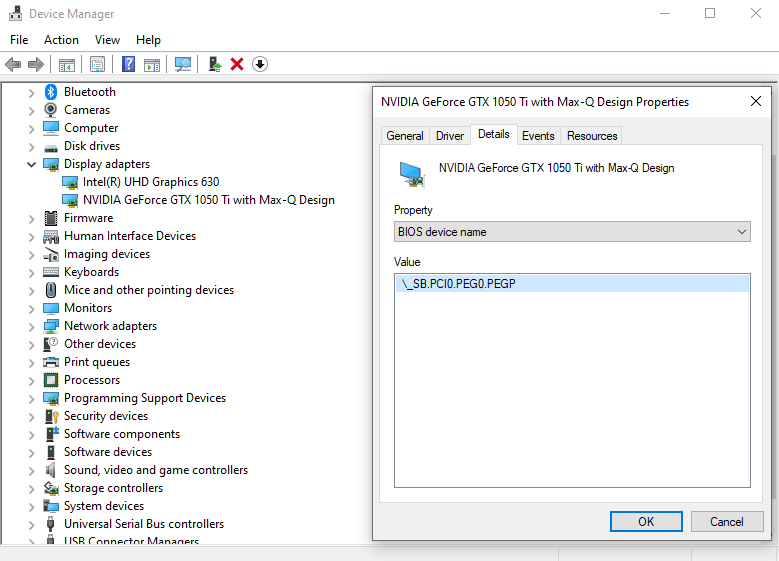

# Disabilitare le GPU nei desktop (SSDT-GPU-DISABLE)

[[toc]]

Questo è necessario per le GPU non supportate da macOS, necessario principalmente per gli utenti Nvidia e per chi la accoppia a una GPU AMD per usare macOS. WhateverGreen supporta il boot-arg `-wegnoegpu`, ma funziona soltanto quando usi una iGPU perciò per il resto dovremmo creare un SSDT.

Perciò, per disabilitare una GPU specifica, dobbiamo trovare due cose:

* Percorso ACPI della GPU
* [SSDT-GPU-DISABLE](https://github.com/macos86/Getting-Started-With-ACPI/blob/master/extra-files/decompiled/SSDT-GPU-DISABLE.dsl)

## Trovare il Percorso ACPI della GPU

Trovare il percorso PCI di una GPU è abbastanza semplice, il miglior modo di farlo e di usare Windows:

* Apri Gestione Dispositivi
* Seleziona Adattatori Schermo, dopo fai un doppio click sulla tua GPU
* Sotto la scheda Dettagli, cerca per "Percorso di Allocazione" (Location Paths)
  * Nota che alcune GPU potrebbero nasconderlo sotto la voce "Nome dispositivo BIOS"





"ACPI" è ciò che ci interesssa:

```
ACPI(_SB_)#ACPI(PC02)#ACPI(BR2A)#ACPI(PEGP)#PCI(0000)#PCI(0000)
```

Ora convertiamo questo percorso in uno più semplice, rimuovi ogni `#ACPI` e `#PCI(0000)`:

```
`_SB_.PC02.BR2A.PEGP
```

Et voilà! Abbiamo trovato il percorso ACPI, ora abbiamo tutto e siamo pronti

## Creare l'SSDT

Iniziamo prendendo il nostro [SSDT-GPU-DISABLE](https://github.com/macos86/etting-Started-With-ACPI/blob/master/extra-files/decompiled/SSDT-GPU-DISABLE.dsl) e aprilo. Qui ci sono due cose da cambiare:

```c
External (_SB_.PCI0.PEG0.PEGP, DeviceObj)
Method (_SB.PCI0.PEG0.PEGP._DSM, 4, NotSerialized)
```

Nel nostro esempio, cambieremo tutte le menzioni di:

* `PCI0` con `PC02`
* `PEG0` con `BR2A`

Suggerimento: Se il tuo percorso ACPI è più corto del previsto, questo è normale. Sii sicuro che il percorso sia quello del dispositivo giusto, alcuni utenti dovranno adattare `_SB_` in maniera simile al percorso corretto

## [Ora sei pronto per compilare questo SSDT!](/compile.md)
