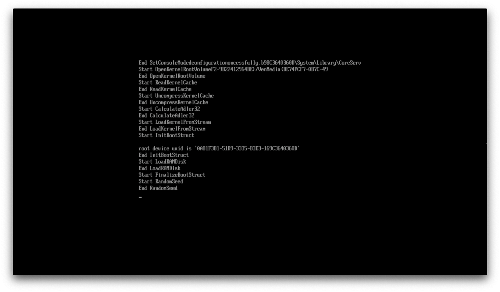
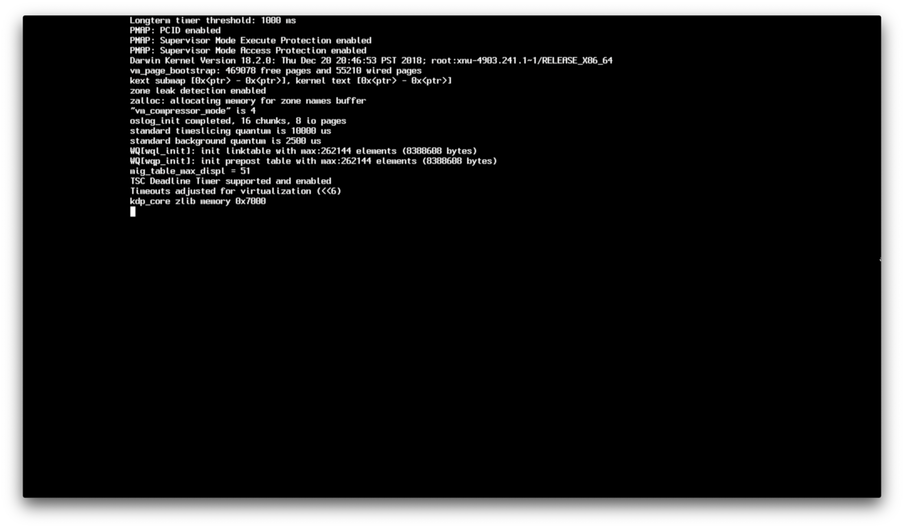
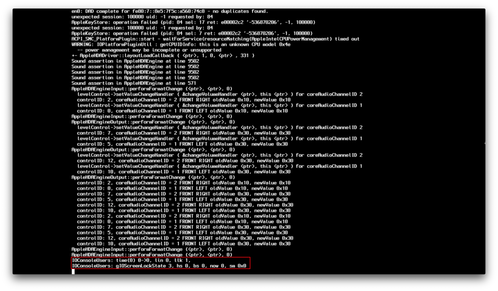

# Comprendere il processo di avvio di macOS

Quindi, con la risoluzione dei problemi di un hackintosh, può essere un po 'difficile capire veramente *dove* ti trovi bloccato poiché la parola chiave esatta che stai cercando di trovare potrebbe non corrispondere a nulla su Google. Anche se questa pagina non risolverà tutti i tuoi problemi, dovrebbe almeno aiutare a capire meglio dove ti trovi bloccato nel processo di avvio di macOS e, si spera, dare alcune idee sul motivo per cui sei bloccato.

## Avvio di OpenCore

Questa sezione sarà breve, poiché i problemi di avvio di OpenCore sono abbastanza rari e di solito un semplice errore dell'utente:

* Il sistema si accende e cerca i dispositivi di avvio
* Il sistema individua BOOTx64.efi su OpenCore USB sotto EFI/BOOT/
* Viene caricato BOOTx64.efi che quindi carica a catena OpenCore.efi da EFI/OC/
* Vengono applicate le proprietà NVRAM
* I driver EFI vengono caricati da EFI/OC/Drivers
* Il protocollo GOP (Graphics Output Protocol) è installato
* Le tabelle ACPI vengono caricate da EFI/OC/ACPI
* I dati in SMBIOS vengono applicati
* OpenCore carica e mostra tutte le possibili opzioni di avvio
* Ora avvia il tuo programma di installazione di macOS

Se a questo punto hai problemi con l'avvio, queste le cose principali da controllare:

* [Bloccato a `no vault provided!`](./extended/opencore.md#bloccato-su-no-vault-provided!)
* [Non vedi le partizioni macOS](./extended/opencore.md#non-riesco-a-vedere-le-partizioni-macos)
* [L'avvio di OpenCore si riavvia nel BIOS](./extended/opencore.md#l'avvio-di-OpenCore-riavvia-nel-bios)

Per il resto dei possibili problemi, vedere qui:

* [Problemi di avvio di OpenCore](./extended/opencore.md)

## boot.efi Handoff



È qui che entra in scena il bootloader di macOS (boot.efi), in particolare quello che fa è preparare l'ambiente per il caricamento del kernel e dove OpenCore inietta kexts. Se ti blocchi a questo punto, è probabile che ci sia un problema con il caricamento del kernel, i principali colpevoli:

* [Bloccato a EndRandomSeed](./extended/kernel.md#bloccato-su-endrandomseed)
* [Bloccato a `[EB|#LOG:EXITBS:START]`](./extended/kernel.md#bloccato-su-eb-log-exitbs-start)
* [`Couldn't allocate runtime area` errors](./extended/kernel.md#errori-couldn-t-allocate-runtime-area)

Per il resto dei possibili problemi, vedere qui:

* [Problemi del kernel](./extended/kernel.md)

**Nota**: In macOS 10.15.4, Apple ha cambiato il protocollo di debug boot.efi, quindi le cose appariranno un po 'diverse rispetto a prima ma si applicano ancora tutte le stesse regole

## XNU/Kernel Handoff

Ora che boot.efi ha configurato tutto per noi, ora possiamo vedere il kernel che fa le sue cose. Questa sezione è comunemente denominata [Fase di root](https://developer.apple.com/library/archive/documentation/Darwin/Conceptual/KernelProgramming/booting/booting.html):



Questa sezione è dove vengono verificati i dati SMBIOS, vengono caricate le tabelle ACPI/Kext e macOS cerca di mettere tutto in ordine. I guasti qui sono generalmente il risultato di:

* SSDTs Corrotti
* Kexts corrotti (o impostati in modo errato nel tuo config.plist sotto -> Kernel -> Add)
* Mappa della memoria incasinata

Vedi qui per ulteriori informazioni sulla risoluzione dei problemi:

* [Kernel Panic `Cannot perform kext summary`](./extended/kernel.md#kernel-panic-cannot-perform-kext-summary)
* [Kernel Panic in `Invalid frame pointer`](./extended/kernel.md#kernel-panic-on-invalid-frame-pointer)


Ora qui abbiamo "[Iniziano le configurazioni PCI]", questa sezione può essere vista come un test hardware per i nostri sistemi, kext e SSDT che abbiamo inserito, e dove IOKit avvia i test hardware per trovare i dispositivi a cui collegarsi.

Le cose principali che vengono testate qui:

* Embedded Controllers
* Storage(NVMe, SATA, etc)
* PCI/e
* NVRAM
* RTC
* PS2 and I2C

Per informazioni più specifiche su come muoversi in quest'area, vedere qui:

* [Bloccato su `RTC...`, `PCI ConfigurationBegins`, `Previous Shutdown...`, `HPET`, `HID: Legacy...`](./extended/kernel.md#bloccato-su-rtc-pci-configurationbegins-previous-shutdown-hpet-hid-legacy)


È qui che entrano in gioco il limite di 15 porte e la mappatura USB, e dove compaiono i famigerati errori "Waiting for Root Device"; cose principali da controllare:

* ["Waiting for Root Device" o Prohibited Sign error](./extended/kernel.md#errore-waiting-for-root-device-or-prohibited-sign)


È qui che i nostri FakeSMC/VirtualSMC entrano in scena e fanno la loro magia, DSMOS stesso è un kext che verifica se il tuo sistema ha un SMC e richiederà una chiave. Se questa chiave non è presente, DSMOS non decrittograferà il resto dei file binari e rimarrai bloccato qui. Potresti anche rimanere bloccato su AppleACPICPU che è lo stesso errore.

* [kextd stall[0]: AppleACPICPU](./extended/kernel.md#kextd-stall-0-appleacpicpu)

```
Il tuo controllo odierno del karma:
C'era una volta un utente che piagnucolava
il suo sistema operativo esistente era così cieco,
sarebbe stato meglio piratare un sistema operativo che funziona alla grande
ma ha scoperto che il suo hardware è stato rifiutato.
Per favore, non rubare Mac OS!
Davvero, è così poco cool.
(C) Apple Computer, Inc.
```

Fonte: non rubare Mac OS X.kext


È qui che entra in gioco il driver audio di Apple e dove brilla AppleALC. Generalmente è raro vedere problemi qui, ma se lo fai, prova a disabilitare AppleALC e qualsiasi altro kext relativo all'audio.



E qui arriviamo all'inizializzazione del driver della GPU e dove anche WhateverGreen fa la sua magia. Generalmente gli errori qui sono dovuti alla GPU e non a WhateverGreen stesso; questi di solito sono i principali colpevoli:

* [Bloccato o vicino a `IOConsoleUsers: gIOScreenLock...`](./extended/kernel.md#bloccato-su-o-vicino-ioconsoleusers-gioscreenlock-giolockstate-3))
* [Schermo nero dopo `IOConsoleUsers: gIOScreenLock...` on Navi](./extended/kernel.md#schermo-nero-dopo-ioconsoleusers-gioscreenlock-su-navi)

## macOS Handoff


E finalmente hai superato tutto quel verbose! Se rimani bloccato sul logo Apple dopo tutto quel verbose, ci sono un paio di cose da controllare:

* [macOS congelato subito prima dell'accesso](./extended/kernel.md#macOS-bloccato-subito-prima-dell-accesso)
* [Schermo nero dopo `IOConsoleUsers: gIOScreenLock...` con Navi](./extended/kernel.md#schermo-nero-dopo-ioconsoleusers-gioscreenlock-su-navi)
* [Congelato nel programma di installazione di macOS dopo 30 secondi](./extended/userspace-issues.md#programma-di-installazione-di-macOS-congelato-dopo-30-secondi)
