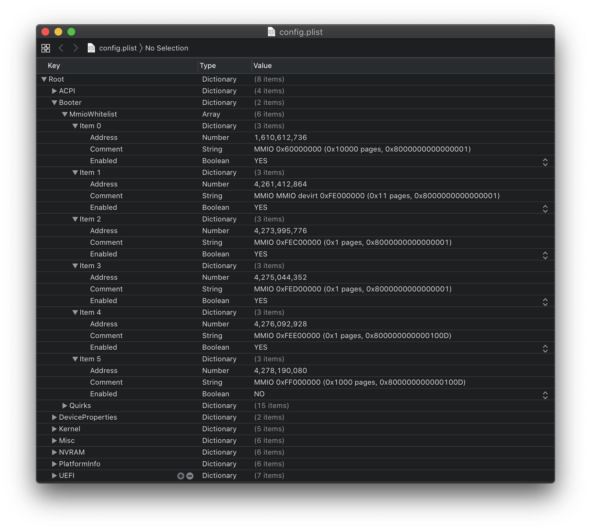

# Correzione dei valori delle slide KASLR

Questa sezione è per gli utenti che desiderano comprendere e correggere gli errori tipo `Couldn't allocate runtime area`. Questo genere di errore si presenta abbastanza frequentemente con le schede madri con chipset Z390, X99 e X299.

* Nota: in questa guida viene supportato solo OpenCore. Clover non viene minimamente considerato

## Dunque, cos'è questo KASLR?

KASLR (dall'inglese `Kernel Address Space Layout Randomization`) sta per `randomizzazione del layout dello spazio degli indirizzi del kernel` ed è un meccanismo di sicurezza per proteggere l'accesso a determinate aree di memoria relative al kernel. In particolare, per un aggressore è molto più difficile capire dove si trovano gli oggetti importanti in memoria poiché cambia ad ogni avvio del sistema operativo. [Maggiori spiegazioni riguardo al KASLR](https://lwn.net/Articles/569635/)

KASLR diventa un problema quando si introducono dispositivi con piccole mappe di memoria o semplicemente troppi dispositivi presenti. Probabilmente c'è spazio per il funzionamento del kernel, ma c'è anche spazio libero in cui il kernel non si adatta completamente. È qui che ricorriamo a `slide = xxx`. Invece di lasciare che macOS scelga un'area casuale da utilizzare ad ogni avvio, lo costringeremo a scegliere un'area ben specifica che sappiamo funzionerà.

## E per chi sono queste informazioni?

Bene, come ho detto prima, questo è per gli utenti che non hanno abbastanza spazio per il kernel o si muovonono in uno spazio troppo piccolo. Generalmente riscontrerai un errore simile a questo all'avvio:

```
Error allocating 0x1197b pages at 0x0000000017a80000 alloc type 2
Couldn't allocate runtime area
```

Con qualche variazione:

```
Only 244/256 slide values are usable!
```

O addirittura si arresta in modo anomalo durante l'esecuzione di macOS:

```
panic(cpu 6 caller 0xffffff801fc057ba): a freed zone element has been modified in zone kalloc.4096: expected 0x3f00116dbe8a46f6 but found 0x3f00116d00000000
```

La parte migliore di questi errori è che possono essere casuali, anche il motivo per cui spegnere e riaccendere il PC 20 volte può anche risolvere il problema, ma solo temporaneamente.

Fatto divertente: ci vogliono circa **31 ms** per trovare un'area in cui operare e l'impostazione manuale di un valore di slide può in media ridurre i tempi di avvio dello **0,207%** !!!

## Allora come risolvo questo problema?

La vera soluzione in realtà è abbastanza semplice. Avrai bisogno di:

* **OpenCore users**:
  * [OpenRuntime](https://github.com/acidanthera/OpenCorePkg/releases)
  * [OpenShell](https://github.com/acidanthera/OpenCorePkg/releases)(Non dimenticare di abilitarlo in `Root -> Misc -> Tools`)

E dovremo anche configurare il nostro config.plist -> Booter:

* **AvoidRuntimeDefrag**: YES
  * Corregge i servizi di runtime UEFI come data, ora, NVRAM, controllo dell'alimentazione, ecc
* **DevirtualiseMmio**: YES
  * Riduce l'impronta di memoria rubata, espande le opzioni per i valori "slide=N" ed è molto utile per risolvere i problemi di allocazione della memoria su Z390.
* **EnableSafeModeSlide**: YES
  * Consente di utilizzare i valori dello slide in modalità provvisoria
* **ProtectUefiServices**: NO
  * Protegge i servizi UEFI dall'override del firmware, principalmente rilevante per VM, serie 300 e sistemi più recenti come Ice Lake e Comet Lake
* **ProvideCustomSlide**: YES
  * Questo assicura che il kernel scelga solo regioni buone ed eviti quelle che potrebbero causare errori di avvio. È ancora casuale ma omette quelle regioni difettose nella sua randomizzazione
* **RebuildAppleMemoryMap**: YES
  * Genera una mappa di memoria compatibile con macOS in modo che si adatterà a ciò che il kernel si aspetta. Su alcuni firmware OEM di laptop potresti non essere in grado di avviare con questa opzione attiva. Nel caso disattivala.

## To fix ^^

## Preparazione del BIOS

Il motivo per cui abbiamo bisogno di ripristinare la mappa di memoria è che vogliamo che sia più stabile, che ci siano meno variazioni ad ogni avvio e di conseguenza meno casi limite (le mappe di memoria non sempre sono perfette). Per iniziare:

* Aggiorna il BIOS all'ultima versione (i primi BIOS spediti sono noti per avere problemi con il memory layout, specialmente con Z390)
* Resettare il CMOS
* Abilitare alcune impostazioni del BIOS necessarie:
  * `Above4GDecoding`: consente ai dispositivi PCI di utilizzare regioni di memoria superiori a 4 GB, il che significa che macOS avrà più spazio per adattarsi; può essere problematico su alcuni chipset come X99 e X299 quindi consigliamo di attivarla e in caso di problemi disattivarla.
    * Nota: Dal 2020 nei BIOS è stato introdotto il supporto al `Resizable BAR`, opzione che si sblocca con l'abilitazione di `Above4GDecoding`. Assicurarsi che `Booter -> Quirks -> ResizeAppleGpuBars` sia impostato su `0` se l'opzione si presenta.
  * `Opzioni di avvio -> Modalità Windows 8.1/10`: ci assicurerà che non verranno caricate delle opzioni per dispositivi legacy. Fun fact: `Other OS` è progettato solo per l'avvio di versioni precedenti di Windows e non per altri sistemi operativi.
* Disabilitare tutti i dispositivi non necessari nel BIOS (questo significa che ci sarà meno variazione nel memory layout ad ogni avvio, quindi meno possibilità di errori in fase di avvio). Impostazioni comuni:
  * `CSM`: per il supporto legacy, aggiunge un mucchio di spazzatura che non vogliamo. Anche questo può causare problemi in fase di avvio.
  * `Intel SGX`: Software Guard Extensions, occupa molto spazio e non ha alcuna utilità in macOS.
  * `Parallel Port`: macOS non può nemmeno sfruttare le porte parallele.
  * `Serial Port`: Sarei curioso di sapere quanti di voi le stiano usando per fare debug del kernel...
  * `iGPU`: Non è l'ideale, ma alcuni sistemi hanno mappe talmente grandi che l'iGPU non può adattarsi.
  * `Thunderbolt`: Molti hack non supportano Thunderbolt; le schede che non hanno dispositivi Thunderbolt ma che hanno questa opzione sprecano solo più spazio.
  * `Illuminazione a LED`: Scusa amico, è ora di andare.
  * `USB legacy`: più schifezze legacy.

## Avvio di prova

Con le nostre impostazioni EFI, config.plist e BIOS modificate, è ora di provare la nostra nuova configurazione. Se hai ancora problemi, ci sarà da indagare ancora più a fondo per calcolare il valore di slide.

## Calcolare il valore dello slide

Quello che dovrai fare è aprire una shell EFI (OpenShell, UEFIShell) nel tuo boot manager preferito ed eseguire `memmap`. L'output ti darà un elenco di tutte le pagine di memoria e delle loro relative dimensioni. E qui inizia il divertimento:

Esempio di ciò che vedrai:

| Type | Start | End | \# Pages | Attributes |
| :--- | :--- | :--- | :--- | :--- |
| RT_Data | `0000000000000000` | `0000000000000FFF` | `0000000000000001` | `800000000000000F` |
| Available | `0000000000001000` | `0000000000057FFF` | `0000000000000057` | `000000000000000F` |
| Reserved | `0000000000058000` | `0000000000058FFF` | `0000000000000001` | `000000000000000F` |
| Available | `0000000000059000` | `000000000008FFFF` | `0000000000000037` | `000000000000000F` |
| RT_Code | `0000000000090000` | `0000000000090FFF` | `0000000000000001` | `800000000000000F` |
| Available | `0000000000091000` | `000000000009DFFF` | `000000000000000D` | `000000000000000F` |
| Reserved | `000000000009E000` | `000000000009FFFF` | `0000000000000002` | `000000000000000F` |
| Available | `0000000000100000` | `000000005B635FFF` | `000000000005B536` | `000000000000000F` |
| BS_Data | `000000005B636000` | `000000005B675FFF` | `0000000000000040` | `000000000000000F` |
| Available | `000000005B676000` | `000000006AF77FFF` | `000000000000F902` | `000000000000000F` |
| LoaderCode | `000000006AF78000` | `000000006B155FFF` | `00000000000001DE` | `000000000000000F` |
| BS_Data | `000000006B156000` | `000000006B523FFF` | `00000000000003CE` | `000000000000000F` |
| ACPI_NVS | `000000006B524000` | `000000006B524FFF` | `0000000000000001` | `000000000000000F` |
| BS_Data | `000000006B526000` | `000000006B625FFF` | `0000000000000100` | `000000000000000F` |
| Available | `000000006B626000` | `000000006B634FFF` | `000000000000000F` | `000000000000000F` |

Probabilmente ti starai chiedendo `come diavolo facciamo a convertirlo in un valore di Slide?`. Beh è abbastanza semplice. Quello che ci interessa è il valore più grande disponibile nella colonna `Start`. In questo esempio vediamo che `000000006B626000` è il nostro valore più grande (tieni presente che questi valori sono rappresentati in base esadecimale, quindi se ci sono più valori vicini tra loro potresti dover convertirli in base decimale). Per calcolare il valore dello slide basterà ricorrere a questa semplice formula matematica (la calcolatrice incorporata di macOS ha la sezione programmatore: abilitala premendo ⌘ + 3):

`000000006B626000` = `0x6B626000`

(`0x6B626000` - `0x100000`)/`0x200000` = `0x35A`

E per verificare che sia corretto:

`0x100000` + (`0x35A` * `0x200000`) = `0x6B500000`

Ogni volta che il valore restituito **non** è l'originale(`0x6B500000` vs `0x6B626000`), aggiungi semplicemente +1 al valore finale dello slide. Ciò è dovuto all'arrotondamento. Quindi, ad esempio `0x35A` convertito in decimale diventa `858` e quindi +1 ti darà `slide = 859`.

> Ma aspetta solo un secondo, è maggiore di 256!

È corretto, questo è causato dalle mappe di memoria che includono i settori di `Above4GDecoding` che non possono essere utilizzati. Quindi dovrai continuare a scorrere l'elenco fino a trovare un valore abbastanza piccolo (nel nostro caso sarebbe `0000000000100000`).

E solo per renderlo un po' più chiaro sulla formula:

(HEX - `0x100000`)/`0x200000` = Valore slide in esadecimale

`0x100000` + (Valore slide in esadecimale * `0x200000`) = Il tuo valore originale in esadecimale (se non lo è aggiungi +1 al valore slide calcolato).

Ora vai nel tuo config.plist e aggiungi il valore dello slide al resto dei boot-argument (per noi sarebbe `slide=0` quando si usa `0x100000`). Se questo valore ti dà ancora errori, puoi procedere al secondo valore di `Start` e così via.

::: danger Traduzione non chiara

Con questo concetto in mente, il valore massimo di `Start` che sarai capace di usare per darti la minima energia di slide è `0x20100000`.

:::

A volte potresti scoprire che quando calcoli lo slide ricevi valori super piccoli come `slide=-0.379150390625`, quando questo accade arrotonda a `slide=0`.

E per gli utenti che hanno problemi a trovare il valore dello slide possono anche digitare`$slide [insert largest #Pages value]` nel canale #Sandbox in [r/Hackintosh Discord](https://discord.gg/u8V7N5C)

> Ma questo è tremendamente difficile

Beh, non preoccuparti, perché c'è una soluzione semplice. Dopo aver eseguito `memmap` nella shell, esegui:

```
shell> fs0: // sostituisci con il percorso della USB

fs0: \> dir // per verificare che questa sia la directory giusta, in caso contrario prova fs1: e così via

Directory di fs0: \
01/01/01 3: 30p EFI

fs0: \> memmap> memmap.txt
```

Questo aggiungerà un file `memmap.txt` alla radice del tuo EFI, puoi quindi procedere a rilasciarlo nel canale #Sandbox di r/Hackintosh discord e digitare `$slide [insert a link to memmap.txt]`

## Utilizzo di DevirtualiseMmio

DevirtualiseMmio è un quirk piuttosto interessante, in quanto aggira un enorme ostacolo con molte schede madri con chipset Z390 e praticamente tutte le schede madri HDET con chipset come X99 e X299. Il modo in cui lo fa è che prende le regioni MMIO e rimuove gli attributi di runtime consentendo loro di essere utilizzati comodamente come spazio per il kernel, e accoppiarlo con il quirk `ProvideCustomSlide` significa che possiamo mantenere le funzioni di sicurezza dello slide ottenendo anche una macchina avviabile.

Per sistemi estremamente problematici come i Threadripper TRX40 19h, dobbiamo trovare regioni specifiche che non sono necessarie per il corretto funzionamento. È qui che entra in gioco `MmioWhitelist`. Tieni presente che la whitelist non è richiesta per la maggior parte dei sistemi.

Eseguendo la versione di debug di OpenCore con `DevirtualiseMmio` attivo, nei log di avvio noterai qualcosa del genere:

```
21:495 00:009 OCABC: MMIO devirt start
21:499 00:003 OCABC: MMIO devirt 0x60000000 (0x10000 pages, 0x8000000000000001) skip 0
21:503 00:003 OCABC: MMIO devirt 0xFE000000 (0x11 pages, 0x8000000000000001) skip 0
21:506 00:003 OCABC: MMIO devirt 0xFEC00000 (0x1 pages, 0x8000000000000001) skip 0
21:510 00:003 OCABC: MMIO devirt 0xFED00000 (0x1 pages, 0x8000000000000001) skip 0
21:513 00:003 OCABC: MMIO devirt 0xFEE00000 (0x1 pages, 0x800000000000100D) skip 0
21:516 00:003 OCABC: MMIO devirt 0xFF000000 (0x1000 pages, 0x800000000000100D) skip 0
21:520 00:003 OCABC: MMIO devirt end, saved 278608 KB
```

* Nota: vedere [OpenCore Debugging](/extras/debug.md) su come abilitare il logging su file

Quindi avendo 6 regioni che dobbiamo esaminare e vedere quali sono `cattive`, l'idea migliore è bloccare tutte le sezioni MMIO *tranne* una e provare ogni regione per ottenere un elenco di buone regioni.

Ora prendendo l'esempio sopra e creando la nostra `MmioWhitelist`, dovremo prima convertire l'indirizzo da esadecimale a decimale:

* `MMIO devirt 0x60000000` -> `1610612736`
* `MMIO devirt 0xFE000000` -> `4261412864`
* `MMIO devirt 0xFEC00000` -> `4273995776`
* `MMIO devirt 0xFED00000` -> `4275044352`
* `MMIO devirt 0xFEE00000` -> `4276092928`
* `MMIO devirt 0xFF000000` -> `4278190080`

Una volta fatto, basterà aggiungere le varie regioni alla sezione `config.plist/Booter/MmioWhitelist` come illustrato di seguito:


