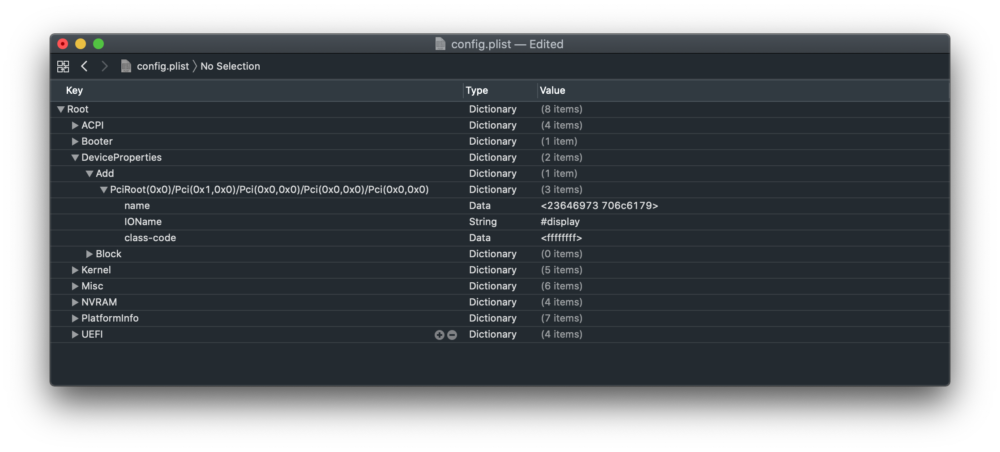
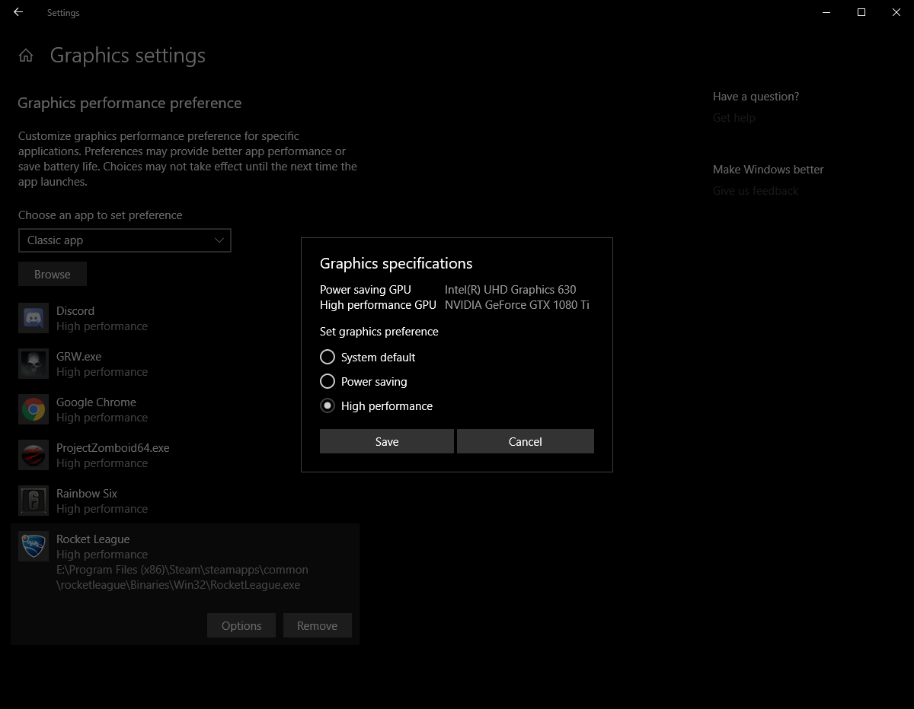

# Disabilitare GPU

Devi nascondere la tua GPU non supportata? Bene, con OpenCore le cose sono parecchio diverse, e bisogna specificare a cosa vogliamo fare lo spoof. Ci sono 3 modi per farlo:

* Boot Flag
  * Disabilita tutte le GPU tranne la iGPU
* DeviceProperties
  * Disabilita la GPU in uno slot
* SSDT
  * Disabilita la GPU in uno slot

**CSM deve essere disabilitato nel BIOS per effettuare lo spoff correttamente, specialmente nei sistemi basati su CPU AMD.**

## Boot Flag

Nella maniera più semplice, devi aggiungere questo boot-arg:

`-wegnoegpu`

Nota che questo disabiliterà tutte le GPU esclusa la iGPU.

### Metodo DeviceProperties

Questo è abbastanza semplice, trova il percorso PCI con [gfxutil](https://github.com/acidanthera/gfxutil/releases) e dopo crea una nuova sezione DeviceProperties col tuo spoof:

```
path/to/gfxutil -f GFX0
```

E l'output sarà qualcosa di simile:

```
DevicePath = PciRoot(0x0)/Pci(0x1,0x0)/Pci(0x0,0x0)/Pci(0x0,0x0)/Pci(0x0,0x0)
```

Con questo, naviga attraverso `Root -> DeviceProperties -> Add` e aggiungi il tuo percorso PCI con le seguenti proprietà:

| Chiave | Tipo | Valore |
| :--- | :--- | :--- |
| disable-gpu | Boolean | `True` |



### Metodo SSDT

Ci sono molti modi per trovare la path, ma generalmente il metodo più semplice è trovarlo da Gestione Dispositivi di Windows.

Esempio del percorso con `\_SB.PCI0.PEG0.PEGP`:

```

    DefinitionBlock ("", "SSDT", 2, "DRTNIA", "spoof", 0x00000000)
    {
       External (_SB_.PCI0.PEG0.PEGP, DeviceObj)

       Method (_SB.PCI0.PEG0.PEGP._DSM, 4, NotSerialized)
       {
          If ((!Arg2 || !(_OSI ("Darwin"))))
          {
             Return (Buffer (One)
             {
                0x03
             })
          }

          Return (Package (0x0A)
          {
             "name",
             Buffer (0x09)
             {
                "#display"
             },

             "IOName",
             "#display",
             "class-code",
             Buffer (0x04)
             {
                0xFF, 0xFF, 0xFF, 0xFF
             },
          })
       }
    }

```

Una copia di questo SSDT può essere trovato qui: [Spoof-SSDT.dsl](https://github.com/dortania/OpenCore-Install-Guide/blob/master/extra-files/Spoof-SSDT.dsl). Dovrai usare [MaciASL](https://github.com/acidanthera/MaciASL/releases) per compilarlo. Ricorda che `.aml` è assemblato e `.dsl` è il codice sorgente. Puoi compilare con MaciASL selezionando File -> Save As -> ACPI Machine Language.

Fonte: CorpNewt

## Windows GPU Selection

In dipendenza dal tuo setup, potresti notare che Windows renderizza giochi o applicazioni usando una GPU non desiderata.

Molti utenti hanno solo due GPU. Nvidia e la iGPU Intel HD/UHD. Da quando Nvidia non funziona più su macOS, avranno i monitor collegati alla porta HDMI/DP della scheda madre per convenienza. Di conseguenza Windows renderizza i giochi e applicazioni attraverso la IGPU. Puoi reinstradare un gioco specifico o un'applicazione a una differente GPU andando in: Impostazioni > Sistema > Schermo > Impostazioni di grafica.



Il gioco o l'applicazione renderizzate avranno il buffer copiato sulla iGPU. Che viene mostrato a te. Questo porta ad alcuni svantaggi:

* GSync non funzionerà più.
* Le impostazioni Nvidia non potranno più essere aperte. Richiedono lo schermo collegato alla GPU
* Diminuzione del frame rate.
* Aumento della latenza degli input.
* Limite nella frequenza di aggiornamento.

Se la tua scheda madre ha solamente il connettore HDMI per la IGPU, la frequenza di aggiornamento massima per specifica 2.1 è [120Hz](https://www.hdmi.org/spec21Sub/EightK60_FourK120). Questo assume che la tua scheda e il tuo monitor usino la stessa specifica. Questo significa che il tuo monitor a 144Hz vedrà un massimo di 120Hz essendo limitato dall'hardware. Questa limitazione *non* si applica se la tua scheda madre ha anche un connettore DP per la IGPU.

Se hai più di due GPU (AMD, Nvidia e Intel), questa impostazione è limitata. Un monitor connesso alla GPU AMD significa che Windows consentirà di selezionare solo la GPU AMD o quella Intel. Quella Nvidia non verrà usata. In una futura versione di Windows, questo [limite è rimosso](https://pureinfotech.com/windows-10-21h1-new-features/#:~:text=Graphics%20settings).

Come raccomandazione, se usi tutti e due i sistemi operativi in maniera equivalente e preferisci non avere difetti, la tua opzione migliore è l'uso di uno switch HDMI o DP.
