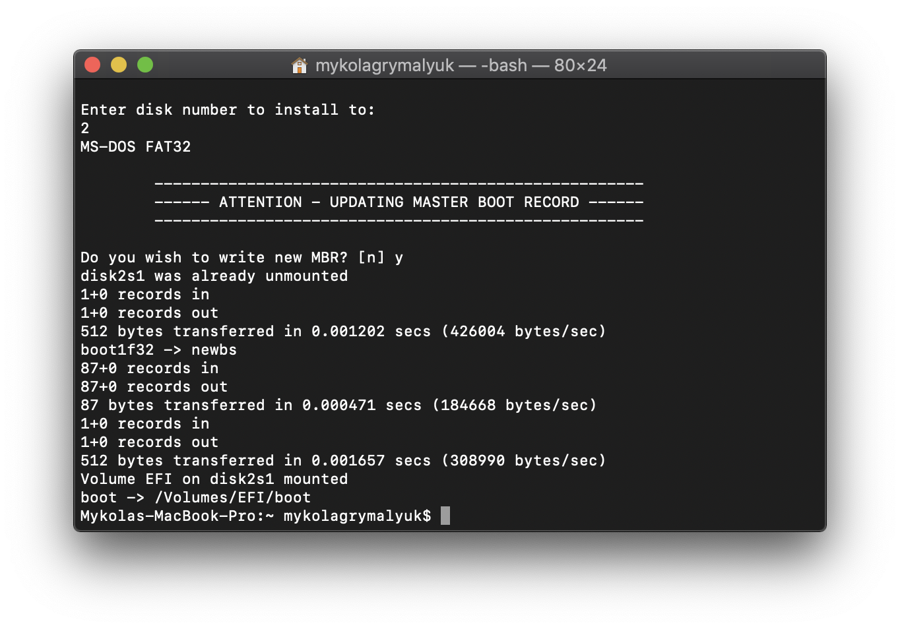
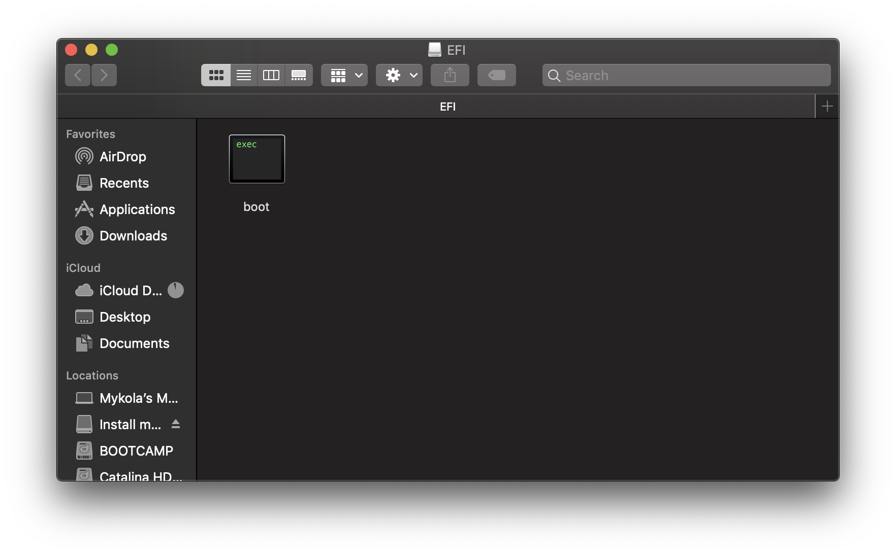

# Scaricare macOS: Metodo Offline

> Versioni supportate: macOS 10.10-attuale
>
> Sistemi supportati: macOS

## Scarichiamo l'Installer (10.13-attuale)

Da una macchina macOS che supera i requisiti del sistema operativo che vuoi installare, vai direttamente nell'App Store e scarica il sistema operativo desiderato e continua alla sezione [**Configurare l'installer**](#configurare-l'installer).

Per macchine che richiedono una versione specifica o che non possono scaricare dall'App Store, puoi usare l'utility InstallInstallMacOS by Munki.

Per avviarlo, semplicemente copia e incolla il comando qua sotto in una finestra terminale:

```sh
mkdir -p ~/macOS-installer && cd ~/macOS-installer && curl https://raw.githubusercontent.com/munki/macadmin-scripts/main/installinstallmacos.py > installinstallmacos.py && sudo python installinstallmacos.py
```


Come vedi, otterrai una lista di 10 installer di macOS. Se hai bisogno di una particolare versione di macOS, selezionala digitando il numero accanto ad essa. Nell'esempio sceglieremo il 10:


Questo ci metterà un po', deve scaricare l'installer di 8GB+, perciò è altamente raccomandato leggere il resto della guida intanto che attendi.

Una volta finito, troverai nella cartella `~/macOS-Installer/` un DMG contenente l'installer di macOS, chiamato `Install_macOS_11.1-20C69.dmg`, per esempio. Montalo e troverai l'applicazione installer.

* Nota: Ti raccomandiamo di muovere Install macOS.app nella cartella `/Applications`, dato che lo eseguiremo da là.
* Nota 2: Usando Cmd+Shift+G nel Finder ti permetterà facilmente di andare alla cartella `~/macOS-installer`


## Scarichiamo l'Installer (10.10-10.15)

La guida sottostante spiega come farlo per macOS 10.10-10.12, tuttavia a livello teorico il supporto arriva fino a 10.15.

::: details Metodo Legacy

Per iniziare, vai al qui: [Come ottenere le versioni precedenti di macOS](https://support.apple.com/it-it/HT211683)

Scarica la versione scelta e dovresti ottenere un file .pkg.

A seconda di quale sistema tu sia, puoi usare questo script e passare alla sezione [Configurare l'installer](#configurare-l'installer), tuttavia potresti ricevere questo errore:


Questo significa che dovremmo estrarre manualmente l'installer.

Per iniziare, trascina il InstallMacOSX/InstallOS.dmg e montalo:


Dopo, apriremo una finestra di terminale e creeremo una finestra sulla scrivania. Usa questo comando una volta:

```sh
cd ~/Desktop
mkdir MacInstall && cd MacInstall

# Ora inizia la parte divertente, estrarre l'installer (Nota che potrebbe metterci alcuni minuti):

# El Capitan o più vecchi

xar -xf /Volumes/Install\ OS\ X/InstallMacOSX.pkg

# Sierra

xar -xf /Volumes/Install\ macOS/InstallOS.pkg


# Dopo, usa il comando per il sistema target:

# Yosemite
cd InstallMacOSX.pkg
tar xvzf Payload
mv InstallESD.dmg Install\ OS\ X\ Yosemite.app/Contents/SharedSupport/
mv Install\ OS\ X\ Yosemite.app /Applications

# El Capitan
cd InstallMacOSX.pkg
tar xvzf Payload
mv InstallESD.dmg Install\ OS\ X\ El\ Capitan.app/Contents/SharedSupport/
mv Install\ OS\ X\ El\ Capitan.app /Applications

# Sierra

cd InstallOS.pkg
tar xvzf Payload
mv InstallESD.dmg Install\ macOS\ Sierra.app/Contents/SharedSupport/
mv Install\ macOS\ Sierra.app /Applications
```

:::

## Configurare l'installer

Ora inizializzeremo la USB per prepararla sia per l'installer di macOS che per OpenCore. Useremo il formato macOS Esteso (HFS+) con una mappa partizioni GUID. Questo creerà due partizioni: quella principale `MioVolume` e una seconda chiamata `EFI` che viene usata come partizione di avvio quando il firmware controlla i file di avvio.

::: tip Nota
Di default, Utility Disco mostra solo le partizioni – premi Cmd/Win+2 per mostrare tutti i dischi (alternativamente puoi usare il pulsante Vista)
:::


Dopo avvia il comando `createinstallmedia` concesso da [Apple](https://support.apple.com/en-us/HT201372). Nota che il comando è stato fatto per una usb inizializzata col nome `MyVolume`:

```sh
sudo /Applications/Install\ macOS\ Big\ Sur.app/Contents/Resources/createinstallmedia --volume /Volumes/MyVolume
```

Anche questo userà un po' del tuo tempo, quindi potresti farti un caffè o continuare a leggere la guida (per essere corretti non dovresti seguire la guida step per step senza averla letta tutta prima).

Puoi anche rimpiazzare il percorso di `createinstallmedia` con quello del percorso del percorso del tuo installer (stessa idea con il nome del disco).

::: details Vecchi Comandi createinstallmedia

Copiati dal sito della Apple: [Come creare un programma di installazione avviabile per macOS](https://support.apple.com/it-it/HT201372)

```sh
# Big Sur
sudo /Applications/Install\ macOS\ Big\ Sur.app/Contents/Resources/createinstallmedia --volume /Volumes/MyVolume

# Catalina
sudo /Applications/Install\ macOS\ Catalina.app/Contents/Resources/createinstallmedia --volume /Volumes/MyVolume

# Mojave
sudo /Applications/Install\ macOS\ Mojave.app/Contents/Resources/createinstallmedia --volume /Volumes/MyVolume

# High Sierra
sudo /Applications/Install\ macOS\ High\ Sierra.app/Contents/Resources/createinstallmedia --volume /Volumes/MyVolume

# Sierra
sudo /Applications/Install\ macOS\ Sierra.app/Contents/Resources/createinstallmedia --volume /Volumes/MyVolume --applicationpath /Applications/Install\ macOS\ Sierra.app

# El Capitan
sudo /Applications/Install\ OS\ X\ El\ Capitan.app/Contents/Resources/createinstallmedia --volume /Volumes/MyVolume --applicationpath /Applications/Install\ OS\ X\ El\ Capitan.app

# Yosemite
sudo /Applications/Install\ OS\ X\ Yosemite.app/Contents/Resources/createinstallmedia --volume /Volumes/MyVolume --applicationpath /Applications/Install\ OS\ X\ Yosemite.app

# Mavericks
sudo /Applications/Install\ OS\ X\ Mavericks.app/Contents/Resources/createinstallmedia --volume /Volumes/MyVolume --applicationpath /Applications/Install\ OS\ X\ Mavericks.app --nointeraction
```

:::

Per sistemi che non supportano l'avvio UEFI, vedi sotto:

::: details Impostare il boot Legacy

Per iniziare, hai bisogno di questo:

* BootInstall_IA32.tool o BootInstall_X64.tool
  * Si può trovare nell'OpenCorePkg nel percorso `/Utilties/LegacyBoot/`
* Una USB con l'Installer (Creato come sopra)

Con la tua cartella di avvio di OpenCore, vai a `Utilities/LegacyBoot`. Qui troverai un file chiamato `BootInstall_ARCH.tool`. Quello che fa è installare DuetPkg nel disco desiderato.


Ora usa lo strumento nel terminale **usando sudo** (Questo strumento fallirà se non lo metti):

```sh
# Sostituisci X64 con IA32 nel caso tu abbia una CPU a 32 Bit
sudo ~/Downloads/OpenCore/Utilities/legacyBoot/BootInstall_X64.tool
```


Questo ci darà la lista dei dischi disponibili, scegli il tuo e verrà scritta una nuova MBR. Conferma con yes `[y]` e finisci la procedura.





Questo ti provvederà una partizione EFI con anche un file **bootia32** o **bootx64**

:::

## Impostare l'ambiente EFI di OpenCore

Impostare l'ambiente EFI di OpenCore è semplice – quello di cui hai bisogno è di montare la partizione EFI di sistema. Essa viene fatta automaticamente quando inizializziamo la chiavetta in GUID, ma di default non viene montata, e quindi ora è il momento in cui il nostro amico [MountEFI](https://github.com/corpnewt/MountEFI) entra nella scena:


Noterai che quando apriamo la partizione EFI, essa è vuota. Qua inizia il divertimento.


> Ora che tutto questo è fatto, vai a [Configurare la EFI](/opencore-efi.md) per finire il tuo lavoro
