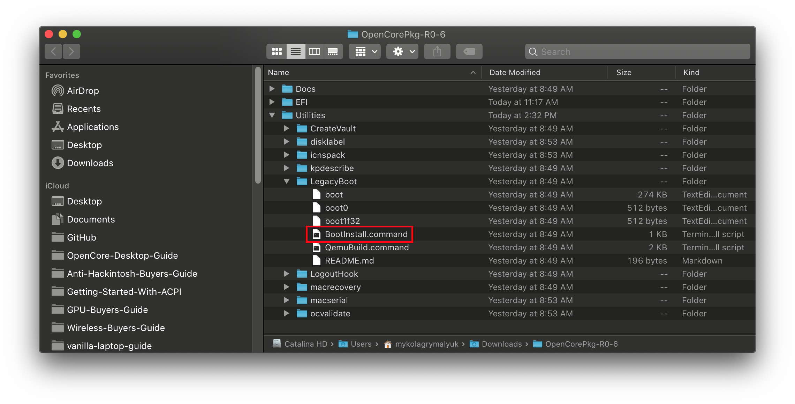

# Creazione dell'installer in macOS

* Versione supportata: 0.6.7

Siccome spesso hai bisogno di un'installazione pulita, anche senza OpenCore, alcuni utenti preferirebbero un'aggiornamento su come scaricare gli aggiornamenti di macOS.

Per iniziare avremo bisogno di un installer di macOS. Puoi saltare questa sezione e andare a inizializzare la USB se devi creare un disco avviabile con OpenCore e non un installer. Per gli altri, puoi scaricare macOS dall'App Store o con lo script di Munki.

## Scaricare macOS: Sistemi Moderni

* Questo metodo ti permette di scaricare macOS 10.13 e più recenti, per 10.12 o meno recenti vedi [Scaricare macOS: Sistemi più vecchi](#scaricare-macos:-sistemi-più-vecchi)

Da una macchina macOS che supera i requisiti del sistema operativo che vuoi installare, vai direttamente nell'App Store e scarica il sistema operativo desiderato e continua alla sezione [**Configurare l'installer**](#configurare-l'installer).

Per macchine che richiedono una versione specifica o che non possono scaricare dall'App Store, puoi usare l'utility InstallInstallMacOS by Munki.

Per avviarlo, semplicemente copia e incolla il comando qua sotto in una finestra terminale:

```sh
mkdir ~/macOS-installer && cd ~/macOS-installer && curl -O https://raw.githubusercontent.com/munki/macadmin-scripts/main/installinstallmacos.py && sudo python installinstallmacos.py
```


Come vedi, otterrai una lista di 10 installer di macOS. Se hai bisogno di una particolare versione di macOS, selezionala digitando il numero accanto ad essa. Nell'esempio sceglieremo il 10:


* **Nota su macOS 11, Big Sur**: Dato che questo sistema è parecchio nuovo, ci sono ancora dei problemi in certi sistemi che non si possono risolvere. Per maggiori informazioni, guarda qui: [OpenCore e macOS 11: Big Sur](../extras/big-sur/README.md)
  * Per gli utenti le prime volte raccomandiamo macOS 10.15, Catalina
* **Nota sulle GPU Nvidia**: Ricordati di verificare se il tuo hardware supporta sistemi nuovi, vedi [Limitazioni Hardware](../macos-limits.md)

Questo ci metterà un po', deve scaricare l'installer di 8GB+, perciò è altamente raccomandato leggere il resto della guida intanto che attendi.

Una volta finito, troverai nella cartella `~/macOS-Installer/` un DMG contenente l'installer di macOS, chiamato `Install_macOS_11.1-20C69.dmg`, per esempio. Montalo e troverai l'applicazione installer.

* Nota: Ti raccomandiamo di muovere Install macOS.app nella cartella `/Applications`, dato che lo eseguiremo da là.
* Nota 2: Usando Cmd+Shift+G nel Finder ti permetterà facilmente di andare alla cartella `~/macOS-installer`


Da qui, passa a [Configurare l'installer](#configurare-l'installer) per finire il tuo lavoro.

## Scaricare macOS: Sistemi più vecchi

* Questi metodi ti permetteranno di scaricare versioni meno recenti di macOS, correntemente supportano ogni versione Intel di OS X (da 10.4 ad attuale)

  * [Legacy macOS: metodo Offline](./mac-install-pkg.md)
    * 10.10-10.12 Supportati
  * [Legacy macOS: metodo Online (10.7-10.15 Supportati)](./mac-install-recovery.md)
    * 10.7-11 Supportati
  * [Legacy macOS: Immagine Disco](./mac-install-dmg.md)
    * 10.4-10.6 Supportati

## Configurare l'installer

Ora inizializzeremo la USB per prepararla sia per l'installer di macOS che per OpenCore. Useremo il formato macOS Esteso (HFS+) con una mappa partizioni GUID. Questo creerà due partizioni: quella principale `MioVolume` e una seconda chiamata `EFI` che viene usata come partizione di avvio quando il firmware controlla i file di avvio.

* Nota: Di default, Utility Disco mostra solo le partizioni – premi Cmd/Win+2 per mostrare tutti i dischi (alternativamente puoi usare il pulsante Vista)
* Nota 2: Utenti che seguono il metodo "Legacy macOS: metodo Online" possono saltare la zona [Impostare l'ambiente EFI di OpenCore](#impostare-l'ambiente-efi-di-opencore)


Dopo avvia il comando `createinstallmedia` concesso da [Apple](https://support.apple.com/en-us/HT201372). Nota che il comando è stato fatto per una usb inizializzata col nome `MyVolume`:

```sh
sudo /Applications/Install\ macOS\ Big\ Sur.app/Contents/Resources/createinstallmedia --volume /Volumes/MyVolume
```

Anche questo userà un po' del tuo tempo, quindi potresti farti un caffè o continuare a leggere la guida (per essere corretti non dovresti seguire la guida step per step senza averla letta tutta prima).

Puoi anche rimpiazzare il percorso di `createinstallmedia` con quello del percorso del percorso del tuo installer (stessa idea con il nome del disco).

::: details Vecchi Comandi createinstallmedia

Copiati dal sito della Apple: [Come creare un programma di installazione avviabile per macOS](https://support.apple.com/it-it/HT201372)

```sh
# Big Sur
sudo /Applications/Install\ macOS\ Big\ Sur.app/Contents/Resources/createinstallmedia --volume /Volumes/MyVolume

# Catalina
sudo /Applications/Install\ macOS\ Catalina.app/Contents/Resources/createinstallmedia --volume /Volumes/MyVolume

# Mojave
sudo /Applications/Install\ macOS\ Mojave.app/Contents/Resources/createinstallmedia --volume /Volumes/MyVolume

# High Sierra
sudo /Applications/Install\ macOS\ High\ Sierra.app/Contents/Resources/createinstallmedia --volume /Volumes/MyVolume

# Sierra
sudo /Applications/Install\ macOS\ Sierra.app/Contents/Resources/createinstallmedia --volume /Volumes/MyVolume --applicationpath /Applications/Install\ macOS\ Sierra.app

# El Capitan
sudo /Applications/Install\ OS\ X\ El\ Capitan.app/Contents/Resources/createinstallmedia --volume /Volumes/MyVolume --applicationpath /Applications/Install\ OS\ X\ El\ Capitan.app

# Yosemite
sudo /Applications/Install\ OS\ X\ Yosemite.app/Contents/Resources/createinstallmedia --volume /Volumes/MyVolume --applicationpath /Applications/Install\ OS\ X\ Yosemite.app

# Mavericks
sudo /Applications/Install\ OS\ X\ Mavericks.app/Contents/Resources/createinstallmedia --volume /Volumes/MyVolume --applicationpath /Applications/Install\ OS\ X\ Mavericks.app --nointeraction
```

:::

## Setup Legacy

Per sistemi che non supportano l'avvio UEFI, vedi sotto:

::: details Setting up Legacy Boot

Per iniziare, hai bisogno di questo:

* BootInstall_IA32.tool o BootInstall_X64.tool
  * Si può trovare nell'OpenCorePkg nel percorso `/Utilties/LegacyBoot/`
* Una USB con l'Installer (Creato come sopra)

Con la tua cartella di avvio di OpenCore, vai a `Utilities/LegacyBoot`. Qui troverai un file chiamato `BootInstall_ARCH.tool`. Quello che fa è installare DuetPkg nel disco desiderato.



Ora usa lo strumento nel terminale **usando sudo** (Questo strumento fallirà se non lo metti):

```sh
# Replace X64 with IA32 if you have a 32-Bit CPU
sudo ~/Downloads/OpenCore/Utilities/legacyBoot/BootInstall_X64.tool
```


Questo ci darà la lista dei dischi disponibili, scegli il tuo e verrà scritta una nuova MBR. Conferma con yes `[y]` e finisci la procedura.


Questo ti provvederà una partizione EFI con anche un file **bootia32** o **bootx64**

:::

## Impostare l'ambiente EFI di OpenCore

Impostare l'ambiente EFI di OpenCore è semplice – quello di cui hai bisogno è di montare la partizione EFI di sistema. Essa viene fatta automaticamente quando inizializziamo la chiavetta in GUID, ma di default non viene montata, e quindi ora è il momento in cui il nostro amico [MountEFI](https://github.com/corpnewt/MountEFI) entra nella scena:


Noterai che quando apriamo la partizione EFI, essa è vuota. Qua inizia il divertimento.


## Ora che tutto questo è fatto, vai a [Configurare la EFI](./opencore-efi.md) per finire il tuo lavoro
