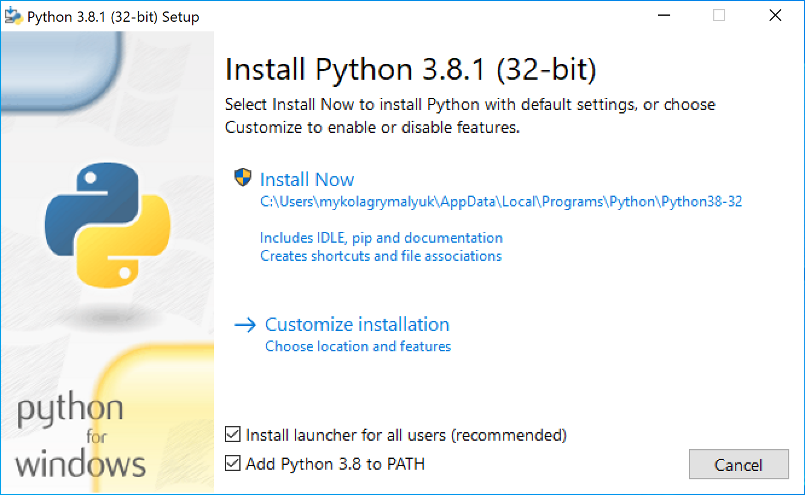

# Problemi vari

* Versione supportata: 0.6.8

Problemi vari che non ruotano attorno a macOS stesso come per esempio il multiboot.

[[toc]]

## Non posso eseguire`acpidump.efi`

Apri la shell OpenCore:

```
shell> fs0: //inserire il drive aduguato

fs0:\> dir //per verificare che questa sia la directory giusta

  Directory of fs0:\

   01/01/01 3:30p  EFI
fs0:\> cd EFI\OC\Tools //nota che è con barre in avanti

fs0:\EFI\OC\Tools> acpidump.efi -b -n DSDT -z
```

## Correzione per SSDTTime: `Could not locate or download iasl!`

Ciò è solitamente dovuto a una versione obsoleta di Python; prova ad aggiornarlo o aggiungi iasl alla cartella degli script per SSDTTime:

* [iasl versione macOS ](https://bitbucket.org/RehabMan/acpica/downloads/iasl.zip)
* [iasl versione Windows](https://acpica.org/downloads/binary-tools)
* [iasl versione Linux](http://amdosx.kellynet.nl/iasl.zip)

## Correzione per Python: `Python is not installed or not found on PATH`

Correzione facile, scarica e installa l'ultima versione di Python:

* [macOS link](https://www.python.org/downloads/macos)
* [Windows link](https://www.python.org/downloads/windows/)
* [Linux link](https://www.python.org/downloads/source/)

Make sure `Add Python to PATH`



## Il disco di avvio di Windows non riesce a vedere le unità APFS

* Driver BootCamp obsoleti (generalmente la ver 6.0 verrà fornita con brigadier, BootCamp Utility in macOS fornisce una versione più recente come la ver 6.1). CorpNewt ha anche biforcato il brigadier risolvendo anche questi problemi: [Brigadier di CorpNewt](https://github.com/corpnewt/brigadier)

## Risoluzione errata con OpenCore

* Segui [Fixing Resolution and Verbose (EN)](https://dortania.github.io/OpenCore-Post-Install/cosmetic/verbose.html) per la corretta configurazione, imposta "UIScale" su "02" per HiDPI
* Gli utenti hanno anche notato che l'impostazione di `ConsoleMode` su Max a volte fallisce, lasciarlo vuoto può aiutare

## Impossibile trovare l'unità Windows/BootCamp fra i selettori

Con OpenCore, dobbiamo notare che non sono supportate le installazioni legacy di Windows, solo UEFI. La maggior parte delle installazioni ora sono basate su UEFI, ma quelle effettuate da BootCamp Assistant sono legacy, quindi dovrai trovare altri mezzi per creare un programma di installazione (Google è tuo amico). Ciò significa anche che anche le partizioni MasterBootRecord/Hybrid sono danneggiate, quindi dovrai formattare l'unità su cui desideri installare con DiskUtility. Consulta la [Multiboot Guide (EN)](https://dortania.github.io/OpenCore-Multiboot/) sulle migliori pratiche

Ora per passare alla risoluzione dei problemi: 

* Assicurati che "Misc -> Security -> ScanPolicy" sia impostato su "0" per mostrare tutte le unità
* Abilita `Misc -> Boot -> Hideself` quando il bootloader di Windows si trova sulla stessa unità

## La selezione del disco di avvio non si applica correttamente

Se si verificano problemi con il disco di avvio che applica correttamente la nuova voce di avvio, molto probabilmente è causato da un "DevicePathsSupported" mancante nel registro di I/O. Per risolvere questo problema, assicurati di utilizzare "PlatformInfo -> Automatic -> True"

Esempio di "DevicePathsSupported" mancante:

* [ Default DevicePath match failure due to different PciRoot #664](https://github.com/acidanthera/bugtracker/issues/664#issuecomment-663873846)

## L'avvio di Windows provoca arresti anomali Bluescreen o crash di Linux

Ciò è dovuto a problemi di allineamento, assicurati che "SyncRuntimePermissions" sia abilitato sui firmware che supportano i MAT. Controlla i tuoi log se il tuo firmware supporta le tabelle degli attributi di memoria (generalmente visualizzate sui firmware 2018 e successivi)

Codice di errore comune di Windows:

* `0xc000000d`

## Errore di avvio di Windows: "OCB: StartImage failed - Already started"

Ciò è dovuto al fatto che OpenCore si confonde quando tenta di avviare Windows e pensa accidentalmente che stia avviando OpenCore. Questo può essere evitato spostando Windows sulla propria unità * o * aggiungendo un percorso di unità personalizzato in BlessOverride. Vedere [Configuration.pdf](https://github.com/acidanthera/OpenCorePkg/blob/master/Docs/Configuration.pdf) per maggiori dettagli.

## Avviso iASL, # non risolto

Se provi a decompilare il tuo DSDT e ottieni un errore simile a questo:

```
iASL Warning: There were 19 external control methods found during disassembly, but only 0 were resolved (19 unresolved)
```

Ciò accade quando una tabella ACPI richiede il resto per un corretto riferimento, non accetta la creazione di DSDT poiché la stiamo utilizzando solo per la creazione di pochi SSDT selezionati. Per coloro che sono preoccupati, puoi eseguire quanto segue:

```
iasl * [insersci tutti i file ACPI files qui]
```

## Incoerenza temporale tra macOS e Windows

Ciò è dovuto al fatto che macOS utilizza l'ora universale mentre Windows si basa su Greenwhich, quindi dovrai forzare un sistema operativo a un modo diverso di misurare il tempo. Consigliamo vivamente di modificare Windows poiché è molto meno distruttivo e doloroso:

* [Installa l'utility Bootcamp (EN)](https://dortania.github.io/OpenCore-Post-Install/multiboot/bootcamp.html)
* [Modificare il registro di Windows (EN)](https://superuser.com/q/494432)
