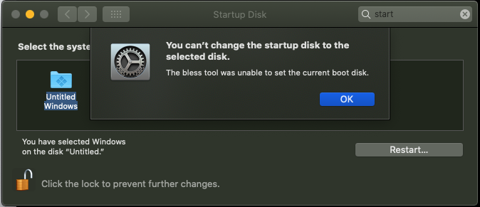

# Problemi Post-Installazione

Possibili problemi quando macOS è già installato.

[[toc]]

## IMessage e Siri non funzionanti

Fare riferimento alla sezione [Fixing iServices (EN)](/OpenCore-Post-Install/universal/iservices.md)

## Nessun audio integrato

Fare riferimento alla sezione [Fixing Audio with AppleALC (EN)](/OpenCore-Post-Install/)

## BIOS ripristinato o messo in modalità provvisoria dopo il riavvio/spegnimento?

Fare riferimento alla sezione [Fixing RTC write issues (EN)](/OpenCore-Post-Install/misc/rtc.md)

## Soluzione al problema con i tasti della tastiera PS2 senza interruzioni di Dell

Per coloro con problemi relativi alla pressione dei tasti che non si rilascia (premuti all'infinito), ti consigliamo di abilitare il profilo Dell di VoodooPS2.

Prima di tutto, devi trovare il percorso del tuo oggetto tastiera ACPI in Gestione periferiche:

```
Gestione dispositivi -> Tastiere -> Doppio clic sulla tastiera -> Proprietà -> Dettagli> nome del dispositivo BIOS
```

Successivamente, prendi [SSDT-KEY-DELL-WN09.dsl](https://github.com/acidanthera/VoodooPS2/blob/master/Docs/ACPI/SSDT-KEY-DELL-WN09.dsl) e modifica, se necessario, il percorso ACPI con quello trovato sopra :

```c
External (_SB_.PCI0.LPCB.PS2K, DeviceObj) <- Rinomina questo

    Method(_SB.PCI0.LPCB.PS2K._DSM, 4) <- Rinomina questo
```

## Accelerazione GPU macOS mancante su AMD X570

Verifica quanto segue:

* La GPU supporta UEFI (GTX-7XX/2013+)
* CSM è disattivato nel BIOS
* Forzare la velocità di collegamento PCIe 3.0

## Problemi con i DRM

Fare riferimento alla sezione [Fixing DRM (EN)](/OpenCore-Post-Install/universal/drm.md)

## "Moduli di memoria configurati in modo errato" su MacPro7,1

Segui la guida elencata qui:

* [Fixing MacPro7,1 Memory Errors (EN)](/OpenCore-Post-Install/universal/memory.md)

Per chi vuole semplicemente disabilitare la notifica (non l'errore in sé) è più che sufficiente. Per questi utenti, consigliamo di installare [RestrictEvents](https://github.com/acidanthera/RestrictEvents/releases)

## App che si bloccano su AMD

~~Soluzione facile, acquista Intel~~

Quindi con AMD, ogni volta che Apple chiama funzioni specifiche della CPU, l'app non funzionerà o andrà in crash. Ecco alcune app e le loro "correzioni":

* I prodotti Adobe non funzionano sempre
  * Alcune correzioni sono disponibili qui: [Adobe Fixes](https://adobe.amd-osx.com/)
  * Tieni presente che queste correzioni disabilitano solo la funzionalità, non sono davvero correzioni
* La macchina virtuale in esecuzione al di fuori del framework di AppleHV non funzionerà (ad esempio: Parallels 15, VMware)
  * VirtualBox funziona bene in quanto non utilizza AppleHV
  * Anche VMware 10 e versioni precedenti possono funzionare
  * È noto che anche Parallels 13.1.0 e versioni precedenti funzionano
* Docker rotto
  * Il toolbox Docker è l'unica soluzione in quanto si basa su VirtualBox, molte funzionalità non sono disponibili con questa versione
* IDA Pro non si installa
  * C'è un controllo specifico di Intel nel programma di installazione, l'app stessa probabilmente va bene
* Nella 15°/16° le pagine web possono mandare la CPU in crash
  * Segui le indicazioni qui dopo l'AGGIORNAMENTO 5: [Correggi pagine web](https://www.insanelymac.com/forum/topic/335877-amd-mojave-kernel-development-and-testing/?do=findComment&comment=2661857)

## Sleep non funziona su AMD

Questo generalmente accade su AMD che utilizza il controller USB del chipset, in particolare per la serie Ryzen e più recenti. Il modo principale per sapere se hai problemi con questo è controllare i registri dopo un ciclo di Sleep/Wake:

* Nel Terminale:
  * `log show --last 1d | grep -i "Wake reason"`

Dovrebbe risultare in qualcosa di simile:

```
Sleep transition timed out after 180 seconds while calling power state change callbacks. Suspected bundle: com.apple.iokit.IOUSBHostFamily.
```

Puoi ricontrollare quale controller è XHC0 tramite IOReg e controllare l'ID del fornitore (1022 per chipset AMD). La soluzione per questo problema è:

* Evita di avere i chipset USB tutti insieme (idealmente imposta `_STA = 0x0` per disabilitare completamente il controller con un SSDT)
* Correggere le proprietà di alimentazione USBX in base alle aspettative del controller

## La cache dei contenuti di AssetCache non è disponibile nella macchina virtuale

Errori come:

```bash
$ sudo AssetCacheManagerUtil activate
AssetCacheManagerUtil[] Failed to activate content caching: Error Domain=ACSMErrorDomain Code=5 "virtual machine"...
```

sorgono a causa del flag "VMM" esposto da sysctl.

Applicare la patch del kernel [VmAssetCacheEnable](https://github.com/ofawx/VmAssetCacheEnable) per mascherare il flag e consentire il normale funzionamento.

## I sistemi di Coffee Lake non si risvegliano

In macOS 10.15.4, there were some changes made to AGPM that can cause wake issues on Coffee Lake systems. Specifically displays hooked up to the iGPU would fail to wake. To resolve this:

* Add `igfxonln=1` to Argomenti di avvio
* Make sure you're using [WhateverGreen v1.3.8](https://github.com/acidanthera/WhateverGreen/releases) or newer

## No brightness control on Dual GPU laptops

In macOS 11.3, there were some changes made to backlight controlling mechanisms that defaults the backlight to be controlled by the dGPU on Dual GPU laptops with MUX enabled. Optimus only laptops, however, are not affected, since you need to disable the dGPU anyways. Specifically, this problem only causes issues if you have a Dual GPU laptop with the internal screen from an iGPU output and external screens from dGPU outputs (`Hybrid Mode` on some Mobile Workstations). To resolve this, you may disable either the iGPU or the dGPU, or do the following:

* Verify SSDT-PNLF is installed(ie. EFI/OC/ACPI as well as config.plist -> ACPI -> Add)

* Add below to `PciRoot(0x0)/Pci(0x2,0x0)`:

`@0,backlight-control | Data | 01000000`

`applbkl | Data | 01000000`

`AAPL,backlight-control | Data | 01000000`

`AAPL00,backlight-control | Data | 01000000`

* Add below to your dGPU PCI address:

`@0,backlight-control | Data | 00000000`

`applbkl | Data | 00000000`

`AAPL,backlight-control | Data | 00000000`

## Nessun Output dai sensori di temperatura/ventola

Quindi un paio di cose:

* iStat Menu non supporta ancora le letture di MacPro7,1
* I sensori in bundle di VirtualSMC non supportano AMD

Per iStat, dovrai attendere un aggiornamento. Per gli utenti AMD, puoi utilizzare:

* [SMCAMDProcessor](https://github.com/trulyspinach/SMCAMDProcessor/releases)
  * Ancora una beta iniziale, ma è stato fatto un ottimo lavoro; notare che è stato testato principalmente su Ryzen
* [FakeSMC3_with_plugins](https://github.com/CloverHackyColor/FakeSMC3_with_plugins/releases)

**Nota per AMD con FakeSMC**:

* Il supporto di FileVault richiede più lavoro con FakeSMC
* Assicurati che non siano presenti altri kext SMC, in particolare quelli di [VirtualSMC](https://github.com/acidanthera/VirtualSMC/releases)

## Errore "Non è possibile modificare il disco di avvio con il disco selezionato"

Ciò è comunemente causato dall'installazione irregolare della partizione dell'unità Windows, in particolare dal fatto che EFI non è la prima partizione. Per risolvere questo problema, dobbiamo abilitare questo Quirk:

* `PlatformInfo -> Generic -> AdviseFeatures -> True`



## La selezione del disco di avvio non si applica correttamente

Se si verificano problemi con "Disco di avvio" che non applica correttamente la nuova voce, molto probabilmente è causato da un "DevicePathsSupported" mancante in IOReg. Per risolvere questo problema, assicurati di utilizzare "PlatformInfo -> Automatic -> True"

Esempio di "DevicePathsSupported" mancante:

* [Default DevicePath match failure due to different PciRoot #664](https://github.com/acidanthera/bugtracker/issues/664#issuecomment-663873846)

## macOS si sveglia con l'ora sbagliata

Una cosa strana che alcune persone potrebbero notare è che, alla riattivazione, macOS avrà l'ora errata per un po 'prima di correggersi automaticamente con il controllo dell'ora di rete. La causa principale di questo problema è molto probabilmente dovuta al fatto che il tuo RTC non "ticchetta" correttamente e può essere risolta con una nuova batteria CMOS (nota che Z270 e più recenti sono piuttosto esigenti con il voltaggio, quindi scegli attentamente).

Per verificare se il tuo RTC funziona correttamente:

* Download [VirtualSMC v1.1.5+](https://github.com/acidanthera/virtualsmc/releases) ed esegui lo strumento smcread:

```bash
/path/to/smcread -s | grep CLKT
```


Questo dovrebbe fornire un valore esadecimale e, una volta convertito, dovrebbe corrispondere al tempo trascorso dalla mezzanotte rispetto a Cupertino.

Quindi, per questo esempio, prenderemo il nostro valore (`00010D13`), quindi lo convertiremo in decimale e infine lo divideremo per 3600. Ciò dovrebbe risultare nel tempo approssimativo trascorso (in secondi) dalla mezzanotte rispetto a Cupertino

* 00010D13 (Convert to HEX)-> 68883 (Divided by 3600 so we get hours)-> 19.13h(so 19:07:48)

Successivamente dovrai mettere il tuo hack in sospensione per un po 'e riattivarlo, quindi controllare ancora una volta il valore CLKT per vedere se ha deviato di più o se ha una differenza impostata. Se trovi che in realtà non ha funzionato molto dal tempo trascorso, dovrai cercare di acquistare una nuova batteria (con una tensione adeguata)

## Nessun controllo del volume/luminosità sui monitor esterni

Stranamente, macOS ha impedito di avere il controllo dell'audio digitale. Per ripristinare alcune funzionalità, l'app [MonitorControl](https://github.com/the0neyouseek/MonitorControl/releases) ha svolto un ottimo lavoro per migliorare il supporto in macOS

## Incoerenza temporale tra macOS e Windows

This is due to macOS using Universal Time while Windows relies on Greenwich time, so you'll need to force one OS to a different way of measuring time. We highly recommend modifying Windows instead as it's far less destructive and painful:

* [Installing and using BootCamp utilities (EN)](/OpenCore-Post-Install/multiboot/bootcamp.md)
* [Modifica registro di Windows](https://superuser.com/q/494432)

## Disabilitare SIP

SIP, acronimo System Integrity Protection, è una tecnologia di sicurezza che tenta di impedire a qualsiasi software dannoso e all'utente finale di danneggiare il sistema operativo. Introdotto per la prima volta con OS X El Capitan, SIP è cresciuto nel tempo per controllare sempre più cose in macOS, inclusa la limitazione delle modifiche a posizioni di file limitate e il caricamento di kext di terze parti con `kextload` (OpenCore non viene influenzato poiché i kext vengono iniettati all'avvio). Per risolvere questo problema, Apple ha fornito numerose opzioni di configurazione nella variabile NVRAM `csr-active-config` che può essere impostata nell'ambiente di ripristino macOS o con la sezione NVRAM di OpenCore (quest'ultima verrà discussa di seguito).

* <span style="color:red">ATTENZIONE:</span> Disabilitare SIP può interrompere alcune funzionalità del sistema operativo come gli aggiornamenti software in macOS 11, Big Sur e versioni successive. Fai attenzione a disabilitare solo valori SIP specifici invece di disabilitare completamente SIP per evitare questi problemi.
  * L'abilitazione di `CSR_ALLOW_UNAUTHENTICATED_ROOT` e `CSR_ALLOW_APPLE_INTERNAL` sono opzioni comuni che possono interrompere gli aggiornamenti del sistema operativo per gli utenti
È possibile scegliere valori diversi per abilitare o disabilitare determinati flag di SIP. Alcuni strumenti utili per aiutarti con questi sono [CsrDecode](https://github.com/corpnewt/CsrDecode) e [csrstat](https://github.com/JayBrown/csrstat-NG). I valori comuni sono i seguenti (i byte vengono scambiati pre-esadecimale per te e nota che vanno in NVRAM -> Add -> 7C436110-AB2A-4BBB-A880-FE41995C9F82 -> csr-active-config):

* `00000000` - SIP completamente abilitato (0x0).
* `03000000` - Disabilita la firma di kext (0x1) e le protezioni del file system (0x2).
* `FF030000` - Disabilita tutto [flag in macOS High Sierra](https://opensource.apple.com/source/xnu/xnu-4570.71.2/bsd/sys/csr.h.auto.html) (0x3ff) .
* `FF070000` - Disabilita tutto [flag in macOS Mojave](https://opensource.apple.com/source/xnu/xnu-4903.270.47/bsd/sys/csr.h.auto.html) e in [macOS Catalina](https://opensource.apple.com/source/xnu/xnu-6153.81.5/bsd/sys/csr.h.auto.html) (0x7ff) poiché Apple ha introdotto un valore per la politica eseguibile.
* `FF0F0000` - Disabilita tutti i flag in macOS Big Sur (0xfff) che ha un altro nuovo [flag per root autenticato](https://eclecticlight.co/2020/06/25/big-surs-signed-system-volume-added-security-protection/).

**Nota**: Disabilitare SIP con OpenCore è un po 'diverso rispetto a Clover, in particolare le variabili NVRAM che non verranno sovrascritte a meno che non sia esplicitamente indicato nella sezione `Delete`. Quindi, se hai già impostato SIP una volta tramite OpenCore o in macOS, devi sovrascrivere la variabile:

* `NVRAM -> Delete -> 7C436110-AB2A-4BBB-A880-FE41995C9F82 -> csr-active-config`
  


## Scrittura nella partizione di sistema macOS

Con macOS Catalina e versioni successive, Apple ha suddiviso il sistema operativo e i dati utente in 2 volumi in cui il volume di sistema è di sola lettura per impostazione predefinita. Per rendere scrivibili queste unità dovremo fare alcune cose:

* Nota: gli utenti di "SecureBootModel" potrebbero finire in un ciclo di avvio di RecoveryOS se la partizione di sistema è stata modificata. Per risolvere questo problema, reimpostare la NVRAM e impostare "SecureBootModel" su "Disabilitato"

### macOS Catalina

1. [Disabilitare SIP](#disabilitare-sip)
2. Montare l'unità come scrivibile (eseguire `sudo mount -uw /` nel terminale)

### macOS Big Sur

1. [Disabilitare SIP](#disabilitare-sip)
2. Montare l'unità come scrivibile (vedere sotto per il comando)

* Nota: a causa del funzionamento degli aggiornamenti del sistema operativo in macOS Big Sur e versioni successive, la modifica del volume di sistema può effettivamente interrompere gli aggiornamenti del sistema operativo. Si prega di modificare con cautela

Comandi basati sui documenti KDK di Apple

```bash
# Innanzitutto, crea un punto di montaggio per l'unità
mkdir ~/livemount

# Quindi, trova il tuo volume di sistema
diskutil list

# Dall'elenco sottostante, possiamo vedere che il nostro volume di sistema è disk5s5
/dev/disk5 (synthesized):
   #:                       TYPE NAME                    SIZE       IDENTIFIER
   0:      APFS Container Scheme -                      +255.7 GB   disk5
                                 Physical Store disk4s2
   1:                APFS Volume ⁨Big Sur HD - Data⁩       122.5 GB   disk5s1
   2:                APFS Volume ⁨Preboot⁩                 309.4 MB   disk5s2
   3:                APFS Volume ⁨Recovery⁩                887.8 MB   disk5s3
   4:                APFS Volume ⁨VM⁩                      1.1 MB     disk5s4
   5:                APFS Volume ⁨Big Sur HD⁩              16.2 GB    disk5s5
   6:              APFS Snapshot ⁨com.apple.os.update-...⁩ 16.2 GB    disk5s5s

# Montare l'unità (es. Disk5s5)
sudo mount -o nobrowse -t apfs  /dev/disk5s5 ~/livemount

# Ora puoi apportare liberamente qualsiasi modifica al volume di sistema

# # Se hai modificato S*/L*/Kernel, S*/L*/Extensions or L*/Extensions,
# dovrai ricostruire la cache del kernel
sudo kmutil install --volume-root ~/livemount --update-all

# Infine, una volta terminata la modifica del volume di sistema, vorremo creare una nuovo snapshot
sudo bless --folder ~/livemount/System/Library/CoreServices --bootefi --create-snapshot
```

## Rollback degli snapshot APFS

Con macOS Big Sur, lo Snapshot del volume di sistema è ora istantaneo, consentendo di eseguire il rollback in caso di problemi con gli aggiornamenti di sistema che si interrompono a causa di un sigillo rotto. Grazie alle nuove istantanee create con ogni aggiornamento del sistema operativo, abbiamo anche un bel po 'da ripristinare.

Per eseguire il rollback, devi prima riavviare nella partizione di Recovery, quindi selezionare "Ripristina dal backup di Time Machine":


* [Ringraziamo Lifewire per l'immagine](https://www.lifewire.com/roll-back-apfs-snapshots-4154969)

## Problemi di sblocco di Apple Watch

Per quelli con problemi di sblocco di Apple Watch, verifica quanto segue:

* Hai una scheda Apple Wireless supportata con Bluetooth Low Energy (4.0+)
* L'orologio e il Mac hanno eseguito l'accesso con lo stesso account
* iServices funzionano correttamente (es. iMessage)
* C'è un'opzione per sbloccare con Apple Watch nelle impostazioni di sicurezza e privacy in Preferenze di Sistema

! [](../../images/troubleshooting/troubleshooting-md/watch-unlock.png)

Se quanto sopra viene soddisfatto e hai ancora problemi di sblocco, ti consigliamo di eseguire la guida di seguito:

* [Correzione dello sblocco automatico](https://forums.macrumors.com/threads/watchos-7-beta-5-unlock-mac-doesnt-work.2250819/page-2?post=28904426#post-28904426)

## Problemi iGPU di output 4K su HDMI

Per le macchine con porte compatibili con HDMI 2.0 con problemi di risoluzione, verificare quanto segue:

* L'output 4k funziona correttamente in Windows
* Il monitor è impostato esplicitamente su HDMI 2.0
  * Se si utilizza un convertitore da HDMI a DisplayPort, assicurarsi che il monitor sia impostato su DisplayPort 1.2 o superiore
* Assicurati che sia stata allocata una quantità di memoria iGPU sufficiente
  * Per Broadwell e versioni successive, si prevede di allocare 64 MB
  * Le macchine che fanno affidamento sulla proprietà `framebuffer-stolenmem` di WhateverGreen dovrebbero sapere che questo può causare problemi di output 4k. Assicurati di poter impostare la memoria dell'iGPU su 64 MB per consentirti di rimuovere queste proprietà
* I laptop e molti utenti desktop potrebbero aver bisogno di questo argomento di avvio:
  * `-cdfon`

Per la risoluzione di tutti l'altri possibili problemi, fare riferimento a [Documenti Intel di WhateverGreen](https://github.com/acidanthera/WhateverGreen/blob/master/Manual/FAQ.IntelHD.en.md)
