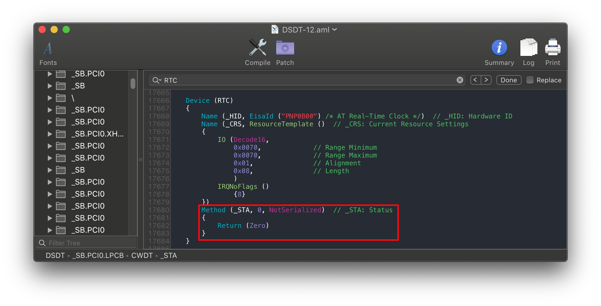

# Kernel Issues

Problemi relativi all'avvio iniziale del programma di installazione di macOS subito prima che venga visualizzata la GUI di installazione.

[[toc]]

## Bloccato su `[EB|#LOG:EXITBS:START]`

Questa sezione sarà divisa in 3 parti, quindi presta molta attenzione:

* [Problemi Booter](#problemi-del-booter)
* [Problemi Kernel Patch](#problemi-di-patch-del-kernel)
* [Problemi UEFI](#problemi-uefi)
* [Problemi macchina Virtuale](#problemi-della-macchina-virtuale)

### Problemi del Booter

I principali colpevoli da tenere d'occhio nella sezione Booter sono:

* **DevirtualiseMmio**
  * Alcuni spazi MMIO sono ancora necessari per funzionare correttamente, quindi dovrai escludere queste regioni in Booter -> MmioWhitelist o disabilitare completamente questo Quirk. Maggiori informazioni qui: [Come usare DevirtualiseMmio](/extras/kaslr-fix.md#utilizzo-di-devirtualisemmio)
  * Per gli utenti TRx40, abilita questo quirk
  * Per gli utenti X99, disabilitare questo Quirk poiché confligge con alcuni firmware

* **SetupVirtualMap**
  * Questo Quirk è richiesto per la maggior parte dei firmware e senza di esso è molto comune un kernel panic, quindi abilitarlo se non lo è già
    * Principalmente Z390 e precedenti richiedono che questo Quirk sia abilitato
    * Tuttavia, alcuni firmware (principalmente 2020+) non funzionano con questo quirk e quindi potrebbe effettivamente causare un Kernel Panic:
      * Serie Intel Ice Lake
      * Serie Comet Lake di Intel (B460, H470, Z490, ecc.)
      * B550 e A520 di AMD (ora è incluso anche il BIOS più recente su X570)
        * Sono incluse anche molte schede B450 e X470 con aggiornamenti del BIOS di fine 2020
      * TRx40 di AMD
      * VM come QEMU
      * Aggiornamenti BIOS X299 2020+ (questo vale per altre schede X299 sull'ultimo BIOS rilasciato alla fine del 2019 o 2020+)

* **EnableWriteUnprotector**

  * Un altro problema potrebbe essere che macOS è in conflitto con la protezione da scrittura dal registro CR0, per risolvere questo abbiamo 2 opzioni:
    * Se il tuo firmware supporta MAT (firmware 2018+):
      * EnableWriteUnprotector -> False
      * RebuildAppleMemoryMap -> True
      * SyncRuntimePermissions -> True
    * Per firmware meno recenti:
      * EnableWriteUnprotector -> True
      * RebuildAppleMemoryMap -> False
      * SyncRuntimePermissions -> False
    * Nota: alcuni laptop (es. Dell Inspiron 5370) anche con supporto MAT si interromperanno all'avvio, in questi casi avrai due opzioni:
      * Avvia con la vecchia combinazione di quirk del firmware (cioè con EnableWriteUnprotector e disabilita `RebuildAppleMemoryMap` +`SyncRuntimePermissions`)
      * Abilita `DevirtualiseMmio` e segui [guida MmioWhitelist](/extras/kaslr-fix.md)

Per quanto riguarda il supporto MAT, i firmware costruiti con EDK 2018 lo supporteranno e molti OEM hanno persino aggiunto il supporto fino ai laptop Skylake. Il problema è che non è sempre ovvio se un OEM ha aggiornato il firmware, puoi controllare i log di OpenCore se il tuo lo supporta ([Vedi qui come ottenere un log](/extras/debug.md)):

```
OCABC: MAT supportiss 1
```

* Nota: "1" significa che supporta MAT, mentre "0" significa di no.

### Problemi di patch del kernel

Questa sezione sarà suddivisa tra utenti Intel e AMD:

#### Utenti AMD

* Mancanti [kernel patches](https://github.com/AMD-OSX/AMD_Vanilla/tree/opencore)(si applica solo alle CPU AMD, assicurati che siano patch OpenCore e non Clover. Clover usa `MatchOS` mentre OpenCore ha`MinKernel` e `Maxkernel`)
  * Nota che anche patch del kernel obsolete avranno lo stesso effetto, assicurati di utilizzare le patch più recenti di AMD OS X.

#### Utenti Intel

* **AppleXcpmCfgLock** and **AppleCpuPmCfgLock**
  * Patch CFG o XCPM mancanti, abilitare `AppleXcpmCfgLock` e `AppleCpuPmCfgLock`
    * Haswell e versioni successive richiedono solo AppleXcpmCfgLock
    * Ivy Bridge e versioni precedenti richiedono solo AppleCpuPmCfgLock
    * Broadwell e versioni precedenti richiedono AppleCpuPmCfgLock se si esegue 10.10 o versioni precedenti
    * In alternativa puoi disabilitare correttamente CFG-Lock: [Fixing CFG Lock](/OpenCore-Post-Install/misc/msr-lock.md)
* **AppleXcpmExtraMsrs**
  * Può anche essere richiesto, questo è generalmente pensato per Pentium, HEDT e altri sistemi strani non supportati nativamente in macOS.

#### Utenti Intel  Legacy

Per macOS Big Sur, molti firmware hanno problemi a determinare il numero di core della CPU e quindi il kernel panic avviene troppo presto per lo screen printing. Tramite seriale, puoi vedere il seguente panic:

```
max_cpus_from_firmware not yet initialized
```

Per risolvere

* Abilita `AvoidRuntimeDefrag` in Booter -> Quirks
  * Questo dovrebbe funzionare per la maggior parte dei firmware

Tuttavia, su alcune macchine come HP Compaq DC 7900, il firmware continuerà ad andare in panico, quindi dobbiamo forzare un valore di conteggio dei core della CPU. Usa la patch seguente solo se EvitareRuntimeDefrag non ha funzionato:

::: details Legacy CPU Core patch

Per fare ciò, aggiungi la seguente patch (sostituendo la 04 di B8 **04** 00 00 00 C3 con la quantità di thread della CPU supportati dal tuo hardware):):

| Chiave | Tipo | Valore |
| :--- | :--- | :--- |
| Base | String | _acpi_count_enabled_logical_processors |
| Count | Integer | 1 |
| Enabled | Boolean | True |
| Find | Data | |
| Identifier | String | Kernel |
| Limit | Integer | 0 |
| Mask | Data | |
| MaxKernel | String | |
| MinKernel | String | 20.0.0 |
| Replace | Data | `B804000000C3` |
| ReplaceMask | Data | |
| Skip | Integer | 0 |

:::

### Problemi UEFI

* **ProvideConsoleGop**
  * Necessario per passare alla schermata successiva, questo era originariamente parte di AptioMemoryFix ma ora è all'interno di OpenCore come Quirk. Lo trovate in UEFI -> Output
  * Nota a partire dalla 0.5.6, questo Quirk è abilitato per impostazione predefinita nel sample.plist
* **IgnoreInvalidFlexRatio**
  * Questo è necessario per Broadwell e precedenti **Non perr AMD e Skylake o successivi**

## Bloccato su EndRandomSeed

Stessi problemi come sopra, vedi qui per maggiori dettagli: [Bloccato su `[EB|#LOG:EXITBS:START]`](#bloccato-su-eb-log-exitbs-start)

## Bloccato dopo aver selezionato la partizione macOS in OpenCore

Stessi problemi come sopra, vedi qui per maggiori dettagli: [Bloccato su `[EB|#LOG:EXITBS:START]`](#bloccato-su-eb-log-exitbs-start)

* Note: Abilitare [DEBUG OpenCore](/extras/debug.md) può anche aiutare a capire

## Kernel Panic su `Invalid frame pointer`

Questo è dovuto a qualche problema intorno al `Booter -> Quirks` che hai impostato, le cose principali da controllare:

* `DevirtualiseMmio`
  * Alcuni spazi MMIO sono ancora necessari per funzionare correttamente, quindi dovrai escludere queste regioni in Booter -> MmioWhitelist o disabilitare completamente questo Quirk
  * Maggiori informazioni qui: [Utilizzo di DevirtualiseMmio](/extras/kaslr-fix#utilizzo-di-devirtualisemmio)

* `SetupVirtualMap`
  * Questo Quirk è richiesto per la maggior parte dei firmware e senza di essa è molto comune un kernel panic, quindi abilitalo se non lo è già
    * Tuttavia, alcuni firmware non funzionano con questo Quirk e quindi potrebbero effettivamente causare questo kernel panic:
    * Serie Ice Lake Intel
    * Serie Comet Lake Intel
    * AMD B550
    * AMD A520
    * AMD TRx40
    * VMs come QEMU
  
Un altro problema potrebbe essere che macOS è in conflitto con la protezione da scrittura dal registro CR0, per risolvere questo abbiamo 2 opzioni:

* Se il tuo firmware supporta MATs(2018+ firmwares):
  * EnableWriteUnprotector -> False
  * RebuildAppleMemoryMap -> True
  * SyncRuntimePermissions -> True
* Per firmware meno recenti:
  * EnableWriteUnprotector -> True
  * RebuildAppleMemoryMap -> False
  * SyncRuntimePermissions -> False

Per quanto riguarda il supporto MAT, i firmware costruiti su EDK 2018 lo supporteranno e molti OEM hanno persino aggiunto il supporto fino ai laptop Skylake. Il problema è che non è sempre ovvio se un OEM ha aggiornato il firmware, puoi controllare i log di OpenCore se il tuo lo supporta:

```
OCABC: MAT support is 1
```

Nota: "1" significa che supporta MAT, mentre "0" significa che non lo supporta.

## Bloccato su `[EB | LD: OFS] Err (0xE)` all'avvio del volume di preavvio

Errore completo:

```
[EB | `LD: OFS] Err (0xE) @ OPEN (System \\ Library \\ PrelinkedKernels \\ prelinkedkernel)
```

Ciò può accadere quando il volume di preavvio non è aggiornato correttamente, per risolvere questo problema è necessario avviare da Recovery e ripararlo:

1. Abilita JumpstartHotplug in UEFI -> APFS (la Recovery potrebbe non avviarsi su macOS Big Sur senza questa opzione)
2. Avviare il ripristino
3. Apri il terminale ed esegui quanto segue:

```bash
# Innanzitutto, trova il volume di preavvio
diskutil list

# Dall'elenco sottostante, possiamo vedere che il nostro volume di preavvio è disk5s2
/dev/disk5 (synthesized):
   #:                       TYPE NAME                    SIZE       IDENTIFIER
   0:      APFS Container Scheme -                      +255.7 GB   disk5
                                 Physical Store disk4s2
   1:                APFS Volume ⁨Big Sur HD - Data⁩       122.5 GB   disk5s1
   2:                APFS Volume ⁨Preboot⁩                 309.4 MB   disk5s2
   3:                APFS Volume ⁨Recovery⁩                887.8 MB   disk5s3
   4:                APFS Volume ⁨VM⁩                      1.1 MB     disk5s4
   5:                APFS Volume ⁨Big Sur HD⁩              16.2 GB    disk5s5
   6:              APFS Snapshot ⁨com.apple.os.update-...⁩ 16.2 GB    disk5s5s

# Ora monta il volume di preavvio
diskutil mount disk5s2

# Quindi eseguire updatePreboot sul volume di preavvio
diskutil apfs updatePreboot /volume/disk5s2
```

Alla fine riavviare

## Bloccato su `OCB: LoadImage failed - Security Violation`

```
OCSB: nessuna firma adatta - violazione della sicurezza
OCB: Apple Secure Boot vieta questa voce di avvio, Applicazione!
OCB: LoadImage fallito - Violazione della sicurezza
```

Ciò è dovuto ad un mancante/obsoleto Apple Secure Boot manifest presente sul tuo volume del preboot risultante nel mancato caricamento se abillitato SecurebootModel Set; il motivo per cui tali file mancano è in realtà un bug in MacOS.

Per risolvere questo è possibile eseguire una delle seguenti operazioni:

* Disabilita SecurebootModel
  * ossia, `misc -> secuirty -> SecurebootModel -> Disabled`
* Reinstallare Macos con l'ultima versione
* O copia i Secure Boot manifest da `/usr/standalone/i386` a `/Volumes/Preboot/<UUID>/System/Library/CoreServices`
  * Nota che molto probabilmente dovrai farlo tramite il terminale, poiché il volume Preboot non è facilmente modificabile dal Finder
  
Per fare questo tramite Terminale:

```bash
# Innanzitutto, trova il tuo volume del preboot
diskutil list

# Dall'elenco sottostanti, possiamo vedere che il nostro volume del preboot è Disk5S2
/dev/disk5 (synthesized):
   #:                       TYPE NAME                    SIZE       IDENTIFIER
   0:      APFS Container Scheme -                      +255.7 GB   disk5
                                 Physical Store disk4s2
   1:                APFS Volume ⁨Big Sur HD - Data⁩       122.5 GB   disk5s1
   2:                APFS Volume ⁨Preboot⁩                 309.4 MB   disk5s2
   3:                APFS Volume ⁨Recovery⁩                887.8 MB   disk5s3
   4:                APFS Volume ⁨VM⁩                      1.1 MB     disk5s4
   5:                APFS Volume ⁨Big Sur HD⁩              16.2 GB    disk5s5
   6:              APFS Snapshot ⁨com.apple.os.update-...⁩ 16.2 GB    disk5s5s

# Ora monta il volume del preboot
diskutil mount disk5s2

# CD nel tuo volume del preboot
# Nota Il volume effettivo è sotto /System/Volumes/Preboot
cd /System/Volumes/Preboot

# Segnati il tuo uuid.
ls
 46923F6E-968E-46E9-AC6D-9E6141DF52FD
 CD844C38-1A25-48D5-9388-5D62AA46CFB8

# # Se ne visualizzerai multipla (es. dual boot di più versioni di macos),  dovrai
# determinare quale è l'UUID corretto.
# Il modo più semplice  è la stampa del valore di .disk_label.contentDetails
# di ogni volume.
cat ./46923F6E-968E-46E9-AC6D-9E6141DF52FD/System/Library/CoreServices/.disk_label.contentDetails
 Big Sur HD%

cat ./CD844C38-1A25-48D5-9388-5D62AA46CFB8/System/Library/CoreServices/.disk_label.contentDetails
 Catalina HD%

# Successivamente  copiare i file Secure Boot
# Sostituire CD844C38-1A25-48D5-9388-5D62AA46CFB8 con il tuo UUID
cd ~
sudo cp -a /usr/standalone/i386/. /System/Volumes/Preboot/CD844C38-1A25-48D5-9388-5D62AA46CFB8/System/Library/CoreServices
```

## Bloccato su `OCABC: Memory pool allocation failure - Not Found`

Ciò è dovuto alle impostazioni del BIOS errate:

* Above4GDecoding è abilitato
* CSM è disabilitato (abilitare la modalità Windows 8.1/10 WHQL può fare lo stesso su alcune schede)
  * Nota su alcuni laptop, il CSM deve essere abilitato
* Il BIOS è da aggiornare (Z390 e HEDT sono noti per avere firmware scarsamente scritte)

## Bloccato su `Buffer Too Small`

* Abilita Above4GDecoding nel BIOS

## Bloccato su `Plist only kext has CFBundleExecutable key`

`Executable path` mancante o errato nel tuo config.plist, questo dovrebbe essere risolto con la ri-esecuzione di ProperTree's snapshot tool(Cmd/Ctrl+R).

## Bloccato su `This version of Mac OS X is not supported: Reason Mac...`

Questo errore avviene quando SMBIOS non è più supportato da quella versione di MacOS; assicurati che i valori siano impostati in `PlatformInFO-> Generic` con `Automatic` abilitato. Per un elenco completo di SMBIOS supportato e dei loro Os, vedere qui: [Scegliere il giusto SMBIOS](/extras/SmBIOS-Support.md)

::: details SmBIOS supportati in Macos 10.15, Catalina

* iMac13,x+
* iMacPro1,1
* MacPro6,1+
* Macmini6,x+
* MacBook8,1+
* MacBookAir5,x+
* MacBookPro9,x+

:::

::: details SmBIOS supportati in macOS 11, Big Sur

* iMac14,4+
* iMacPro1,1
* MacPro6,1+
* Macmini7,1+
* MacBook8,1+
* MacBookAir6,x+
* MacBookPro11,x+

:::

::: details SmBIOS supportati in macOS 12, Monterey

* iMac16,1+
* iMacPro1,1
* MacPro6,1+
* Macmini7,1+
* MacBook9,1+
* MacBookAir7,1+
* MacBookPro11,3+

:::

## Errori `Couldn't allocate runtime area`

vedere [Fissare i valori KASLR slide](/extras/kaslr-fix.md)

## Bloccato su `RTC...`, `PCI ConfigurationBegins`, `Previous Shutdown...`, `HPET`, `HID: Legacy...`

Bene questa area generale è laddove un sacco di dispositivi PCI sono configurati, ed è dove si verificheranno la maggior parte dei problemi di avvio. Altri nomi includono:

* `apfs_module_start...`,
* `Waiting for Root device`,
* `Waiting on...IOResources...`,
* `previous shutdown cause...`

I luoghi principali da verificare:

* **Manca la patch EC**:
  * Assicurati di avere il tuo SSDT EC sia in EFI/OC/ACPI e che sia abilitato ACPI -> Add, **Doppio controllo se è abilitato.**
  * Se non ne hai uno, prendilo qui: [Iniziamo con ACPI](/Getting-Started-With-ACPI/)
* **Conflitto IRQ**:
  * Più comune su portatili e pre-costrutti più anziani; lancia SSDTTime scegli l'opzione FixHPET e aggiungi il risultante SSDT-HPET.aml e lepatches  ACPI al tuo config (l'SSDT non funzionerà senza le patch ACPI)
* **Problemi di allocazione PCI**:
  * **Aggiorna il tuo BIOS**, assicurati che sia il più recente. La maggior parte degli OEM ha un'allocazione PCI disastrosa su firmware meno recenti, in particolare AMD
  * Assicurarsi anche che Above4G sia abilitato nel BIOS, se non è disponibile alcuna opzione, aggiungere `npci=0x2000` nelle boot args.
    * Alcune schede X99 e X299 (cioè GA-X299-UD4) possono richiedere sia npci boot-arg che Above4G abilitato
  * NOTA sulle CPU AMD: **Non avere contemporaneamente l'impostazione Above4G abilitata e boot-arg npci, andranno in conflitto**
    * Nota 2020+ BIOS: Quando si abilita Above4G, potrebbe essere che nel Bios diventi disponibile l'opzione "Resizable BAR Support". Assicurarsi che `Booter -> Quirks -> ResizeAppleGpuBars` sia impostato su `0` se l'opzione si presenta.
  * Altre impostazioni del BIOS Importanti: CSM Disabilitato, Windows 8.1/10 UEFI mode abilitata
* **Problemi NVMe or SATA**:
  * A volte se viene utilizzato un pessimo controller SATA o un unità NVME non supportato, è possibile rimanere bloccato qui. Cose che puoi controllare:
    * Non utilizzare sia SSD NVM Samsung PM981 che Micron 2200S
    * Samsung 970 EVO Plus che abbia il firmware più recente (firmware più vecchi erano noti per instabilità e blocchi, [Vedi qui per maggiori informazioni](https://www.samsung.com/semiconductor/minisite/ssd/download/tools/))
  * SATA Hot-Plug sia disabilitato nel BIOS (più comunemente può causare problemi sui sistemi basati sulla CPU AMD)
    * Assicurarsi che le unità NVME siano impostate come modalità NVME nel BIOS (alcuni BIOS hanno un bug in cui è possibile impostare unità NVME come SATA)
* **NVRAM non funziona**:
  * Problema comune nelle schede madri HEDT e serie 300, hai un paio di percorsi da seguire:
    * Serie 300 Consumer Intel: Guarda [Iniziamo con ACPI](/Getting-Started-With-ACPI/) come creare SSDT-PMC.aml
    * HEDT(ie. X99): Guarda [Emulare la NVRAM](/OpenCore-Post-Install/misc/nvram.md) su come disabilitare la scrittura della NVRAM; nota che per l'installazione non è necessario eseguire lo script. Basta configurare il config.plist

* **RTC Mancante**:
  * Comunemente trovato su serie 300+ Intel(es. Z370, Z490), causata dall'orologio RTC disabilitato di default. Guarda [Iniziamo con ACPI](/Getting-Started-With-ACPI/) su come creare SSDT-AWAC.aml
  * X99 and X299 hanno decies RTC non funzionanti, la soluzione è usare SSDT-RTC0-RANGE. Guarda [Iniziamo con ACPI](/Getting-Started-With-ACPI/) per la creazione di detto file
  * Qualche compilatore ubriaco in HP ha disabilitato RTC su HP 250 G6 senza possibilità di riabilitarlo per ora.
    * Modelli interessati noti: `HP 15-DA0014dx`, `HP 250 G6`
    * Gli utenti con questa "maledizione" nell'hardware dovranno creare un orologio RTC falso per i macos con cui giocare. Vedere [Iniziamo con ACPI](/Getting-Started-With-ACPI/) per ulteriori dettagli, qui sotto una immagine ad esempio:

Esempio di come appare un RTC disabilitato senza nessuna possibilità di essere abilitato (nota che non c'è valore per riattivarlo come `STAS»):



## Bloccato su ACPI table loading on B550


Se stai rimanendo bloccato su/o vicino a tabella ACPI caricando su una scheda madre AMD B550 o A520, aggiungi il seguente SSDT:

* [SSDT-CPUR.aml](https://github.com/dortania/Getting-Started-With-ACPI/blob/master/extra-files/compiled/SSDT-CPUR.aml)

si ricorda di aggiungere questo SSDT in EFI/OC/ACPI **and**  di abilitarlo nel config.plist in  ACPI -> Add (la funzione ProperTree's snapshot può farlo per te)

## Errore "Waiting for Root Device" o Prohibited Sign

* Altri nomi: Segno dello Stop, Schermo deformato

Questo è generalmente visto come un errore USB o SATA, di seguito un paio di modalità per correggere:

### Problema USB

Questo presuppone che tu stia solo avviando il programma di installazione da USB e non macos.

* Se stai superando il limite di 15 porte, puoi temporaneamente aggirarlo con `xhciportlimit`, ma per uso a lungo termine, consigliamo di fare una [Mappa USB](/OpenCore-Post-Install/usb/)
  * `Kernel -> Quirks -> XhciPortLimit -> True`

*Un altro problema può essere che un determinato firmware non passerà la proprietà USB a MacOS

* `UEFI -> Quirks -> ReleaseUsbOwnership -> True`
* Anche abilitare XHCI Handoff nel BIOS può risolvere

* A volte, se l'USB è collegato a una porta 3.x, collegarlo a una porta 2.0 può correggere questo errore.

* Per CPUs AMD's 15h and 16h , potresti aver bisogno di aggiungere:
  * [XLNCUSBFix.kext](https://cdn.discordapp.com/attachments/566705665616117760/566728101292408877/XLNCUSBFix.kext.zip)

* Se XLNCUSBFix non funziona ancora, prova quanto segue:
  * [AMD StopSign-fixv5](https://cdn.discordapp.com/attachments/249992304503291905/355235241645965312/StopSign-fixv5.zip)

* Utenti X299: abilitare la decodifica di 4G
  * Bug del firmware su x299 in cui il USB si interrompe

* Porte USB mancanti in ACPI:
  * Per Intel Coffee Lake and precedenti, raccomandiamo di usare [USBInjectAll](https://bitbucket.org/RehabMan/os-x-usb-inject-all/downloads/)
  * For Intel Ice Lake e Comet Lake, raccomandiamo [SSDT-RHUB](https://github.com/dortania/Getting-Started-With-ACPI/blob/master/extra-files/compiled/SSDT-RHUB.aml)
    * L'opzione `7. USB Reset` di SSDTTime  può fare la stessa cosa
  * Per AMD, lancia l'opzione `7. USB Reset` di SSDTTime e aggiungi l'SSDT-RHUB che ti viene fornito alla tua EFI  e dichiaralo nel config.plist
  
### Problemi SATA

In rare occasioni (principalmente laptop), il controller SATA non è ufficialmente supportato da MacOS. Per risolvere questo, potremo fare alcune cose:

* Configurare SATA come AHCI nel BIOS
  * MacOS non supporta correttamente hardware raid o la modalità IDE.
  * Nota Le unità che già utilizzano la tecnologia Intel Rapid Storage (RST, Raid Soft per Windows e Linux) non saranno accessibili in MacOS.
* [SATA-unsupported.kext](https://github.com/khronokernel/Legacy-Kexts/blob/master/Injectors/Zip/SATA-unsupported.kext.zip)
  * Aggiunge supporto per oscuri controller SATA, comunemente nei laptop.
  * Per controller SATA legacy, [AHCIPortInjector.kext](https://www.insanelymac.com/forum/files/file/436-ahciportinjectorkext/) potrebbe essere più adatto.
* [Catalina's patched AppleAHCIPort.kext](https://github.com/dortania/OpenCore-Install-Guide/blob/master/extra-files/CtlnaAHCIPort.kext.zip)
  *Per gli utenti che eseguono Macos 11, Big Sur e hanno problemi. This backports the known working Catalina kext, SATA-unsupported is not needed with this kext

Si noti che sperimenterai questo problema solo dopo aver installato MacOS sull'unità, l'avvio del programma di installazione di MacOS non si bloccherà a causa di problemi SATA.

## Kernel panic con IOPCIFamily su X99

Per coloro che sono sulla piattaforma X99 di Intel, controllare quanto segue:

* LChe le seguenti patch del kernel siano abilitate:
  * AppleCpuPmCfgLock
  * AppleXcpmCfgLock
  * AppleXcpmExtraMsrs
* Avere il seguente SSDT:
  * SSDT-UNC(in caso contrario, vedere [Getting started with ACPI](/Getting-Started-With-ACPI/) sulla creazione di detto file)

## Bloccato su o vicino a `IOConsoleUsers: gIOScreenLock...`/`gIOLockState (3...`

Questo è giusto prima che la GPU venga inizializzata correttamente, verifica quanto segue:

* La GPU supporta UEFI (GTX-7XX/2013+)
* CSM è disattivato nel BIOS
  * Potrebbe essere necessario abilitarlo sui laptop
* Forzare la velocità di collegamento PCIe 3.0
* Controlla che ig-platform-id e device-id siano validi se si esegue una iGPU.
  * Per gli UHD 630 desktop potrebbe essere necessario utilizzare "00009B3E"
  * Provando varie [correzioni di WhateverGreen](https://github.com/acidanthera/WhateverGreen/blob/master/Manual/FAQ.IntelHD.en.md)
  * Boot-Arg `-igfxmlr`. Questo può anche manifestarsi come un errore "Divide by Zero".
  * Gli utenti con iGPU Coffee Lake potrebbero anche aver bisogno di `igfxonln = 1` in 10.15.4 e versioni successive

## Schermo deformato su laptops

Abilita CSM nelle impostazioni UEFI. Può apparire come "Boot legacy ROMs" o altra impostazione legacy.

## Schermo nero dopo `IOConsoleUsers: gIOScreenLock...` su Navi

* Aggiungi `agdpmod = pikera` agli argomenti di avvio
* Prova le diverse uscite video
* Prova ad usare SMBIOS MacPro7,1 con l'argomento di avvio `agdpmod = ignore`

Per gli utenti di MSI Navi, sarà necessario applicare la patch menzionata qui: [Il programma di installazione non funziona con 5700XT # 901](https://github.com/acidanthera/bugtracker/issues/901)

In particolare, aggiungi la seguente voce in `Kernel -> Patch`:

::: details MSI Navi Patch

```
Base:
Comment: Navi VBIOS Bug Patch
Count: 1
Enabled: YES
Find: 4154592C526F6D2300
Identifier: com.apple.kext.AMDRadeonX6000Framebuffer
Limit: 0
Mask:
MinKernel: 19.00.00
MaxKernel: 19.99.99
Replace: 414D442C526F6D2300
ReplaceMask:
Skip: 0
```

:::

Nota: macOS 11, Big Sur non richiede più questa patch per MSI Navi.

## Kernel Panic `Cannot perform kext summary`

Generalmente visto come un problema che riguarda il prelinked kernel, in particolare che macOS ha difficoltà a interpretare quello che abbiamo iniettato. Verifica che:

* Your kexts are in the correct order(master then plugins, Lilu always before the plugins)
* Kexts con un eseguibile contengono un binario, kexts con il solo plist (Injector) NO (ie. USBmap.kext, XHCI-unspported.kext, etc does not contain an executable)
* Non includere più copie degli stessi kext nel tuo config.plist (es. includendo più copie di VoodooInput da multipli kext, ti consigliamo di scegliere il primo kext nell'array di configurazione e disabilitare il resto)

Nota: questo errore potrebbe anche essere molto simile a [Kernel Panic su `Invalid frame pointer`](#kernel-panic-on-invalid-frame-pointer)

## Kernel Panic `AppleIntelMCEReporter`

Con macOS Catalina, il supporto del doppio socket è interrotto e un fatto divertente del firmware AMD è che alcune schede segnaleranno effettivamente CPU con socket multipli. Per risolvere questo problema, aggiungi [AppleMCEReporterDisabler](https://github.com/acidanthera/bugtracker/files/3703498/AppleMCEReporterDisabler.kext.zip) sia a EFI/OC/Kexts and config.plist -> Kernel -> Add

## Kernel Panic `AppleIntelCPUPowerManagement`

Ciò è probabilmente dovuto a NullCPUPowerManagement difettoso o completamente mancante. Per risolvere il problema, rimuovere NullCPUPowerManagement da `Kernel -> Add` e `EFI/OC/Kexts` quindi abilitare `DummyPowerManagement` in `Kernel -> Emulate`

* **Nota**: sulle vecchie CPU Intel (es. Penryn e precedenti), potrebbe essere dovuto a conflitti IRQ o al dispositivo HPET disabilitato. Per risolvere, hai 2 opzioni:
  * [Opzione FixHPET di SSDTTime](/Getting-Started-With-ACPI/ssdt-methods/ssdt-easy.md)
  * Forzatura del dispositivo HPET
  
  ::: details Forzatura del dispositivo HPET

  Sotto ACPI -> Patch:

| Comment | String | Force HPET Online |
| :--- | :--- | :--- |
| Enabled | Boolean | YES |
| Count | Number | 0 |
| Limit | Number | 0 |
| Find | Data | `A010934F53464C00` |
| Replace | Data | `A40A0FA3A3A3A3A3` |

:::

## Kernel Panic `AppleACPIPlatform` in 10.13


Su macOS 10.13, High Sierra il sistema operativo è molto più rigoroso con le tabelle ACPI, [in particolare un bug relativo al modo in cui venivano gestite le intestazioni](https://alextjam.es/debugging-appleacpiplatform/). Per risolvere, abilita `NormalizeHeaders` in ACPI -> Quirks nel tuo config.plist

## macOS bloccato subito prima dell'accesso

Questo è un esempio comune di TSC incasinato, per la maggior parte del sistema aggiungi [CpuTscSync](https://github.com/lvs1974/CpuTscSync)

Il modo più comune per vedere il problema TSC:

Caso 1    |  Caso 2
:-------------------------:|:-------------------------:
  |  

## La tastiera funziona ma il trackpad no

Assicurati che VoodooInput sia elencato *prima di* VoodooPS2 e VoodooI2C kexts nel tuo config.plist.

::: details Risoluzione dei problemi di VoodooI2C

Controlla l'ordine in cui vengono caricati i tuoi kext - fai in modo che corrispondano a quanto mostrato in [Raccolta di file](/opencore-efi.md):

1. VoodooGPIO, VoodooInput e VoodooI2CServices in qualsiasi ordine (Si trovano in VoodooI2C.kext/Contents/PlugIns)
2. VoodooI2C
3. Satellite/Plugin Kext

Assicurati di avere SSDT-GPIO in EFI/OC/ACPI e nel tuo config.plist sotto ACPI -> Add. Se i problemi persistono, fare riferimento alla [pagina Guida introduttiva a ACPI GPIO](/Getting-Started-With-ACPI/Laptops/trackpad.md).

:::

## `kextd stall[0]: AppleACPICPU`

Ciò è dovuto a un emulatore SMC mancante o guasto; assicurati di quanto segue:

* Lilu e VirtualSMC sono entrambi in EFI/OC/kexts e nel tuo config.plist
* Lilu è prima di VirtualSMC nell'elenco kext
* L'ultima risorsa è provare invece FakeSMC, **non abilitare contemporaneamente VirtualSMC e FakeSMC**

## Kernel Panic su AppleIntelI210Ethernet

Per coloro che utilizzano schede madri Comet Lake con NIC I225-V, potrebbe verificarsi un panico del kernel all'avvio a causa del kext I210. Per risolvere questo problema, assicurati di avere il PciRoot corretto per la tua Ethernet. Questo è comunemente:

* PciRoot(0x0)/Pci(0x1C,0x1)/Pci(0x0,0x0)
  * Per impostazione predefinita, questo è ciò che utilizzano le schede madri Asus e Gigabyte

* PciRoot(0x0)/Pci(0x1C,0x4)/Pci(0x0,0x0)
  * Alcuni OEM potrebbero usare questo

Per coloro che vogliono vedere PciRoot manualmente, ti consigliamo di installare macOS completamente ed eseguire quanto segue con [gfxutil](https://github.com/acidanthera/gfxutil/releases):

```
/path/to/gfxutil | grep -i "8086:15f3"
```

Questo dovrebbe sputare qualcosa del genere:

```
00:1f.6 8086:15f3 /PC00@0/GBE1@1F,6 = PciRoot(0x0)/Pci(0x1F,0x6)
```

La parte finale `PciRoot (0x0)/Pci(0x1F, 0x6)` è ciò che vuoi aggiungere nel tuo config.plist con device-id `F2150000`

## Kernel panic su "Wrong CD Clock Frequency" su laptop  Icelake


Per risolvere questo kernel panic, assicurati di avere `-igfxcdc` nei tuoi argomenti di avvio.

## Kernel panic su "cckprng_int_gen"

Panic completo:

```
"cckprng_int_gen: generator has already been sealed"
```

È probabile che sia 1 di queste 2 cose:

* Emulatore SMC mancante (es. Nessun VirtualSMC nel tuo config.plist o EFI)
  * Aggiungi [VirtualSMC.kext](https://github.com/acidanthera/VirtualSMC/releases) al tuo config.plist e EFI
* Utilizzo SSDT non corretto con SSDT-CPUR

Per quest'ultimo, assicurati di utilizzare solo SSDT-CPUR  con **B550 and A520**. Non utilizzare su X570 o hardware precedente (es. B450 o A320)

## Bloccato su `Forcing CS_RUNTIME for entitlement` in Big Sur


Questa è in realtà la parte in cui macOS sigillerà il volume di sistema e dove potrebbe sembrare che macOS si sia bloccato. **NON RIAVVIARE** pensando di essere bloccato, il completamento dell'operazione richiederà un po 'di tempo.

## Bloccato su `ramrod`(^^^^^^^^^^^^^)


Se rimani bloccato nella sezione `ramrod` (in particolare, si avvia, avviene questo errore e si riavvia di nuovo, causando un loop), questo suggerisce che il tuo emulatore SMC è rotto. Per risolvere questo problema, hai 2 opzioni:

* Assicurati di utilizzare le build più recenti di VirtualSMC e Lilu, con `vsmcgen=1` in boot-arg
* Passa a [Rehabman's FakeSMC](https://bitbucket.org/RehabMan/os-x-fakesmc-kozlek/downloads/) (puoi usare il trucco `MinKernel`/`MaxKernel` menzionato sopra per limitare FakeSMC a Big Sur e superiori

E quando cambi kext, assicurati di non avere sia FakeSMC che VirtualSMC abilitati nel tuo config.plist, poiché ciò causerà un conflitto.

## Problemi della macchina virtuale

* VMWare 15 è noto per rimanere bloccato su `[EB|#LOG:EXITBS:START]`. VMWare 16 risolve il problema.

## Riavvio su "AppleUSBHostPort::createDevice: failed to create device" da macOS 11.3+

Vedi [Problema USB](#problema-usb)
