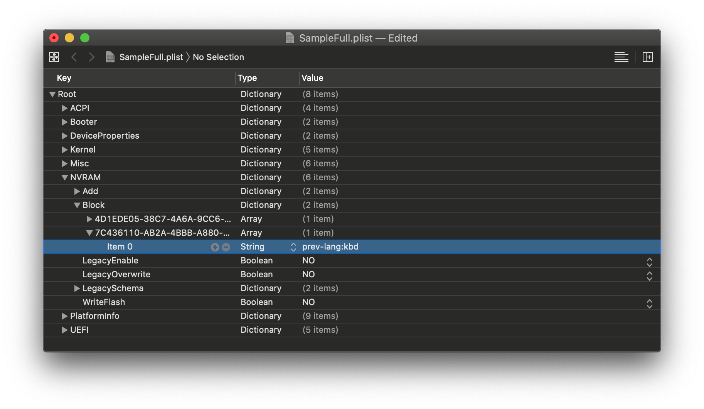
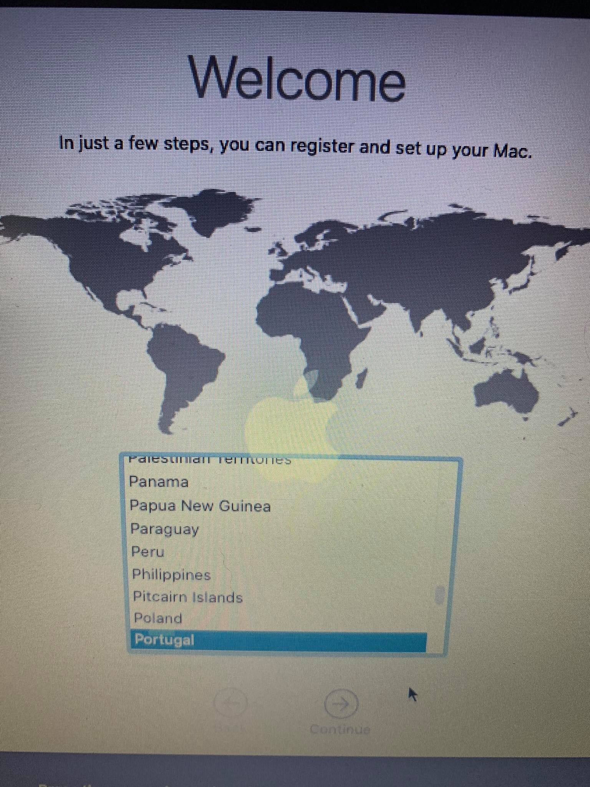

# Problemi nello spazio utente

Problemi riguardanti una volta che hai avviato il programma di installazione e la GUI è stata caricata

[[toc]]

## macOS installer in Russo

La configurazione di esempio predefinita è in russo perché gli slavi governano il mondo di Hackintosh, controlla il tuo valore `prev-lang: kbd` in `NVRAM -> Add -> 7C436110-AB2A-4BBB-A880-FE41995C9F82`. Impostato su `656e2d55533a30` per American: `en-US:0` e un elenco completo può essere trovato in [AppleKeyboardLayouts.txt](https://github.com/acidanthera/OpenCorePkg/blob/master/Utilities/AppleKeyboardLayouts/AppleKeyboardLayouts.txt). Per coloro che utilizzano un semplice editor di testo (es. UEFI Shell, Notepad++, ecc.), `656e2d55533a30` diventerà `ZW4tVVM6MA==`

Potrebbe anche essere necessario reimpostare la NVRAM tramite l'apposito selettore di avvio

* Nota: i laptop Thinkpad sono noti per essere semi-bloccati dopo un ripristino della NVRAM in OpenCore; su queste macchine si consiglia di ripristinare la NVRAM aggiornando il BIOS.

Ancora non ha funzionato? Bene, tempo di armi pesanti. Forzeremo la rimozione di quella proprietà esatta e lasceremo che OpenCore la ricostruisca:

`NVRAM -> Delete -> 7C436110-AB2A-4BBB-A880-FE41995C9F82 -> Item 0` quindi impostalo di tipo `String` e valore `prev-lang-kbd`



## Il programma di installazione di macOS è danneggiato

Se hai scaricato macOS prima di ottobre 2019, probabilmente hai un certificato di installazione macOS scaduto; ci sono 2 modi per risolvere questo problema:

* Scarica la copia più recente di macOS
* Modifica la data nel terminale in una in cui il certificato era valido

Per quest'ultimo:

* Disconnetti tutti i dispositivi di rete (Ethernet, disabilita WiFi)
* Nel terminale della Recovery impostare al 1 ° settembre 2019:

```
date 0901000019
```

## Bloccato su `IOConsoleUsers: gIOScreenLock...`

Questo è giusto prima che la GPU venga inizializzata correttamente; verifica quanto segue:

* La GPU supporta UEFI (GTX 7XX/2013+)
* CSM è disattivato nel BIOS
* Forzare la velocità di collegamento PCIe 3.0
* Controlla che ig-platform-id e device-id siano validi se si usa una iGPU.
  * Potrebbe essere necessario utilizzare "00009B3E" per desktop UHD 630
* Provando varie [WhateverGreen Fixes](https://github.com/acidanthera/WhateverGreen/blob/master/Manual/FAQ.IntelHD.en.md)
  * argomento di avvio `-igfxmlr`. Questo può anche manifestarsi come un errore di divisione per zero.
* Gli utenti di Coffee Lake iGPU potrebbero anche aver bisogno di `igfxonln=1` in 10.15.4 e versioni successive

## Schermo deformato su laptops

Abilita CSM nelle impostazioni UEFI. Può apparire come "Boot legacy ROMs" o un'altra impostazione legacy.

## Schermo nero dopo `IOConsoleUsers: gIOScreenLock...` su laptops e AIO

Verifica quanto segue:

* SSDT-PNLF installato (es. EFI/OC/ACPI e dichiarato nel config.plist -> ACPI)
* Le proprietà iGPU sono state impostate correttamente in `DeviceProperties -> PciRoot(0x0)/Pci(0x2,0x0)`
* Coffee Lake e laptop più recenti, aggiungi `-igfxblr` ai tuoi argomenti di avvio
  * In alternativa, aggiungi `enable-backlight-registers-fix | Data | 01000000` a "PciRoot(0x0)/Pci(0x2,0x0)"

Inoltre, verifica i problemi menzionati in [`Bloccato su `IOConsoleUsers: gIOScreenLock...`](#bloccato-su-ioconsoleusers-gioscreenlock)

## Schermo nero dopo `IOConsoleUsers: gIOScreenLock...` con Navi

* Aggiungi `agdpmod = pikera` agli argomenti di avvio
* Prova le diverse uscite del display
* Prova a eseguire SMBIOS MacPro7,1 con l'argomento di avvio `agdpmod = ignore`

For MSI Navi users, you'll need to apply the patch mentioned here: [Installer not working with 5700XT (pikera) #901](https://github.com/acidanthera/bugtracker/issues/901)

In particolare, aggiungi la seguente voce in `Kernel -> Patch`:

```
Base:
Comment: Navi VBIOS Bug Patch
Count: 1
Enabled: YES
Find: 4154592C526F6D2300
Identifier: com.apple.kext.AMDRadeonX6000Framebuffer
Limit: 0
Mask:
MinKernel:
MaxKernel:
Replace: 414D442C526F6D2300
ReplaceMask:
Skip: 0
```

## Congelato nel programma di installazione di macOS dopo 30 secondi

Ciò è probabilmente dovuto a NullCPUPowerManagement difettoso o completamente mancante; quello ospitato sulla Guida Vanilla di AMD OSX è danneggiato. Vai da Shannee e gridagli di aggiustarlo. Per risolvere il problema; rimuovere NullCPUPowerManagement da `Kernel -> Add` e `EFI/OC/Kexts` quindi abilitare `DummyPowerManagement` in `Kernel -> Emulate`

## Riavvio della CPU 15h/16h dopo la schermata Data & Privacy

Segui le indicazioni qui dopo l'AGGIORNAMENTO 2: [Risolvere il "Data and Privacy reboot"](https://www.insanelymac.com/forum/topic/335877-amd-mojave-kernel-development-and-testing/?do=findComment&comment=2658085)

## MacOS bloccato subito prima dell'accesso

Questo è un esempio comune di TSC incasinato; per la maggior parte dei sistemi aggiungi [CpuTscSync](https://github.com/lvs1974/CpuTscSync)

Per Skylake-X, molti firmware inclusi Asus ed EVGA non scriveranno su tutti i core. Quindi dovremo ripristinare il TSC all'avvio a freddo e svegliarci con [TSCAdjustReset](https://github.com/interferenc/TSCAdjustReset). La versione compilata può essere trovata qui: [TSCAdjustReset.kext](https://github.com/dortania/OpenCore-Install-Guide/blob/master/extra-files/TSCAdjustReset.kext.zip). Nota che tu **devi** aprire il kext (Mostra contenuto pacchetto nel finder, `Contents -> Info.plist`) and change the Info.plist -> `IOKitPersonalities -> IOPropertyMatch -> IOCPUNumber` al numero di thread della CPU avere a partire da `0`(i9-7980xe 18 core sarà `35` visto che ha 36 threads totali)

Il modo più comune per vedere il problema TSC:

Caso 1    |  Caso 2
:-------------------------:|:-------------------------:
  |  

## MediaKit segnala che lo spazio non è sufficiente

Questo errore è dovuto a un piccolo EFI, per impostazione predefinita Windows creerà un EFI da 100 MB mentre macOS si aspetterà 200 MB. Per aggirare questo problema hai 2 modi per andare:

* Espandi l'EFI dell'unità a 200 MB (cerca su Google per sapere come)
* Formatta l'intera unità anziché solo la partizione
  * Nota per impostazione predefinita Utility Disco mostra solo le partizioni, premi Cmd/Win + 2 per mostrare tutti i dispositivi (in alternativa puoi premere il pulsante Visualizza)

Default           |  Show All Devices(Cmd+2)
:-------------------------:|:-------------------------:
  |  

## Cancellazione di Utility Disco fallita

La causa sarà una (o più) delle 5 seguenti:

* Formattazione della partizione e non dell'unità, vedere [MediaKit segnala lo spazio insufficiente](#mediakit-segnala-che-lo-spazio-non-è-sufficiente)
* DiskUtility ha uno strano bug in cui fallirà alla prima cancellazione; provare a cancellare di nuovo
* Il supporto hot plug SATA nel BIOS sta causando problemi (prova a disabilitare questa opzione)
* Vecchio firmware, assicurati che l'unità abbia il firmware più recente
* E infine, potresti semplicemente avere un disco rotto/difettoso

## SATA Drives Non Mostrati in Disk Utility

* Assicurati che la modalità SATA sia AHCI nel BIOS
* Alcuni controller SATA potrebbero non essere ufficialmente supportati da macOS, per questi casi ti consigliamo di scaricare [CtlnaAHCIPort.kext](https://github.com/dortania/OpenCore-Install-Guide/blob/master/extra-files/CtlnaAHCIPort.kext.zip)
  * Per controller SATA molto vecchi, [AHCIPortInjector.kext](https://www.insanelymac.com/forum/files/file/436-ahciportinjectorkext/) potrebbe essere più adatto.

## Bloccato a 2 minuti rimanenti


Questo errore è direttamente correlato alla fase in cui macOS scriverà determinate variabili NVRAM affinché il tuo sistema si avvii successivamente, e quindi quando ci sono problemi che ruotano attorno alla NVRAM si bloccherà qui.

Per risolvere, abbiamo alcune opzioni:

* Serie 300 Intel Fix(ie. Z390):
  * [SSDT-PMC](/Getting-Started-With-ACPI/)
* Altri possono impostare quanto segue nel loro config.plist:
  * LegacyEnable -> YES
  * LegacyOverwrite -> YES
  * WriteFlash -> YES

## Il server di ripristino non può essere contattato

Se hai creato il tuo programma di installazione in Windows o Linux, significa che il tuo programma di installazione USB è basato sulla Recovery. Ciò significa che solo una piccola parte del programma di installazione di macOS è su disco mentre il resto deve essere scaricato dai server Apple nel programma di installazione. Il motivo per cui non includiamo guide complete per l'installazione è dovuto a driver HFS instabili e altre Utility che comunemente finiscono con il danneggiamento dei dati.

Per risolvere l'errore, hai alcune opzioni:

* Assicurati di avere una connessione Ethernet o WiFi funzionante
  * Apri "Utility Rete" sotto il menù "Utility" nell'installer e verifica se la tua scheda di rete viene visualizzata
    * Se la tua scheda di rete  **non** viene visualizzata, è probabile che ti manchi il kext di rete corretto
      * Fare riferimento qui: [Ethernet Kexts](/opencore-efi.md#ethernet) e [Trovare il tuo hardware](/find-hardware.md)
    * Se la scheda di rete **viene** visualizzata, eseguire quindi `ping -c3 www.google.com` nel terminale del programma di installazione per assicurarsi che la connessione di rete funzioni
      * Se non viene visualizzato nulla, molto probabilmente non hai i kext corretti per la Rete
        * Ti consigliamo di provare le versioni precedenti di kexts nei casi in cui le build più recenti abbiano strani bug con il tuo hardware
      * Se restituisce qualcosa, il problema riguarda Apple. Sfortunatamente, dovrai semplicemente provare a installarlo di nuovo un'altra volta

| Controllo NIC | Ping |
| :--- | :--- |
|  |  |

## Tastiera e mouse non funzionanti in Big Sur

Per alcuni sistemi legacy (es. Core2 Duo/2010 e versioni precedenti), potresti notare che mentre le porte USB funzionano, i tuoi dispositivi basati su HID come la tastiera e il mouse potrebbero essere danneggiati. Per risolvere questo problema, aggiungi la seguente patch:

::: details IOHIDFamily Patch

config.plist -> Kernel -> Patch:

| Key | Type | Value |
| :--- | :--- | :--- |
| Base | String | _isSingleUser |
| Count | Integer | 1 |
| Enabled | Boolean | True |
| Find | Data | |
| Identifier | String | com.apple.iokit.IOHIDFamily |
| Limit | Integer | 0 |
| Mask | Data | |
| MaxKernel | String | |
| MinKernel | String | 20.0.0 |
| Replace | Data | `B801000000C3` |
| ReplaceMask | Data | |
| Skip | Integer | 0 |

[Source](https://applelife.ru/threads/ustanovka-macos-big-sur-11-0-beta-na-intel-pc-old.2944999/page-81#post-884400)

:::

## Bloccato su `Il tuo Mac necessita di un aggiornamento del firmware per poter essere installato su questo volume`

Se ti viene chiesto di aggiornare il firmware per installare con un volume APFS, è probabile che sia una tabella SMBIOS obsoleta. Innanzitutto, verifica quanto segue:

* Hai `PlatformInfo -> Automatic` abilitato
* `UpdateSMBIOSMode` è impostato su`Create`
  * Assicurati che `CustomSMBIOSGuid` sia spento
  * Per le macchine Dell e VAIO, assicurati che `CustomSMBIOSGuid` sia abilitato e che`UpdateSMBIOSMode` sia invece impostato su `Custom`
    * `CustomSMBIOSGuid` e `UpdateSMBIOSMode` vanno sempre accesi assieme
* Utilizzo di un SMBIOS supportato in questa versione di macOS
  * es. non stai usando `-no_compat_check`
* Stai utilizzando l'ultima versione di OpenCore

Se continui a ricevere questo errore, probabilmente ci sono alcune informazioni SMBIOS obsolete in OpenCore stesso. Si consiglia di passare a un SMBIOS simile e vedere se il problema è stato risolto. Per un elenco completo di SMBIOS, vedere qui: [Scegliere il giusto SMBIOS](/extras/smbios-support.md)
